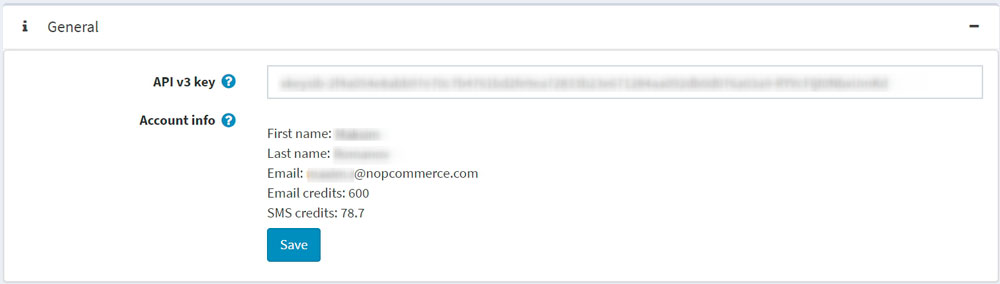
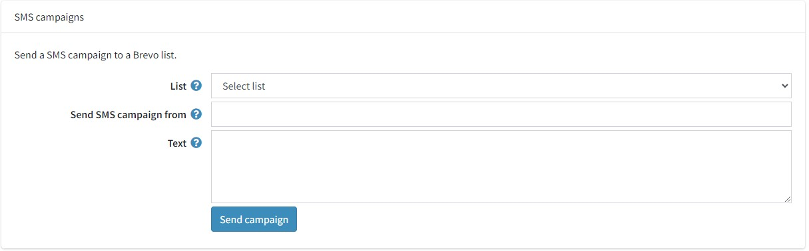
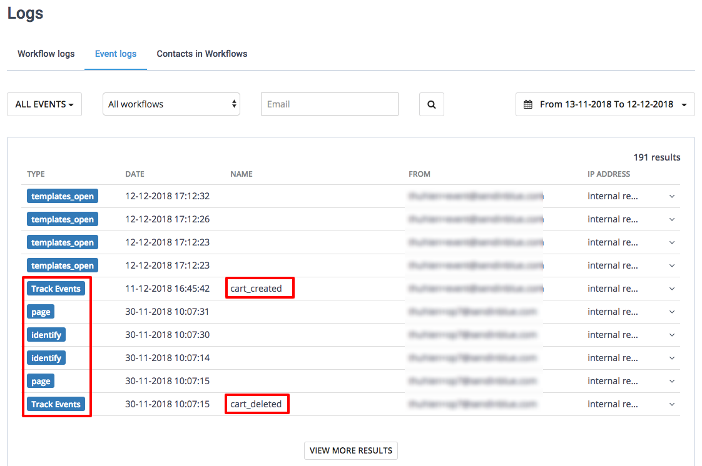

# Brevo

## Brevo 是什么

Brevo是一款集所有功能于一身的**数字营销工具箱**，能够满足您的所有**营销需求**。它能够通过电子邮件活动、短信和**营销工作流程自动化**来**建立和发展关系**。

它允许店主：

- 设计清晰、专业的新闻通讯
- 建立并瞄准受众
- 自动化营销（例如，废弃购物车恢复）

## 设置 Brevo 插件

### 安装并启用插件

您可以在此处找到它：**配置 → 本地插件**。
想要更快找到插件，请配合搜索面板中的**类型过滤插件**：

如果插件未安装，请使用`安装`按钮安装该插件。然后单击`编辑`按钮启用它。在这种情况下，您将看到`编辑插件详细信息`窗口。使用`已启用`复选框将插件标记为已启用，然后单击`保存`按钮。

### 如何配置插件

1. 单击配置按钮。您将看到`配置 - Brevo`窗口：

2. 您需要使用此链接创建一个免费的 Brevo 帐户。
3. 在SMTP 和 API页面上输入您 Brevo 帐户的API v3 密钥。
4. 单击保存按钮。
5. 完成此操作后，您应该能够看到您的帐户详细信息。

6. 转到联系人面板，将您的客户与您的 Brevo 帐户同步。

- 要创建新的 Brevo 列表，请单击**创建列表**按钮以重定向到您的 Brevo 帐户。
- 从下拉列表中，选择将添加订阅者及其联系人数据的列表。单击`保存`按钮。

#### 同步了哪些数据？

以下表单字段将同步为联系人属性：

- **电子邮件**
- **名**
- **姓**
- **短信**
- **商店 ID**
- **用户名**
- **电话**
- **国家**
- **性别**
- **出生日期**
- **公司**
- **地址1**
- **地址2**
- **邮政编码**
- **城市**
- **县**
- **状态**
- **传真**

> [!NOTE|style:flat]
> 对于同步，请注意需要为客户启用这些表单字段。转到**配置 → 设置 → 客户设置 → 客户表单**字段。

订单数据同步为交易属性：

- **ORDER_ID**：订单ID
- **ORDER_PRICE**：订单金额
- **ORDER_DATE**：订单日期

> [!NOTE|style:flat]
> 当订单的付款状态为“已付款”时，订单就会同步。

#### 联系人多久同步一次？

初始同步后，将每 6000 秒运行一次任务，以自动将您的新订阅者添加到您的 Brevo 列表中。

单击**立即同步**按钮即可立即同步。

要更改同步频率，请转到**系统 → 计划任务**。

### 发送交易电子邮件

转到**交易电子邮件**面板，通过 brevo SMTP 发送您的交易电子邮件。

1. 选中**使用 Brevo SMTP**复选框。
2. 粘贴您的 SMTP 密码（可在此处找到）。
3. 从下拉列表中，选择您希望发送电子邮件的发件人。
4. 单击**保存**按钮。

然后，您应该能够看到电子邮件通知列表。其中列出了您发送的所有交易电子邮件（例如订单确认电子邮件）。

对于每个模板，您可以：

- 选择其是否处于活动状态或非活动状态。
- 在默认的模板和Brevo模板之间进行选择。具体操作如下：
1. 单击**编辑**按钮
2. 从下拉菜单中选择您的模板
3. 单击**更新**
- 编辑其内容。

> [!NOTE|style:flat]
> 如果您选择了Brevo 电子邮件模板，则单击“编辑模板”以在您的 Brevo 帐户上编辑模板的内容。如果您尚未选择 Brevo 电子邮件模板，则单击“编辑模板”将把阅读有关消息模板编辑过程的更多信息。您还可以从该页面发送测试电子邮件来检查内容。请注意，每封测试电子邮件都将使用电子邮件信用。

### 发送短信

转到SMS面板，除了电子邮件之外，还可以向您的客户发送短信通知。

1. 选中**使用短信通知**复选框。
2. 输入字母数字发件人（最多 11 个字符）。
3. 输入您的电话号码。
4. 单击**保存**按钮。

要向 Brevo 列表发送短信活动：

1. 转到**短信活动块**。
2. 选择要发送短信活动的**联系人列表**。
3. 在**发送短信活动的发件人**字段中输入发件人的姓名。字符数限制为 11 个（字母数字格式）。
4. 使用**文本**字段指定短信活动内容。一条消息的字符数限制为 160 个。
5. 点击**保存广告活动**。

插件现已配置完毕。您可以直接从 Brevo 访问所有交易电子邮件统计信息。

### 设置营销自动化工作流程

> [!NOTE|style:flat]
> 必须通过客户的电子邮件地址来识别客户才能触发工作流程，也就是说，客户应该登录商店的帐户或在结账时输入他们的电子邮件地址。

转到**营销自动化**面板安装营销自动化跟踪脚本，以跟踪商店中购物者的活动。一旦访客注册、潜在客户放弃购物车、客户购买或发生其他事件，您就可以通过发送一系列电子邮件或短信来自动化营销。

1. 选中**使用营销自动化**复选框。
2. 如果您的 Brevo 帐户上启用了营销自动化平台，则插件将自动填充您的**跟踪器 ID**。
3. 将 Brevo 生成的跟踪脚本粘贴到**跟踪脚本**字段。{TRACKING_ID} 和 {CUSTOMER_EMAIL} 将被动态替换。
4. 确保 Brevo 小部件在**配置 → 小部件**页面上已激活。
5. 单击**保存**按钮。

一旦营销自动化启用并正常运行，您将在 Brevo 帐户的自动化 → 日志 → 事件日志下找到以下日志：

- 页
- 确认
- 径赛项目

该插件将自动跟踪购物者的活动，以便您设置工作流程来恢复丢失的销售和订单确认工作流程。传递了 3 个跟踪事件：

- 当商品添加到购物车时，会传递 cart_updated。
- 当购物车清空时，会传递 cart_deleted。
- order_completed 在订单已下达时传递。这意味着付款状态为“已付款”。

## 恢复废弃的购物车

### 开始之前

您将需要以下物品：

- Brevo 帐户凭证。如果您没有，请免费注册。
- 确保您的帐户已启用 Brevo 的电子邮件新模板语言。
- 按照以下步骤设置 brevo 插件。

### 创建废弃购物车电子邮件模板

首先，登录您的 Brevo 帐户，然后转到自动化平台 >电子邮件模板。单击右上角的新模板按钮。

电子邮件模板可以通过多种类型的数据进行个性化：

- 联系人属性已保存在您的 Brevo 列表中
- 废弃物品详情
- 废弃购物车详细信息

#### 使用联系人属性个性化您的电子邮件

让我们从使用联系人属性进行个性化开始。

在下面的例子中，我们包含了以下个性化内容：

- 收件人的名字，使用 { { contact.FIRSTNAME } }
- 收件人的姓氏，使用 { { contact.LASTNAME } }

> [!NOTE|style:flat]
> FIRSTNAME 和 LASTNAME 应该是您 Brevo 帐户中现有的属性。

现在让我们用订单变量（例如留下的物品名称、图像、价格等）来个性化电子邮件模板。为此，我们将使用新模板语言插入动态列表。

#### 使用废弃物品详细信息个性化您的电子邮件

以下变量可以直接从 Brevo 模板内容中的动态列表中包含：

| **物品数据**       | **将此占位符插入到您的模板中** |
| ------------------ | ------------------------------ |
| 姓名               | { { 项目名 } }                 |
| 库存单位           | { { item.sku} }                |
| 类别               | { { item.category} }           |
| ID                 | { { item.id} }                 |
| 商品变体的 ID      | { { item.variant_id} }         |
| 商品变体名称       | { { item.variant_name} }       |
| 价格               | { { item.price} }              |
| 数量               | { { 商品数量 } }               |
| 购买商品的店面链接 | { { item.url} }                |
| 图像               | { { item.image} }              |

在拖放编辑器中，选择将显示废弃项目的块。

1. 单击**铅笔图标**可以编辑设计块的设置。
2. 启用**动态列表**选项。
3. 在**参数**字段中写入items。
4. 在**变量**字段中写入item。
5. 设置显示的商品数量限制。例如，如果购物车中剩余 5 件商品，而您将限制设置为 3 件，则电子邮件中只会显示 3 件商品。

现在将变量添加到您的电子邮件模板。在上面的示例中，我们添加了：

- { { item.name } }- 商品名称
- { { item.quantity } }- 商品数量
- { { item.price | floatformat: 2 } }- 商品价格

要添加商品链接，请选择行动号召 (CTA)按钮。在右侧边栏的链接下，输入{ { item.url } }。

要添加商品图片，请选择图片。在右侧边栏的图片来源下，选择来自 URL，然后输入{ { item.image } }。

设计完成后，点击绿色的**保存并退出**按钮。然后点击**保存并激活**按钮。

#### 使用废弃购物车详细信息个性化您的电子邮件

以下变量可以直接包含在您的 Brevo 模板内容中：

| **购物车详情** | **插入此占位符**          |
| -------------- | ------------------------- |
| 联系           | { { params.affiliation} } |
| 货币           | { { params.currency } }   |
| 折扣           | { { params.折扣} }        |
| 船运           | { { params.shipping} }    |
| 小计           | { { params.subtotal} }    |
| 税             | { { params.tax } }        |
| 税前总额       | { { params.tax } }        |
| 全部的         | { { params.税前总额} }    |
| 链接至购物车   | { { params.url} }         |

> [!NOTE|style:flat]
> 根据会话打开的位置，购物车链接页面中显示的商品会有所不同。例如，假设客户正在使用笔记本电脑浏览。如果他们在手机上点击放弃购物车的电子邮件，则不会显示他们放弃的购物车。

在拖放编辑器中，选择所需的块来显示废弃购物车信息，然后添加所需的订单变量。

我们建议使用floatformat来格式化数字。在下面的示例中，我们添加了：

- { { params.currency } }- 废弃购物车的货币
- { { params.subtotal | floatformat: 2 } }- 放弃购物车的小计
- { { params.discount | floatformat: 2 } }- 放弃购物车的折扣
- { { params.total | floatformat: 2 } }- 放弃购物车的总数

要添加废弃购物车的链接，请选择**号召性用语 (CTA)按钮**。在右侧栏的链接下，输入{ { params.url } }。

设计完成后，点击绿色的**保存并退出**按钮。然后点击**保存并激活**按钮。

### 创建废弃购物车工作流程

> [!NOTE|style:flat]
> 必须通过客户的电子邮件地址来识别客户才能触发工作流程，即客户应该登录到您的本系统商店的帐户或在结帐时输入他们的电子邮件地址。

导航到您的 Brevo 帐户的“自动化”选项卡。

单击 **+** 创建新工作流程，然后选择**详细的废弃购物车**并按照步骤操作。

在发送电子邮件步骤中，从下拉列表中选择您刚刚创建并激活的电子邮件模板。

当您的工作流程完成后，单击**完成**以保存并激活它。

请随意阅读本教程以帮助您创建工作流程：

- 恢复废弃的购物车：自动发送电子邮件（步骤 3）

### 例子

假设客户 Jean Blue jean.blue@brevo.com访问了您的商店，但以下 3 件商品留在了购物车中。

您的模板将如下所示：

Jean Blue 收到的电子邮件将如下所示：

## 发送订单确认电子邮件

### 开始之前

您将需要以下物品：

Brevo 帐户凭证。如果您没有，请免费注册。
确保您的帐户中启用了 Brevo 电子邮件新模板语言。
按照以下步骤设置 brevo 插件。

### 创建订单确认电子邮件模板

首先，登录您的 Brevo 帐户，然后转到自动化平台 >电子邮件模板。单击右上角的新建模板按钮。

电子邮件模板可以通过多种类型的数据进行个性化：

- 联系人属性已保存在您的 Brevo 列表中
- 订单详细信息
- 订购商品详情

#### 使用联系人属性个性化您的电子邮件

让我们从使用联系人属性进行个性化开始。

在下面的例子中，我们包含了以下个性化内容：

- 收件人的名字{ { contact.FIRSTNAME } }
- 收件人的姓氏{ { contact.LASTNAME } }

> [!NOTE|style:flat]
> FIRSTNAME 和 LASTNAME 应该是您 Brevo 帐户中现有的属性。

#### 使用订单详细信息个性化您的电子邮件

以下变量可直接包含在您的 Brevo 模板内容中：

| **订单数据**            | **送货地址数据**                         | **帐单地址数据**                        |
| ----------------------- | ---------------------------------------- | --------------------------------------- |
| { { params.url} }       | { { params.shipping_address.firstname} } | { { params.billing_address.firstname} } |
| { { params.currency } } | { { params.shipping_address.lastname} }  | { { params.billing_address.lastname} }  |
| { { params.date} }      | { { params.shipping_address.company } }  | { { params.billing_address.company } }  |
| { { params.折扣} }      | { { params.shipping_address.phone } }    | { { params.billing_address.phone } }    |
| { { params.id } }       | { { params.shipping_address.address1 } } | { { params.billing_address.address1 } } |
| { { params.收入} }      | { { params.shipping_address.address2 } } | { { params.billing_address.address2 } } |
| { { params.shipping} }  | { { params.shipping_address.city } }     | { { params.billing_address.city } }     |
| { { params.subtotal} }  | { { params.shipping_address.country } }  | { { params.billing_address.country } }  |
| { { params.tax } }      | { { params.shipping_address.state} }     | { { params.billing_address.state} }     |
| { { params.税前总额} }  | { { params.shipping_address.zipcode} }   | { { params.billing_address.zipcode} }   |

在拖放编辑器中，选择将显示订单信息的所需块，然后添加变量。

我们建议使用floatformat来格式化数字。在下面的示例中，我们添加了：

- { { params.currency | floatformat: 2 } }- 订单的货币
- { { params.subtotal | floatformat: 2 } }- 订单小计
- { { params.discount | floatformat: 2 } }- 订单折扣
- { { params.total | floatformat: 2 } }- 订单总额

现在让我们用有序项目来个性化电子邮件模板。为此，我们使用新模板语言插入动态列表。

#### 使用订购商品的详细信息个性化您的电子邮件

以下变量可以直接从 Brevo 模板内容中的动态列表中包含：

| **物品数据**       | **将此占位符插入到您的模板中** |
| ------------------ | ------------------------------ |
| 姓名               | { { 项目名 } }                 |
| 库存单位           | { { item.sku} }                |
| 类别               | { { item.category} }           |
| ID                 | { { item.id} }                 |
| 商品变体的 ID      | { { item.variant_id} }         |
| 商品变体名称       | { { item.variant_name} }       |
| 价格               | { { item.price} }              |
| 数量               | { { 商品数量 } }               |
| 购买商品的店面链接 | { { item.url} }                |
| 图像               | { { item.image} }              |

在拖放编辑器中，选择将显示订购物品的所需块。

1. 单击**铅笔图标**可以编辑设计块的设置。
2. 启用**动态列表**选项。
3. 在**参数**字段中输入items。
4. 在**变量**字段中输入item。
5. 设置显示项目数限制。例如，如果有 5 个项目，而您设置限制为 3，则电子邮件中只会显示 3 个项目。

现在将变量添加到您的电子邮件模板。在上面的示例中，我们添加了：

- { { item.name } }- 商品名称
- { { item.quantity } }- 商品数量
- { { item.price | floatformat: 2 } }- 商品价格

要添加项目链接，请选择**号召性用语 (CTA)按钮**。在**右侧边栏的链接**下，输入{ { item.url } }。

要添加商品图片，请选择图片。在右侧边栏的图片来源下，选择来自 URL，然后输入{ { item.image } }。

设计完成后，点击绿色的**保存并退出**按钮。然后点击**保存并激活**按钮。

### 创建订单确认工作流程

> [!NOTE|style:flat]
> 必须通过客户的电子邮件地址来识别客户才能触发工作流程，也就是说，客户应该登录到您的商店的帐户或在结帐时输入他们的电子邮件地址。

导航到您的 Brevo 帐户的“自动化”选项卡。

单击 **+** 创建新工作流程，然后选择**产品购买**并按照步骤操作。

1. 步骤 1/3 — 事件发生
- 选择自定义事件（追踪事件）。
- 类型order_completed。
- 点击**下一步**。

2. 步骤 2/3 — 添加延迟
- 选择延迟。例如，5 秒。
- 点击**下一步**。

3. 步骤 3/3 — 发送电子邮件
- 从下拉列表中，选择您刚刚创建并激活的电子邮件模板。
- 选择**使用我的事件数据来定制电子邮件**。
- 选择**触发工作流的事件数据**。
- 单击**完成**。

工作流程完成后，单击**完成**以保存并激活它。

### 例子

假设客户 Jean Blue jean.blue@brevo.com从您的商店购买了以下 3 件商品。

您的模板将如下所示：

Jean Blue 在jean.blue@brevo.com收到的电子邮件将如下所示：

