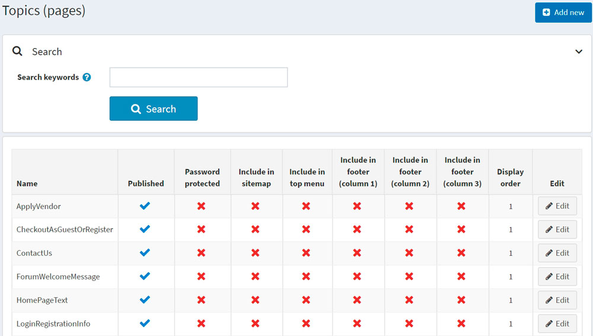
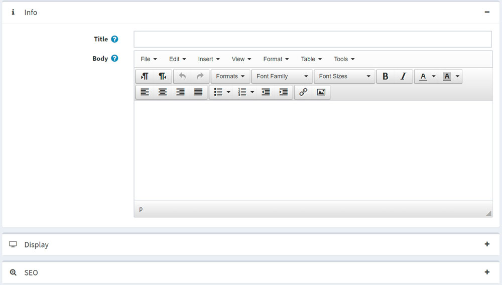

# 主题（页数）


主题（页面）是自由格式的内容块，可以显示在您的网站上，可以嵌入其他页面，也可以显示在单独的页面上。这些通常用于常见问题解答页面、政策页面、特殊说明等。要创建自定义页面，您应该创建一个新主题，并在主题详细信息页面上输入您的自定义页面内容。可以为每种语言单独编写内容。

## 主题列表

要查看主题，请转到**内容管理 → 主题（页面）**。通过在**搜索关键字**字段中输入主题文本或其片段，或在特定商店的所有主题中搜索主题列表中的主题。



## 添加主题

要添加新主题，请转到**内容管理 → 主题（页面）**。单击**添加新主题**并填写有关新主题的信息。



### 信息

在信息面板中，定义以下主题详细信息：

- 输入主题的**标题**。
- 使用**Body**字段提供的编辑器添加主题内容。
- URL字段仅供参考。它是公共商店中主题的 URL。您可以通过编辑下面的**搜索引擎友好页面名称字段**来编辑它。

### 展示

在显示面板中，定义以下主题详细信息：

- 选中**已发布**复选框以发布该主题。

- 您可以将此主题包含在**顶部菜单**、**页脚（第 1 列）**、**页脚（第 2 列）**、**页脚（第 3 列）**和**站点地图**中。通过选择相应的复选框来执行此操作。

- 如果此主题受密码保护，请选中**受密码保护**复选框。**密码**字段将显示在公共商店的主题页面上。客户需要输入密码才能访问此主题的内容。

- 从**客户角色**下拉列表中，选择可以访问该主题的一个或多个客户角色。

> [!NOTE|style:flat]
> 为了使用此功能，您必须禁用以下设置：**配置 → 目录设置 → 忽略 ACL 规则（站点范围）**。在[此处](./访问控制列表.md)阅读有关访问控制列表的更多信息。


- 在**仅限于商店**下拉列表中，选择将显示该主题的商店。

为了使用此功能，您必须禁用以下设置：**目录设置 → 忽略“每个商店限制”规则（全站）**。

- 使用**商店关闭时可访问**字段可使该主题在商店关闭时可访问。
- 选择主题的**显示顺序**。例如，1代表列表中的第一项。
- 输入该主题的**系统名称**。

> [!NOTE|style:flat]
> 可以为不同的主题使用相同的系统名称。例如，您可以创建两个具有相同系统名称的不同主题，并让不同的客户角色可以访问它们。例如，访客和注册客户角色。这意味着访客和注册客户将在网站上看到不同的内容。


> [!NOTE|style:flat]
> 在编辑现有主题或单击新主题的**保存并继续编辑**按钮后，您可以单击**预览**按钮查看主题在网站上的显示方式。


### 搜索引擎优化

在SEO面板中，定义以下主题详细信息：

- 在**搜索引擎友好页面名称**字段中，输入搜索引擎使用的页面名称。如果您不输入任何内容，则网页 URL 将使用页面名称形成。如果您输入custom-seo-page-name，则将使用以下 URL：`http://www.yourStore.com/custom-seo-page-name`。

- 在**Meta title**字段中，输入所需的标题。title 标签指定了您的网页的标题。它是插入到网页标题中的代码，格式如下：
```html
<head>
   <title>
      Creating Title Tags for Search Engine Optimization & Web Usability
    <title>
</head>
```

- 输入所需类别的**Meta 关键词**，它代表了您页面最重要主题的简短列表。Meta 关键词标签的格式如下：`<meta name="keywords" content="keywords, keyword, keyword phrase, etc.">`

- 在**元描述**字段中，输入类别的描述。元描述标签是页面内容的简短摘要。元描述标签的格式如下：`<meta name="description" content="Brief description of the contents of your page.">`

点击**保存**。该主题将显示在公共商店中。