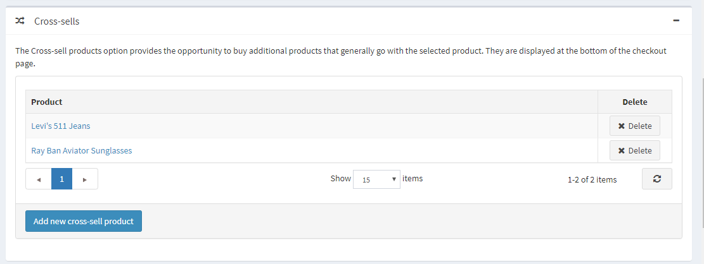
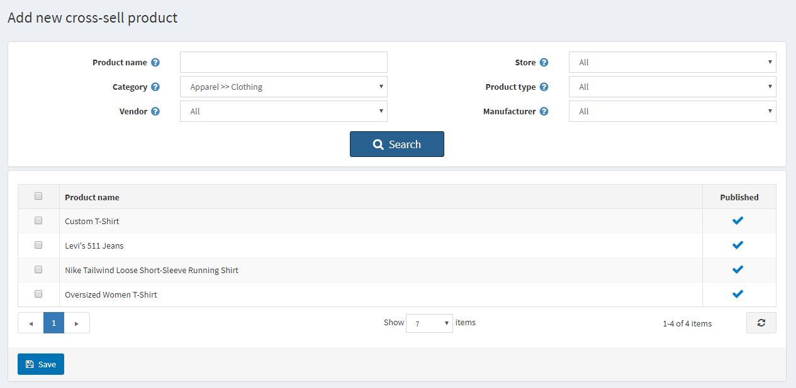
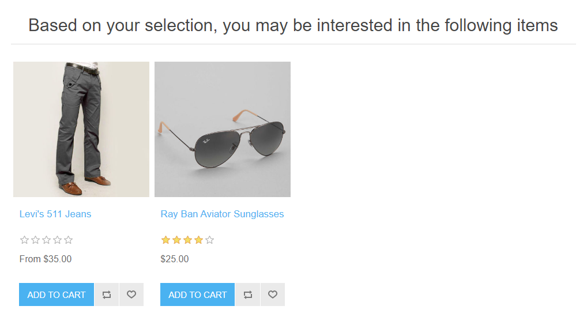
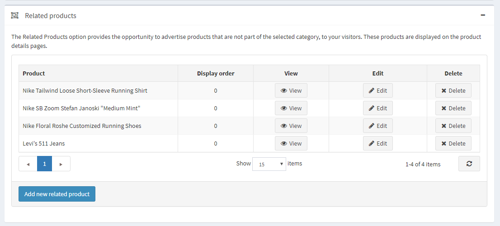
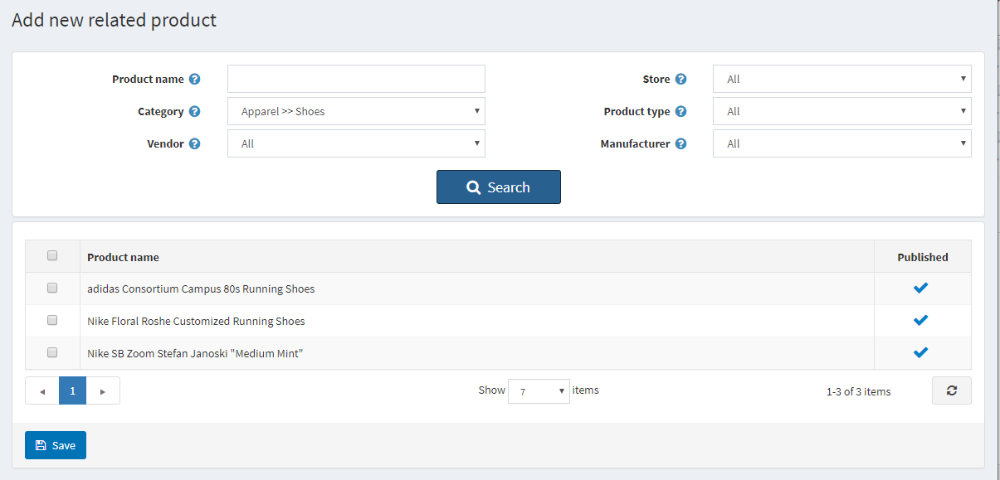
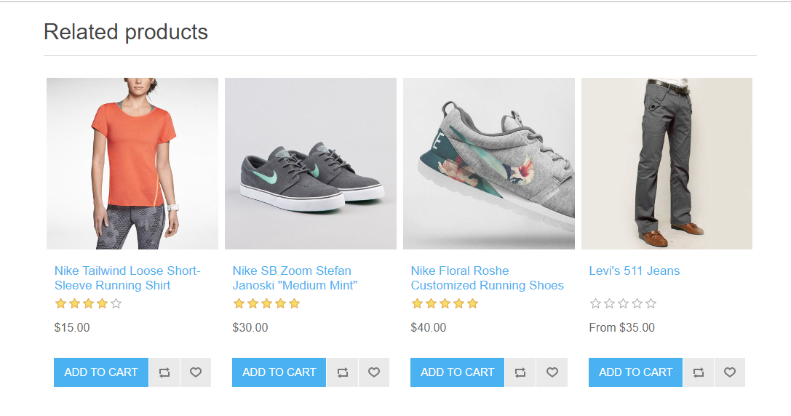

# 交叉销售和相关产品

“交叉销售”和“相关产品”是本系统中的营销工具，可用于根据客户的购物行为（查看并将某些产品添加到购物车）向客户提供他们可能喜欢的其他产品。这也是您追加销售某些产品的好机会。您可以同时使用这两种工具。

您可以在产品编辑页面创建或编辑产品时设置交叉销售和相关产品。转到**目录 → 产品**，选择一个产品，然后单击**编辑**。找到交叉销售和相关产品面板。

> [!NOTE|style:flat]
> 您需要保存产品才能添加交叉销售和相关产品。

## 交叉销售

“交叉销售产品”选项提供了销售通常与所选产品一起购买的其他产品的机会；但是，您可以添加目录中的任何产品，即使这些产品与购物车中的产品不互补。交叉销售显示在结帐页面的底部。例如，当您的客户购买 CPU 时，他们可能需要显示器和其他东西。您可以为产品添加无限数量的交叉销售产品。

### 添加新的交叉销售

单击**添加新的交叉销售产品**并从目录中选择产品。您可以使用以下条件：**产品名称**、**类别**、**供应商**、**商店**、**产品类型**和**制造商**轻松找到产品。

选择交叉销售产品并保存后，您可以检查交叉销售在结帐页面上的显示方式：

## 相关产品

相关产品选项提供了向客户宣传和追加销售所选产品的机会。这些产品显示在产品详细信息页面上所选产品的下方。您可以为产品添加无限数量的相关产品。

### 添加新的相关产品

单击**添加新相关产品**并从目录中选择产品。您可以使用以下条件：**产品名称**、**类别**、**供应商**、**商店**、**产品类型**和**制造商**轻松找到产品。

选择相关产品并保存后，您可以检查相关产品在产品详情页上的显示方式：

