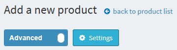
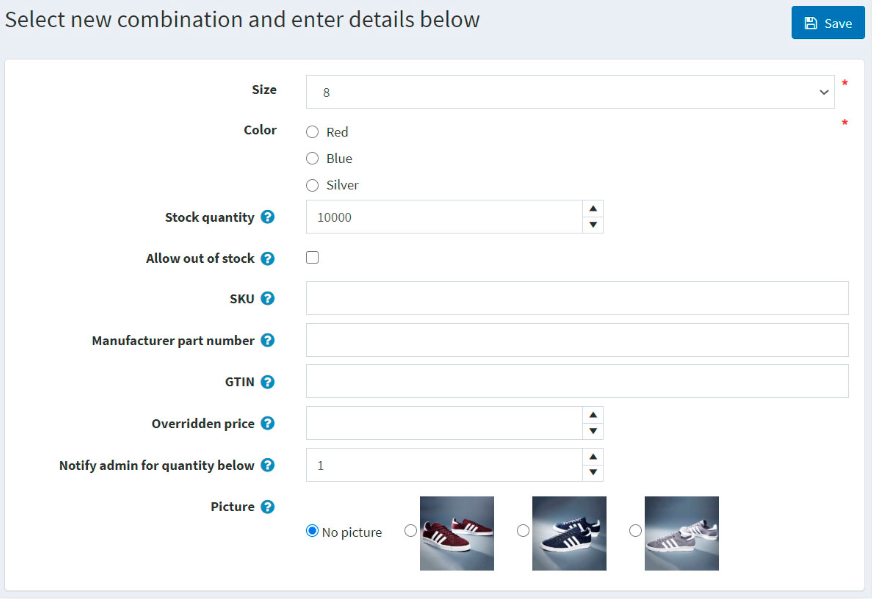
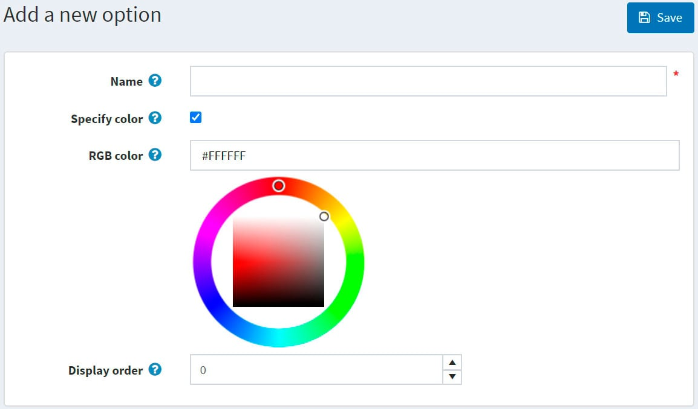

# 产品

添加和设置产品是店主最重要的任务之一。您需要定义产品类型，将产品分类，添加各种产品选项和吸引人的产品图片，定义产品标签和其他 SEO 参数。所有这些都将帮助您让客户轻松搜索和比较产品，从而带来更多购买。

添加产品还包括一些重要的内部设置，例如库存和运输参数。

## 添加产品

以最佳方式摆放产品对于商店来说至关重要。确保不遗漏任何细节，例如展示各种尺寸和颜色选项、提供详尽的产品描述、添加吸引人的图片。

要添加新产品，请转到**目录 → 产品**。单击右上角的**添加新按钮**。

> [!NOTE|style:flat]
> 您可以通过单击“导入”按钮**从外部文件导入产品**。一旦有了产品列表，您就可以单击“导出”按钮将其导出到外部文件以进行备份。单击“导出”按钮后，您将看到下拉菜单，使您可以**导出到 XML（找到的所有产品）**或**导出到 XML（选定的产品）**以及**导出到 Excel（找到的所有产品）**或**导出到 Excel（选定的产品）**。此外，还可以**将目录下载为 PDF**以将选定的产品打印为 PDF 文件。要从列表中删除产品，请选择要删除的项目，然后**单击删除（选定）按钮**。

添加新产品页面有两种模式：**高级模式**和**基本模式**（默认为高级模式）。您可以切换到基本模式，该模式仅显示必填字段。

您还可以设置基本模式，以选择需要的字段。为此，请单击开关旁边的**设置按钮**。设置弹出窗口将显示如下：

选择所需的字段并点击**保存**。请注意，此时页面将会刷新。

### 产品信息

首先在产品信息面板中填写一般信息：

- 输入**产品名称**。

- 输入将在目录中显示的产品**简短描述**。

- 输入产品的**完整描述**，该描述将显示在产品详细信息页面上。在这里，您可以添加文本、要点、链接或其他图片。请务必写出详细的描述，因为它会影响买家的决策。

- 输入产品**SKU**。这是内部用于跟踪产品的产品库存单位。这是您用于跟踪该产品的唯一内部 ID。

- **类别**。您可以将产品分配到任意多个类别。您可以在目录 → 类别中管理产品类别。

- **制造商**。您可以将产品分配给任意数量的制造商。您可以在目录 → 制造商制造商中。

- 选择“**已发布**”以使产品在您的商店中可见。

- 输入**产品标签**— 用于产品识别的关键字。输入标签，用逗号分隔。与特定标签关联的产品越多，它在目录页面侧栏上显示的热门标签部分中了解有关如何管理产品标签的更多信息产品标签。

- 输入**GTIN（全球贸易项目编号）**。这些标识符包括 UPC（北美）、EAN（欧洲）、JAN（日本）和 ISBN（书籍）。

- 输入**制造商零件编号**。这是制造商为产品提供的零件编号。

- 选中“**在主页上显示**”复选框，可将此产品显示在商店主页上。推荐用于您最受欢迎的产品。如果选中此复选框，店主还可以指定产品的**显示顺序**。1 代表列表顶部。

- 将**产品类型**设置为简单或分组章节中了解有关产品类型的更多信息[分组产品（变体）](./产品.md#分组产品（变体）)。

- 如果您在系统 → 模板页面上安装了自定义产品模板，则产品**模板**字段可见。

- 如果您希望产品出现在目录或搜索结果中，请选择“**单独可见**” ；否则，产品将隐藏在目录中，只能从分组产品详细信息页面访问。

- 选择能够在目录中看到产品的**客户角色**。**如果此选项不是必需的，请将此字段留空，这样每个人都可以看到该产品。**

> [!NOTE|style:flat]
> 为了使用此功能，您必须禁用以下设置：配置 → 目录设置 → 忽略 ACL 规则（站点范围）阅读有关访问控制列表的更多信息这里。

- 如果产品**在特定商店销售**，请在“仅限商店”字段中选择商店。如果不需要此功能，请将此字段留空。

> [!NOTE|style:flat]
> 为了使用此功能，您必须禁用以下设置：目录设置 → 忽略“每个商店限制”规则（全站）阅读有关多商店功能的更多信息这里。

- **供应商**。您可以供应商在客户 → 供应商。

- 需要其他产品是定义该产品是否需要其他产品。如果需要，请选择**所需的产品 ID**，以逗号分隔输入它们，并确保没有循环引用，例如，A 需要 B，B 需要 A。选择如果需要，**自动将这些产品添加到购物车**。

- 选择**允许客户评论**以使客户能够评论该产品。

- 定义产品可用性的**可用开始日期**和/或**可用结束日期**。

- 选择标记为新品可将产品标记为**最近添加**。这样，您就可以管理“新产品”页面上显示的产品列表。您还可以使用标记为新品。开始日期和标记为新品。结束日期字段指定将此产品标记为新品的时间段。

- 在**管理员评论**字段中，输入一条评论以供参考。此评论仅供内部使用，客户看不到。

### 价格

在价格面板中，定义：

- 以预定义货币**定价**。

> [!NOTE|style:flat]
> 您可以在配置 → 货币中更改商店货币阅读有关货币的更多信息这里。

- **旧价格**。如果大于零，它将在公共商店中可见，并显示在新价格旁边以供比较。

- **产品成本**，与生产产品或服务相关的所有成本的总和。此成本不会显示给客户。

- **禁用购买按钮**。这对于“按要求”购买的产品很有用。

- **禁用愿望清单按钮**。

- 如果产品尚未在商店中上架，但您希望允许**客户订购**，则可预订。将显示预订按钮以替换公共商店中的标准添加到购物车按钮。选择此选项后，将显示**预订可用开始日期**字段。以 UTC 为单位输入产品的可用开始日期。当此日期到来时，预订按钮将更改为添加到购物车。

- **致电询价**以显示致电询价或致电询报价，而不是公共商店产品详细信息页面上的价格。这可以帮助您与客户建立联系，并提供有关他们感兴趣的产品的其他信息。

- 客户输入价格表示客户必须输入价格。选中后将显示以下字段：

    - 在**最低金额**字段中，输入价格的最低金额。
    - 在**最高金额**字段中，输入价格的最高金额。

- 如果产品有**基准价格**，则启用 **PAngV（基准价格）**。这是德国法律（PAngV）规定的要求。例如，如果您以 1.50 欧元的价格出售 500 毫升啤酒，则必须显示基准价格：每 1 升 3.00 欧元。选中后，将显示以下字段：

    - **产品数量**—— 所售产品的数量。
    - **产品单位**——先前输入的值的度量单位。
    - **参考金额**—— 基准金额。
    - **参考单位**——先前输入的值的测量单位。

- **折扣**了解如何设置[折扣](./折扣.md)这里。

> [!NOTE|style:flat]
> 如果您想使用折扣，请确保在配置 → 设置 → 目录设置 → 性能面板中禁用忽略折扣（站点范围）设置。

- 通过选择 免税 来表示产品是否免税。否则，从**税收类别**下拉列表中，选择该产品所需的税收分类。商店所有者可以在**配置 → 税收 → 税收类别**中配置税收类别。

- [分级价格](./分级价格.md)如果需要，设置

### 船运

在运输面板中定义特定于产品的运输详细信息：

- 如果产品可以运输，请选择**已启用运输** 。此部分将展开以显示更多详细信息。

- 设置用于运费计算的产品参数：**重量**、**长度**、**宽度**、**高度**。

> [!NOTE|style:flat]
> 您可以在**配置 → 运输 → 措施**中更改预定义的措施。

- 如果有的话，**免费送货**。

- 如果产品需要与其他产品分开运输，则**分开运输**。如果订单中包含多件产品，则所有产品都将分开运输。

- **额外的运费**。

- 将在公共商店中显示的**交货日期**。

> [!NOTE|style:flat]
> 您可以在**配置 → 运输 → 交货日期**中管理交货日期选项。

> [!NOTE|style:flat]
> 有启用**估计运费（产品页面）**设置，可在**配置 → 设置 → 运输设置**中启用。此设置允许在产品详细信息页面的弹出窗口中根据客户的送货地址显示估计的运输信息。

### 存货

说明定义产品的[库存设置](./库存.md)。

### 多媒体

在此面板上您可以添加与当前产品相关的所有媒体内容。

#### 图片

在图片面板中，您可以添加产品图片。

您可以使用**上传文件按钮**一次上传多个图像文件。上传图片后，您可以为每张图片设置以下值：

- 在**Alt**字段中，输入“img”HTML 元素的“alt”属性的值。如果为空，则将使用默认规则（例如产品名称）。
- 在**标题**字段中，输入“img”HTML 元素的“title”属性的值。如果为空，则将使用默认规则（例如产品名称）。
- 定义图片在商品页面上的显示顺序，1代表列表顶部。

> [!NOTE|style:flat]
> 要上传 *.svg 格式的图片，您需要激活以下设置
> 

#### 视频

在**视频选项卡**上，您可以添加来自任何视频主机（例如YouTube或Vimeo）的嵌入视频的链接。

### 产品属性

在[产品属性](#产品属性-1)详细了解产品属性以及如何创建它们。

#### 添加新属性

创建属性列表后，单击**属性选项卡**中的**添加新属性**。**添加新属性窗口**将显示如下内容：

设置新属性：

- 从**属性下拉列表**中，选择一个属性。

- 如果您希望在公共存储中此属性前面显示一些文本，请填写**文本提示字段**。

- 选择**是否需要**以根据客户的需要设置此属性。

- 定义此属性的**控制类型**（例如，下拉列表、单选按钮列表）。

> [!NOTE|style:flat]
> 对于“日期选择器”控件类型，可以使用“所有设置（高级）”页面上的**catalogsettings.countdisplayedyearsdatepicker**参数”页面上进行设置的说明。

- 定义产品页面上属性的**显示顺序**。1代表列表顶部。

单击**保存并继续编辑**。值面板现在显示此属性的预定义值。如果需要，单击值行中的**编辑** 。

#### 编辑属性值

选择**属性值类型**。有两种属性值类型：**简单**和**与产品关联**。如果您希望此属性值是目录中的另一种产品并跟踪其库存，请选择与产品关联类型。在这里您可以使用捆绑产品功能，允许客户购买各种组合或产品组合作为单一产品，购物者将有机会使用下面描述的**客户输入数量字段**设置所需的属性数量。

如果之前的设置是关联至产品，则会显示以下字段：

- 关联产品允许您选择与此属性关联的产品。使用**关联产品按钮**选择产品。

 danger 笔记
确保选择相关产品后没有任何警告。例如：

- 选择**客户输入数量字段**以允许客户输入属性的数量（代表相关产品）。
- 如果上一个字段清晰，您可以**指定产品数量**。允许的最小值为 1。
- 输入**属性名称**。
- 指定要与颜色方块属性控件一起使用的**RGB颜色**。
- 在**价格调整字段**中，输入选择此属性值时应用的价格。例如，‘10’表示增加 10 美元。或 10%（如果选择价格调整）。使用百分比。
- 选择价格调整。使用**百分比**，决定是否对产品应用百分比。如果未启用，则使用固定值。
- 使用**权重调整字段**来指定选择此属性值时应用的权重调整。
- 指定**成本字段**。属性值成本是构成此值的所有组件的成本。如果组件是从第三方供应商处购买的，则这可能是采购价格；如果组件是内部制造的，则这可能是材料和制造工艺的总成本。
- 如果应该为客户预先选择此属性值，请选择**已预先选择字段**。
- 输入属性值的**显示顺序**。1代表属性值列表中的第一项。
- 选择与该属性值**关联图片**。点击（选择）此产品属性值时，此图片将替换主产品图像。

单击**保存**。

#### 属性条件

如果需要，请在条件面板中定义此属性的条件。如果选择了上一个属性，则会出现条件属性，例如，如果选择了**个性化单选按钮**，则会出现一个使用名称个性化服装的选项，并且只提供文本输入框。

- 选中启用**条件复选框**以启用该条件。
- 选择**属性及其值**。选择后，条件将得到满足，并且将显示属性。

#### 属性组合

在**属性组合选项卡**中，定义各种属性组合以及每个属性组合的以下信息：

单击**添加组合按钮**选择新组合并输入其详细信息：

对于每个组合，定义：

- 组合内的属性。
- 此组合的当前**库存数量**。
- 如果您在产品详细信息页面启用了**按属性管理库存**，则当当前库存数量低于（达到）最低库存数量时，您可以执行一些操作（例如，库存不足报告）。
- 如果您想允许客户在缺货时购买具有某些属性的产品，则**允许缺货**。
- **库存单位**。
- **制造商零件编号**。
- **全球贸易项目代码**。
- 如果具有某些属性的产品价格与常规产品价格不同，则 **覆盖价格**。例如，您可以通过这种方式提供折扣。留空以忽略该字段。

> [!NOTE|style:flat]
> 指定此字段时，所有其他应用的折扣将被忽略。

- 在**当数量低于以下时通知管理员**中，输入数量低于该数量时将通知管理员。
- 选择与此属性组合**关联图片**。选择此产品属性组合后，此图片将替换主产品图像。

单击**保存**。

> [!NOTE|style:flat]
> 请注意，一些支持自定义用户输入的属性控制类型（例如，文件上传、文本框、日期选择器）对于属性组合来说是无用的。

要生成所有可能的组合，请使用**生成所有可能的组合按钮**。或者使用**生成多个组合按钮**手动选择一些属性值来生成必要的组合。

### 规范属性

规格属性是产品特性，例如屏幕尺寸或 USB 端口数量，可在产品详情页面上看到。规格属性可用于在类别详情页面上筛选产品。请阅读有关[规格属性](#规范属性-1)的更多信息。

> [!NOTE|style:flat]
> 与产品属性不同，规格属性仅用于提供信息。

在规格属性面板中，添加规格属性。

> [!NOTE|style:flat]
> 您可以使用现有的属性列表为您的产品添加属性，或者，如果您需要创建新的属性，请转到**目录 → 属性 → 规范属性**。

要添加新属性，请单击**添加属性按​​钮**并填写添加新产品规格属性部分：

- 从下拉列表中选择**属性类型**。
- 从预先创建的属性列表中**选择属性**。
- 选择**属性选项**。
- 如果需要，允许在类别页面上**通过此选项进行过滤**。
- 选择在**产品页面上显示**以使属性在产品页面上可见。
- 设置属性**显示顺序**。1代表列表顶部。

单击**保存**。

### 产品类别

定义产品是否是：

- [礼物卡](./礼品卡.md)
- [可下载的产品](./产品.md#可下载的产品)
- [租赁](./产品.md#租赁产品)
- [重复产品](./产品.md#重复产品)

### 搜索引擎优化

为产品页面定义以下 SEO 参数：

- **custom-seo-page-name**：搜索引擎使用的页面名称。如果您不输入任何内容，则产品页面 URL 将使用产品名称形成。如果您输入 custom-seo-page-name，则将使用以下自定义 URL `http://www.yourStore.com/custom-seo-page-name`。
- **元标题**：网页的标题。
- **元关键词**：与产品相关的最重要主题（关键词和关键短语）的简短列表。这些词将添加到产品页面标题中。
- **元描述**：将添加到产品页面标题的产品简短描述。

### 相关产品和交叉销售

按照[此处](./交叉销售和相关产品.md)的说明设置相关产品和交叉销售。

### 订单购买

要查看购买该产品的订单列表，请转到**已购买订单面板**。在这里，您可以检查订单状态并查看订单详情。

### 库存数量历史

在此标签中，您可以查看所有产品数量变化、该产品的订单。

### 设置产品页面

以下部分描述了产品页面设置：产品字段、产品页面和共享。

## 产品属性

产品属性是产品的变化（例如颜色、尺寸）。

用户可以创建各种属性组合。例如，产品可以有各种尺寸和颜色。因此，用户可以创建两个属性及其值，例如“尺寸”（S、M、L）和“颜色”（红色、蓝色、白色），然后根据产品的可用性设置组。

本系统中产品属性用于**库存跟踪**，也会导致**价格差异**。

要定义产品属性，请转到**目录 → 属性 → 产品属性**。

> [!NOTE|style:flat]
> 默认情况下没有预先创建的产品属性。

### 添加产品属性

单击**添加按钮**以添加属性。

在添加新产品属性窗口中，填写**名称**和**描述**字段。

单击**保存并继续编辑**以进入预定义值编辑面板。

### 添加预定义值

在预定义值面板中，点击**添加新值**，将打开添加新值窗口：

在添加新值窗口中，定义：

- 属性**名称**。
- 选择此属性值时应用的**价格调整**。例如，“10”表示增加 10 美元。或 10% 表示价格调整。选择使用百分比。
- **价格调整**。**使用百分比**复选框可以确定百分比价格调整，而不是绝对值。
- 选择此属性值时应用的**权重调整**。
- 成本属性值是构成此值的所有组件的成本。如果组件是从第三方供应商处购买的，则成本可能是采购价格；如果组件是内部制造的，则成本可能是材料和制造工艺的总成本。
- 该值是否为客户**预先选择**。
- 属性列表中的**显示顺序**。

填写字段后，单击**保存**。

> [!NOTE|style:flat]
> 添加产品属性时无需创建属性值；您可以在将某个产品属性应用于产品时创建它们。设置属性和值后，可以在产品编辑页面的产品属性面板中对它们进行分组和管理。

> [!NOTE|style:flat]
> 有些店主喜欢突出按属性区分的产品，并为每个特定属性创建单独的产品（例如，单独列出蓝色 T 恤和红色 T 恤）。在这种情况下，我们建议创建一个分组产品（如示例中的衬衫），以便客户查看分组产品时，所有变体都显示在同一页面上。阅读有关[分组产品](./产品.md#分组产品-变体)的更多信息。

> [!NOTE|style:flat]
> 添加新的或更新现有的“预定义值”不会影响已经具有该属性的产品。

### 产品使用面板

在产品使用面板中，您可以选择哪些产品使用此属性：

## 规范属性

规格属性与[产品属性](./产品.md#产品属性)类似，但它们仅用于提供信息（在产品详情页上可见）和在类别详情页上筛选产品。它们不定义产品价格，也不能用于库存跟踪。

### 例子

假设你经营一家网上电脑商店。什么可以帮助顾客做出决定？

- 向客户提供关于您产品的全面而详细的信息。尽管您填写了某台计算机的简短和完整描述，但要让客户看到产品的特性，反映其最重要的细节：

如果在为产品添加[规格属性](./产品.md#规范属性)时选择了在产品页面上显示字段，则此表可以显示在产品详细信息页面上。

- 允许您的客户使用过滤功能搜索计算机。假设我们可以按 CPU 类型和内存在您的商店中进行搜索。那么，类别页面将如下所示：

在为产品添加[规格属性](./产品.md#规范属性)时，选择“允许过滤”字段，以允许根据此属性对某个产品进行过滤。

- 在您的商店中添加“比较产品”功能。此功能也使用规格属性。对于您的计算机商店，“比较产品”页面将如下所示：

要启用“比较产品”功能，请转到配置 → 设置 → 目录设置。在比较产品面板中，选中“比较产品”启用复选框。

请注意，创建规格属性列表后，您需要逐一将规格属性添加到产品中。在添加产品 - [规格属性](./产品.md#规范属性)部分中了解如何将规格属性添加到产品中。

### 创建规范属性组

> [!NOTE|style:flat]
> 所有不属于任何组的规范属性都位于默认组（非分组​​规范属性）中。

要查看和编辑规范属性及其组的列表，请转到**目录 → 属性 → 规范属性**。

点击**添加组按钮**，添加新组。添加新规范属性组窗口将显示如下：

在属性组信息面板中，输入：

- 规范属性组的**名称**。
- 显示**订单号**。

然后点击**保存按钮**更改。

### 创建规范属性

> [!NOTE|style:flat]
> 默认情况下没有预先创建的规范属性。

要查看和编辑规格属性列表，请转到**目录 → 属性 → 规格属性**。

在此页面上，您可以通过选择规范属性然后**单击删除（选定）按钮**来删除它们。

**点击添加属性**，添加新属性。添加新规范属性窗口将显示如下：

在属性信息面板中输入：

- 规范属性的**名称**。
- 显示**订单号**。

**单击保存并继续编辑**以进入选项编辑面板。

### 添加新选项

点击选项面板中的**添加新选项按钮**，创建一个新的规范属性选项。添加新选项窗口将显示如下：

定义以下选项设置：

- 规范属性选项的**名称**。
- 选中**指定颜色**复选框来选择要使用的颜色而不是选项的文本名称（它将显示为“颜色方块”）。
    - 选择将显示给客户的**RGB颜色**。
- 显示**订单号**。

单击“保存”以保存选项详细信息。

以下截图显示已添加的选项： 

### 产品使用

如果您已将规格属性应用到产品，则可以在产品使用面板中看到这些产品的列表：

## 可下载的产品

当您要销售电子书或有声读物、课程、PDF、音乐、软件或想要创建图片库时，可下载产品功能非常有用。

### 例子

假设您想销售电子书。

电子书商店与其他商店有何区别？

- 首先，您应该为客户提供一种从您的商店下载书籍的简便方法。在本系统中，客户可以在“我的帐户”部分找到他们购买的所有可下载产品：

您可能还希望允许您的客户预览他们想要购买的书籍的某些部分。在这种情况下，您的客户将在产品详细信息页面上 看到以下下载示例按钮：

或者，让客户在下载电子书之前 签署用户协议可能会很有用。例如，同意下载和打印每个电子书章节的一份副本仅供个人使用。客户将看到此协议的方式如下：

所有这些功能都可以在编辑产品时设置。此外，在特殊情况下，您可以通过设置客户可以访问某本书的天数或最大下载次数来限制某本书的下载。或者，您可以选择客户何时可以下载某本书：付款后立即下载或手动验证后下载。

如果您已经了解了如何设置[常见产品](./产品.md#添加产品)，请在下面的部分中了解如何使该产品可下载。

### 设置可下载产品

要创建可下载产品，请转到**目录 → 产品**。**单击添加新产品**，填写常用产品字段，然后在可下载产品面板中选择相应的复选框。

定义以下详细信息：

- 在**下载文件**部分，使用**上传文件按钮**上传文件，或通过**选中相应的复选框并输入下载URL**来使用下载URL。
- **无限下载**，即产品可以无限次下载。清除此选项后，会出现一个附加字段。
- 在**最大下载次数**字段中，输入客户购买产品后可获得的最大下载次数。
- 客户可访问文件的**天数**。如果您想要启用连续下载，请将此字段留空。
- **下载激活类型**：
    - 当订单付款时— 选择此选项仅当订单付款状态为“已付款”时才启用下载。
    - 手动— 选择此选项可将控制权交给商店管理员。选择此选项后，管理员必须手动激活下载。此操作在“编辑订单详细信息”页面的“产品”面板中执行。
- **有用户协议**——如果客户必须签署用户协议才能下载产品。
- 然后显示**用户协议文本编辑器**，使您能够输入/编辑用户协议文本。
- 具有**示例下载文件**允许客户下载示例文件。
    - 如果适用，请使用**上传文件按钮上传示例下载文件**，或通过**选中相应的复选框并输入下载URL来使用下载 URL**。它将显示在产品详细信息页面上，任何客户都可以免费下载。

> [!NOTE|style:flat]
> 由于可下载产品不需要运输，请确保运输面板中的**运输已启用**字段清晰可见。

> [!NOTE|style:flat]
> 由于您不需要跟踪可下载产品的库存，请确保在库存面板中将**库存方法**字段设置为不跟踪库存。

### 客户注册

通过在**配置 → 设置 → 客户设置**页面的常用面板中选中需要可下载产品注册复选框来决定是否需要客户注册可下载产品。

### 可下载产品帐户页面

如果您想在客户帐户页面**隐藏可下载产品菜单项**，请转到**配置→设置→客户设置**页面，然后选择隐藏可下载产品选项卡复选框。

## 分组产品（变体）

组合产品或具有变体的产品是销售具有各种补充项目或属性集的产品的便捷工具。此类产品的各种组合可以作为单独的产品出售，价格可能会有所不同。

在本系统中，分组产品看起来就像一个显示所有可能选项的单个产品详细信息页面。它是一种方便且 SEO 友好的工具，可用于销售复杂产品。

> [!NOTE|style:flat]
> 例如，基础产品（如相机机身）可以与各种镜头组合在一起。组合产品的另一个用例是销售具有各种属性组合的产品。例如，具有各种口味的巧克力。在这种情况下，客户可以在同一页面上轻松查看主产品及其所有选项。

### 添加新的分组产品

要创建分组产品，请转到**目录 → 产品**。需要遵循以下几个步骤：

> [!NOTE|style:flat]
> 在此处了解如何填写[产品](./产品.md#添加产品)字段。

1. 创建具有简单产品类型的多个产品。这些是主产品的变体。使用“单独显示”复选框来定义您是否希望它们在目录和搜索结果中单独显示，或仅显示在主产品的产品页面上。

2. 创建一个**分组（带有变体的产品）产品**，**并在关联产品（变体）**面板中分配您在上一步中创建的这些简单产品：

> [!NOTE|style:flat]
> 在公共商店中，客户会在分组产品详细信息页面上看到每个相关产品的单独的**添加到购物车按钮**。

- 一个简单产品只能与一个分组产品相关联。
- 组合产品**不可直接订购**。但是，简单产品与它们相关联。例如，客户不能直接订购 Creative 声卡产品。相反，他们必须订购 Creative 声卡的 OEM 或零售版本。在这种情况下，组合产品是 Creative 声卡，并且此组合产品有两种关联的简单产品：OEM 和零售，每种产品的价格可能不同。

## 重复产品

定期产品类型通常用于订阅或分期付款计划的产品。如果您的产品是定期的，请在定期产品面板中选中相应的复选框。

定义以下详细信息：

- **周期长度**。这是可重复执行循环顺序的时间段。
- 周期以**天、周、月或年**为单位。它定义了时间段的单位。
- **总周期数**是指客户收到重复产品的次数。

您可以为任何产品定义一个重复周期，以便系统自动创建重复订单。在这种情况下，无论何时必须付款，系统都会使用初始订单的付款详细信息来处理后续的重复订单。此外，原始运费将适用于后续订单。

> [!NOTE|style:flat]
> 至少一个活跃的支付模块应该支持定期付款。

## 租赁产品

当您想要创建一个允许客户预订房间和酒店的网站时，租赁产品功能非常有用。此功能还可用于提供婚纱、露营设备、儿童玩具等租赁服务的网站。

### 例子

假设您希望创建一个提供婚纱租赁的网站。

在这种情况下哪些功能有用？

- 最重要的功能之一是允许客户选择租赁期限。在本系统中，可以选择开始日期和结束日期，如下面的屏幕截图所示：

-本系统还允许商店管理员选择租赁期限和租赁期限长度。例如，您想出租一件婚纱至少 3 天。在这种情况下，客户将在产品详细信息页面上看到以下内容：

- 使用结帐属性允许顾客指定承运人应领取礼服的返回时间：[在此处](./结帐属性.md)

如果您已经学会了如何设置[常见产品](./产品.md#添加产品)，请在下面的部分了解如何进行该产品租赁。

### 设置租赁产品

要创建租赁产品，请转到**目录 → 产品**。单击**添加新产品**，填写常用产品字段，然后在租赁面板中选择相应的复选框。

定义以下详细信息：

- **租赁期限长度**是租赁周期长度，最低计费期限。指定此期限的价格。
- **租赁期**以天、周、月或年为单位。它定义租赁期的时间单位。

购买租赁产品时，客户需在公共商店指定租赁期限，系统会自动计算应付金额。

## 进出口产品

本系统支持从 Excel 格式导入产品并以 XML 或 Excel 格式导出产品。您可以从目录中下载 PDF 格式的产品。您可以在主页左上角的**目录 → 产品**中找到这些选项。

### 出口产品

您可以通过点击**导出按钮以 XML**或**Excel 格式导出**产品。**点击导出按钮**后，您将看到下拉菜单，使您可以**导出到 XML（找到的所有产品）**或**导出到 XML（选定的产品）**以及**导出到 Excel（找到的所有产品）**或**导出到 Excel（选定的产品）**。

如果您不需要下载所有产品，请使用搜索面板查找所需产品或/和复选框选择所需产品。将下载包含您选择的产品的文件。该文件将包含产品编辑页面面板中的所有产品特性（产品信息、SEO、图片等）。

> [!NOTE|style:flat]
> 如果您使用产品属性，则导出的 Excel 表将按行分组。要查看属性详细信息，请点击表中产品旁边的“+”。 

### 导入产品

如果您不想手动将所有产品添加到目录中，您可以使用导入选项。

> [!NOTE|style:flat]
> 在开始导入之前，您应该下载 Excel 格式的导入表格模板，如导出产品部分所述。为了准确无误地导入产品，正确命名表格中的所有列至关重要（与下载的表格完全相同）。

无需填写所有表格字段。产品将根据填写的字段创建。

导入的产品以SKU区分，若SKU已存在，则更新其对应的产品。

导入需要大量内存资源。因此不建议一次导入超过 500-1000 条记录。如果您有更多记录，最好将它们拆分为多个 Excel 文件并分别导入。

#### 例子

例如，我们想将舞鞋添加到我们的目录中。让我们在表中创建一个新行：

然后点击**导入**，选择文件，点击**从 Excel 导入按钮**。然后检查目录中是否有新产品。

### 导入托管在外部资源上的带有图片的产品

有时需要导入托管在外部资源上的带有图片的产品。本系统 支持这种情况。但是，出于安全考虑，此选项默认处于禁用状态。您可以在管理区域中的**目录设置页面**上启用它。只需启用**导出/导入产品。允许下载图片**设置即可。

此图片加载方法中，.NET 平台提供了地址验证代码。尽管此机制完全符合[RFC3986](https://datatracker.ietf.org/doc/html/rfc3986)规范，但并不总是能正确判断地址的正确性。我们建议避免在 URL 中使用特殊字符，例如^或~。因此请确保所有指定的 URL 仅包含拉丁字符。

### 导入具有类别和制造商的产品

导入类别和制造商的任务是特定的，因为一个产品可以属于多个类别或制造商。此单元格中的每个新值必须用;字符分隔。请避免使用空格进行格式化，即使算法应该忽略它们（例如，1;2;3 优于 1; 2; 3）。

类别和**制造商**列可以同时包含相应对象的标识符及其名称（您可以使用一种方法或根据自己的判断混合使用这两种选项）。如果您想按名称导入类别，您可以仅指定名称或整个类别名称层次结构。在这种情况下，**父类别将通过 >> 符号与子类别分隔开**。例如，计算机 >> 台式机；

**按名称导入类别和制造商区分大小写**。

### 设置导入/导出

以下部分介绍导入/导出设置：[导出/导入](./目录设置.md#出口进口)。

## 产品标签

产品标签是用于识别产品的关键字。它们用于根据特定功能对产品进行分类，并实现特定、狭窄的产品搜索。例如，如果您销售服装并想为 T 恤创建标签，则标签可以是“T 恤”、“棉质”、“polo 衫”。

要编辑在公共商店中显示的产品标签，请转到**目录 → 产品标签**。

在产品标签页面，您可以在**已标记产品**列中看到有多少产品带有某个标签。您可以点击旁边的**编辑按钮**来编辑标签。或者您也可以通过选择标签然后单击**删除（选定）按钮**来删除标签。

### 添加产品标签

您可以在添加或编辑产品时在编辑产品详细信息页面添加标签。

输入标签，用逗号分隔。创建标签后，它们也可以用于其他产品。与特定标签关联的产品越多，它在目录页面侧栏上显示的热门标签区域中看起来就越大：

### 设置产品标签

以下部分描述了产品标签设置：[标签](./目录设置.md#标签)。

## 产品评论

产品评论是客户对产品的评论。评论也可以包括评级。

在公共商店中，评论显示在产品详细信息页面上。客户可以对各种产品撰写评论。评论撰写并得到店主批准后，其他客户可以通过点击评论旁边的是或否来定义评论是否有帮助。

> [!NOTE|style:flat]
> 默认情况下，评论必须得到店主的批准才能出现在公共商店中。但是，如果店主决定评论无需批准，则可以更改此默认行为。要选择不批准强制性产品评论，请转到**配置 → 设置 → 目录设置**并清除**产品评论必须获得批准**选项。

### 管理产品评论

要管理产品评论，请转到**目录 → 产品评论**。产品评论窗口将显示如下：

#### 搜索评论

- 使用**创建日期**和**创建日期范围**。在创建日期和创建日期字段中，输入搜索的日期范围。或者，您可以单击下拉日历并选择所需的日期范围。
- **消息**。可用于按标题或文本片段查找评论。
- **已批准**。可以通过“已批准”属性来查找评论。
- **产品**。对与特定产品相关的评论进行排序并显示。
- **商店**。允许查看特定商店产品的所有评论。如果您有多个商店，则会显示此字段。

#### 同意或不同意

选择您想要批准或拒绝的评论，然后相应地**单击批准所选按钮**或**拒绝所选按钮**。

### 编辑产品评论

要编辑产品评论，请点击评论旁边的**编辑**。编辑产品评论详情窗口将显示如下：

- 查看添加了此评论的**产品**。单击此字段后，您将被重定向到编辑产品详细信息窗口，您可以在其中编辑产品详细信息。
- 请查看撰写此评论的**商店**。
- 以及创建评论的**客户**。点击此字段后，您将被**重定向**到编辑客户详细信息窗口，您可以在其中编辑详细信息。
- 您可以编辑**评论标题**。
- 及其**文本**。
- 在**回复文本**字段中，您可以留下对评论的回复；它将在评论下的公共商店中可见。
- 评分显示**客户评分**。不可编辑。
- 选中**已批准**复选框以批准审核。
- **创建日期**显示评论的创建日期和时间。

### 评论类型

如果您创建了自定义审核类型，您将看到审核类型面板：

在此区域，您可以查看当前产品的所有附加评论。评级**显示客户评级**。表格中的任何列都不可编辑。

有关设置评论的更多信息，请单击查看[产品评论](./目录设置.md#产品评论)和[评论类型](./目录设置.md#评论类型)章节。