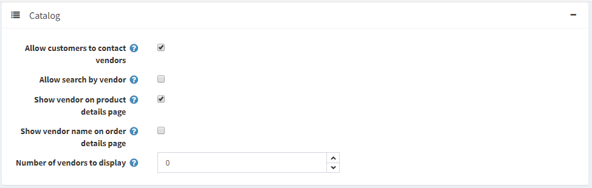

# 供应商管理

供应商代表一类特殊客户，应单独考虑。

本系统拥有多供应商和直销工具，让您无需存货或发货即可在线销售。在这种情况下，每件产品都分配给特定的供应商，供应商的详细信息（包括电子邮件地址）都已存储。

每当下订单时，都会向订单中每件产品的供应商发送电子邮件。电子邮件中包含产品、数量以及更多信息（如果需要）。供应商代表商家将商品发送给客户，商家通常会在月底向每家供应商付款。

来自多个独立供应商的产品会出现在通用产品目录中，即使您的产品由来自世界各地的数百家供应商供应，您的网站访问者也可以在一家网上商店购物。

可以为每个供应商提供管理员面板访问权限，以管理其产品、查看销售报告和有关其产品的订单详细信息。供应商无法查看彼此的活动。

款项将进入商店管理员的商家账户，然后管理员根据订单历史记录手动将资金分配给供应商，每个供应商的订单历史记录将单独跟踪和管理。通过这种方式，客户只会看到来自主公司的一笔费用。

以下步骤介绍了如何设置和提供可访问供应商门户网站的供应商记录。

## 设置供应商帐户

进入**客户 → 供应商**。供应商窗口将显示：

单击**添加按钮**。

### 供应商信息

在供应商信息面板中，定义以下供应商的详细信息：

- 供应商的**名称**。
- 供应商的**描述**。
- 供应商的**电子邮件**。**订单已下**通知将发送到此电子邮件。
- 选中**活动**复选框来激活供应商。
- 上传**供应商图片**。
- **管理员评论**——可选的评论或供内部使用的信息。

> [!NOTE|style:flat]
> 某些供应商消息模板（例如OrderPaid.VendorNotification和OrderPlaced.VendorNotification）默认处于禁用状态。请参阅[消息模板](./消息模板.md)部分，了解如何更改此设置。

### 供应商属性

当您创建一些额外的供应商属性时，供应商属性面板也会显示。

店主可以为供应商创建属性，就像为产品创建属性一样。这将允许多供应商商店收集并向客户显示有关供应商的更多信息。

在下面的[供应商属性](#地址-可选)部分中了解有关供应商属性的更多信息以及如何创建它们。

### 地址（可选）

在地址（可选）面板中，输入供应商的地址。

### 展示

在显示面板中，定义以下显示参数：

- 允许客户从预定义的选项列表中 选择页面尺寸。
    - 如果选中了上一个复选框，则定义页面大小选项（以逗号分隔）。
- 如果清除了上一个复选框，请输入页面大小。
- 显示供应商的顺序。

### 搜索引擎优化

请参阅[SEO 面板](./搜索引擎优化.md#seo面板)部分来设置 SEO。

## 将供应商分配给客户记录

此步骤是可选的，仅当您希望供应商能够登录其管理门户并管理其产品、订单和/或其他数据时才需要。

如果您不希望供应商访问管理区域，请忽略此步骤以允许店主管理所有供应商映射。

进入**客户 → 客户**。客户窗口将显示：

创建新客户或单击要分配供应商的客户记录旁边的**编辑**[添加新客户](./管理客户.md#客户信息)。有关创建客户的更多信息，请参阅添加新客户。

- 在客户信息面板中，确保在客户角色字段中选择了供应商客户角色。

> [!NOTE|style:flat]
> 供应商客户帐户不能属于默认管理员客户角色。

- 在客户信息面板中，找到**供应商经理**字段。选择之前创建的供应商记录。

供应商的客户账户设置完成后，供应商可以使用此客户账户管理产品、订单、发货和查看报告。登录后将显示公共商店顶部的管理链接。

## 供应商设置

本节介绍如何定义商店的供应商设置。这包括要显示的供应商数量、是否在商店的产品详细信息页面上显示供应商等等。

转到**配置 → 设置 → 供应商设置**。

此页面启用多商店配置；这意味着可以为所有商店定义相同的设置，也可以为各个商店定义不同的设置。如果您想要管理某个商店的设置，请从多商店配置下拉列表中选择其名称，然后选中左侧所需的所有复选框以为其设置自定义值。

### 常见的

在“常用”面板中，定义以下供应商设置：

- **允许客户申请供应商账户**。首先，用户填写供应商请求，从而创建供应商账户。然后，请求将提交给店主（通过电子邮件通知）以供接受。
    - 如果选中了上一个复选框，您可以选择服务条款，要求供应商在注册期间接受服务条款。

> [!NOTE|style:flat]
> 店主必须手动将适当的客户记录添加到“供应商”角色，才能授予对管理区域的访问权限。请参阅上面的[将供应商分配给客户记录](#将供应商分配给客户记录)部分。

> [!NOTE|style:flat]
> 要编辑这些**服务条款**，请转到内容管理 → 主题（页面）。找到VendorTermsOfService项并单击编辑。在[主题（页面）](./主题（页数）.md)部分中阅读更多相关信息。

- **允许供应商编辑信息**允许供应商在公共商店提供个人信息。
    - 选择是否**通知供应商信息变更**，以通知管理员有关供应商信息变更的信息。

- **每个供应商的最大产品数量**。

- **允许供应商进口产品**。

### 目录

在目录面板中，定义以下供应商设置：

- **允许客户联系供应商**（使用联系表单发送电子邮件）。此功能可在公共商店的供应商详细信息页面上使用。
- 允许在高级搜索页面上**按供应商搜索客户**。
- 选择是否**在产品详细信息页面显示供应商**（如果关联）。
- 选择是否**在订单详细信息页面显示供应商名称**（如果关联）。
- 公共商店中供应商导航块中**显示的供应商数量**。

### 供应商属性

您可以创建任意数量的供应商属性，例如公司名称或网站。

### 添加新属性

单击**添加按钮**以创建新的供应商属性及其值。“添加新供应商属性”窗口将显示如下：

在属性信息面板中，定义以下信息：

- **名称**：供应商属性的名称。
- **必需**：当需要某个属性时，供应商必须选择适当的属性值才能继续。
- 从**控件类型**下拉列表中，选择显示属性值所需的方法：下拉列表、单选按钮列表、复选框、文本框、多行文本框、只读复选框。
- **显示顺序**：供应商属性的显示顺序。

> [!NOTE|style:flat]
> 下拉列表、单选列表、复选框和只读复选框需要店主定义值。文本框和多行文本框控件类型不需要店主定义值，因为供应商需要填写这些文本框字段。

单击**保存并继续编辑**以进入“值”面板。

### 添加新属性值

在值面板中，单击添加新属性值以创建新的属性值。

在添加新属性值窗口中，定义以下信息：

- **名称**：属性值的名称。
- 选中**预选**复选框表示已为客户预先选择了属性值。
- **显示顺序**：属性值的显示顺序号。

您可以通过单击“值”面板中属性值旁边的相应按钮来编辑和删除属性值。

点击**保存**。新属性将显示在编辑供应商详细信息页面中。