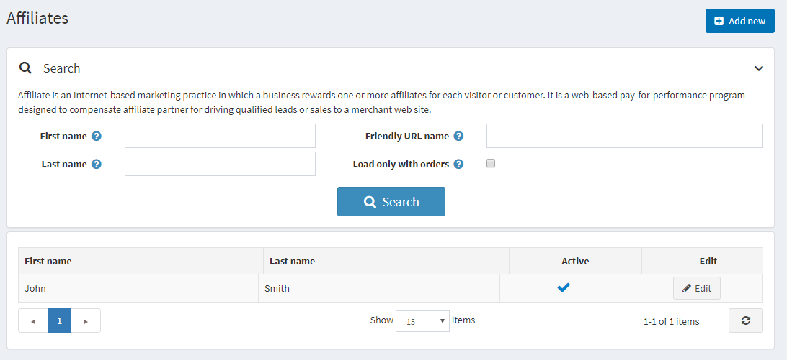

# 关联公司

联盟营销是一种基于互联网的营销实践，联盟会员会根据网站流量（每位访客或客户）获得奖励。这是一种基于网络的按效果付费计划，旨在补偿联盟合作伙伴将合格的潜在客户或销售从其网站引导到商家的网站。

联属会员是将客户推荐到您网站的第三方。本系统 软件可以跟踪这些推荐，以便商店管理员可以确定要支付给联属会员的佣金。一旦客户被分配了联属会员 ID，他们下的每个订单也将使用该 ID 进行标记。

在本系统中，联盟合作伙伴链接如下所示：（http://www.yourstore.com/?AffiliateID=N其中 N 是联盟 ID）。店主还可以指定友好的 URL名称字段以用于营销目的：http://www.yourstore.com/?affiliate=your_friendly_name_here。当您访问联盟详细信息页面时，会显示此 URL。每当在联盟网站上单击此超链接时，本系统 都会查找联盟 ID 查询字符串参数。

## 添加新会员

要添加附属机构，请转到**促销 → 附属机构**，然后单击**添加按钮**。

定义会员详细信息：

- 选中**活动**复选框来激活联属会员。
- **名**。
- **姓**。
- **电子邮件**。
- **公司名称**。
- 从下拉列表中选择**国家**。
- 如果选择的国家是美国，请同时指定**州/省**。
- **县/地区**。
- **城市**。
- **地址1**。
- **地址2**。
- **邮编/邮政编码**。
- **电话号码**。
- **传真号**。
- 在**管理员评论**字段中，您可以输入可选的评论或供内部使用的信息。
- 您可以指定**友好 URL 名称**，即用于营销目的的友好联盟 URL 链接，或者您可以将此字段留空，然后会使用默认 URL。默认情况下，联盟合作伙伴的 URL 如下：（`http://www.yourstore.com/?AffiliateID=N`其中 N 是联盟 ID）。

如果你点击**保存并继续编辑**，你会看到另外两个面板，你可以在其中检查此联属会员的有效性：
- 关联客户面板显示所有关联客户的列表。
- 关联订单面板展示所有关联订单的列表，当关联客户下单时，您可以在此面板中看到该订单。
