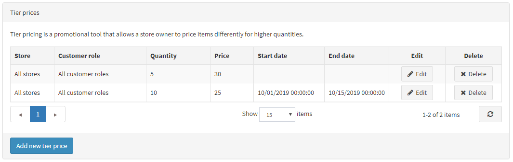
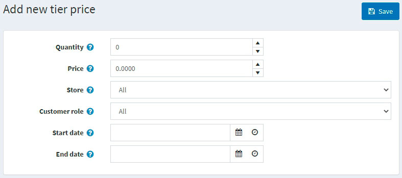
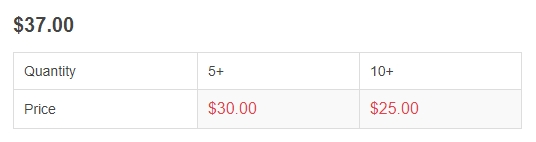

# 分级价格

分级价格是一种促销工具，允许店主在顾客购买大量特定产品时提供特价。此工具通常用于批发，但零售商也可以使用它来激励买家并推动更多销售。

分级价格可以在产品编辑页面应用于产品。转到**目录 → 产品**，选择要添加分级价格的产品，然后单击**编辑**。找到分级价格面板以添加新的分级价格：

> [!NOTE|style:flat]
> 您需要先保存产品，然后才能为产品页面添加分级价格。

## 添加分级价格

点击**添加新等级价格按钮**，添加新等级价格。将显示 添加新等级价格窗口：

- 在**数量**和**价格**字段中，定义适用于一定数量产品的价格。
- 如果您经营多家商店，请从**商店下拉列表**中选择您计划应用分级价格的商店。
- 从**客户角色下拉列表**中，选择定义等级价格所基于的客户角色，例如，所有客户、注册客户、访客。
- 在**开始日期**和**结束日期**字段中，输入分级价格的有效期。如果不适用，请将这些字段留空。

单击**保存**。等级价格表将使用新数据进行更新。

您现在可以在公共商店中查看更新后的产品详细信息页面：

当顾客将一定数量的产品添加到购物车时，价格将自动变化以反映折扣。
