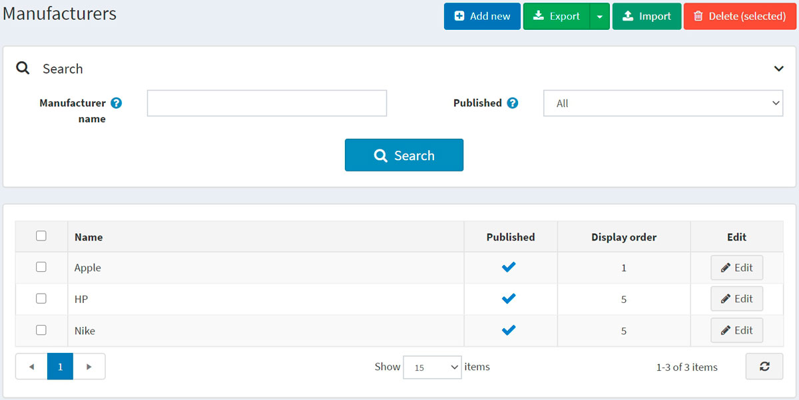
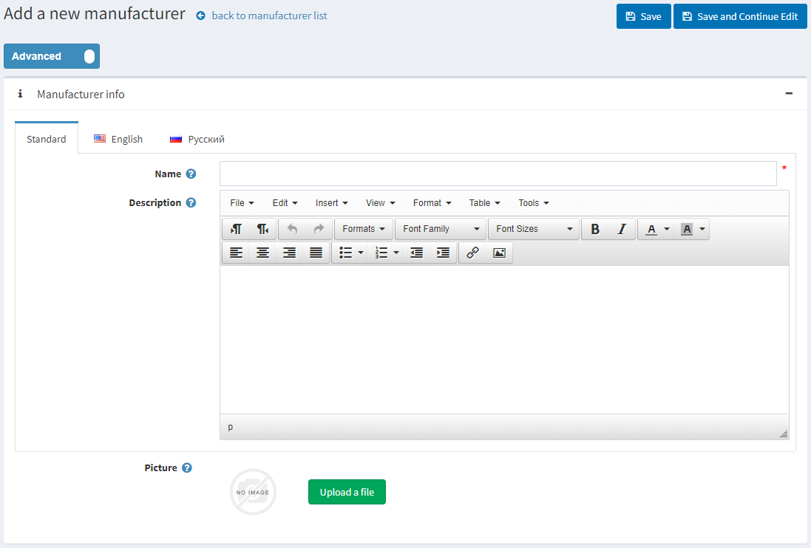
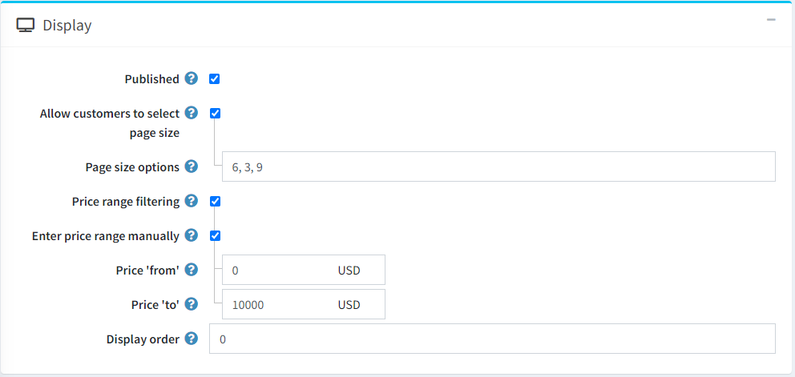
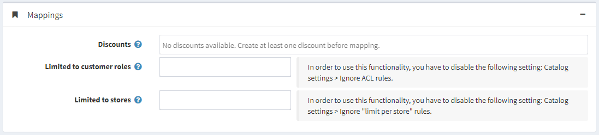
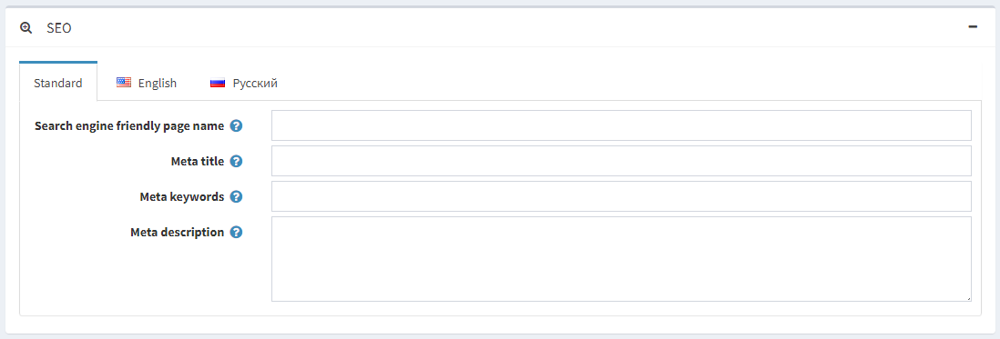
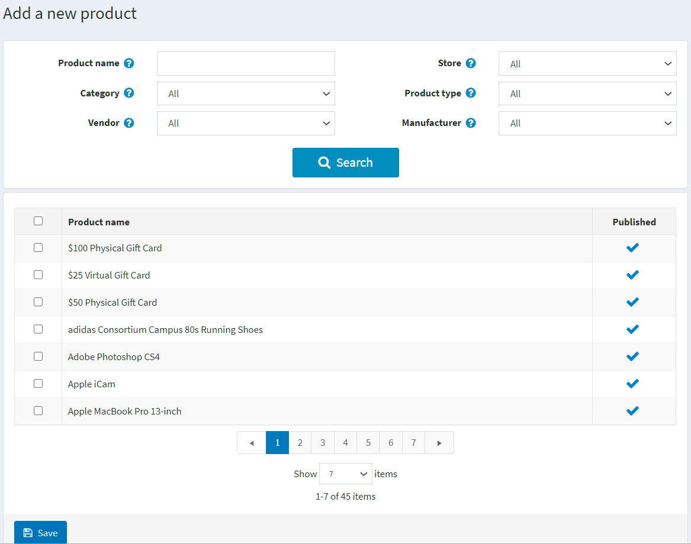
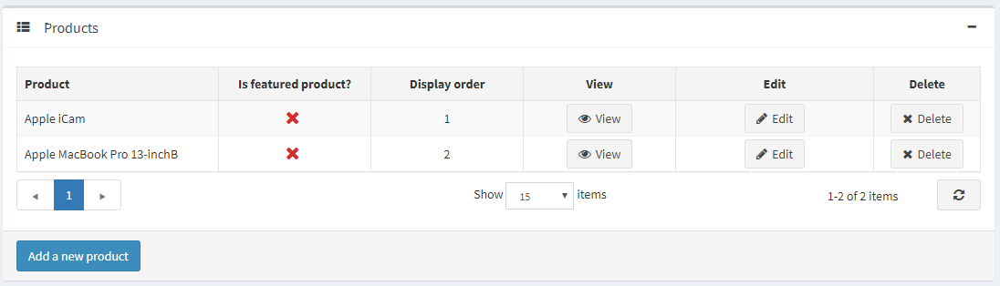

# 制造商


要管理制造商，请转到**目录 → 制造商**。



通过输入**制造商名称**、**已发布属性**或从**某个商店的所有制造商**（如果启用了多个商店）在搜索面板中搜索制造商。

> [!NOTE|style:flat]
> 要从列表中删除制造商，请选择要删除的项目，然后**单击删除（选定）按钮**。您可以单击“导出”按钮将制造商导出到外部文件以进行备份。单击“导出”按钮后，您将看到下拉菜单，使您可以**导出到 XML**或**导出到 Excel**。


## 添加新制造商

点击页面顶部的**添加新**按钮。将显示添加新制造商窗口。



此页面有两种模式：**高级模式**和**基本模式**。切换到基本模式（仅显示主要字段），或使用高级模式（显示所有可用字段）。

### 制造商信息

在制造商信息面板中，定义以下详细信息：

- **名称**：这是目录中显示的制造商的名称。
- **描述**：制造商的描述。使用编辑器进行布局和字体。
- **图片**：代表制造商的图片。从您的设备上传图片。

### 展示



在显示面板中，定义以下详细信息：

- 选中**已发布复选框**以使制造商在公共商店中可见。

- 选中**允许客户选择页面大小复选框**，使客户能够选择页面大小，即制造商详细信息页面上显示的产品数量。客户可以从店主在**页面大小选项**字段中输入的页面大小列表中选择页面大小。

    - 如果选中上一个复选框，将显示**页面大小选项**。输入以逗号分隔的页面大小选项列表（例如，10、5、15、20）。如果未选择任何选项，则第一个选项是默认页面大小。
    - 如果清除**允许客户选择页面大小复选框**，将显示**页面大小**选项。它设置此制造商产品的页面大小，例如每页“4”个产品。

> [!NOTE|style:flat]
> 比如您为某个制造商添加了七款产品，并将其页面大小设置为三，则在公众店铺中，该制造商详情页每页将显示三款产品，总页数为三页。


- 如果您想启用按价格范围过滤，请选中**价格范围过滤复选框**。
    - 如果您希望手动输入价格范围，请选中**手动输入价格范围复选框**。
        - 如果启用上述设置，请输入价格**从**。
        - 价格为**至**。

- **显示顺序**：显示制造商的顺序号。此显示编号用于对公共商店中的制造商进行排序（升序）。显示顺序为 1 的制造商将位于列表顶部。

- 如果您在**系统 → 模板**页面上安装了自定义制造商模板，则**制造商模板**字段可见。此模板定义如何显示此制造商（及其产品）。

### 映射



在映射面板中，定义以下详细信息：

- **折扣**：选择与此制造商相关的折扣。您可以在**促销 → 折扣**页面创建折扣。在[折扣](./折扣.md)章节中了解有关折扣的更多信息。

> [!NOTE|style:flat]
> 请注意，此处仅显示分配给制造商类型的折扣。折扣映射到制造商后，将应用于该制造商的所有产品。


> [!NOTE|style:flat]
> 如果您想使用折扣，请确保在**配置 → 设置 → 目录设置 → 性能面板**中**禁用忽略折扣（站点范围）设置**。


- 在**仅限客户角色**字段中，选择能够在目录中看到制造商的客户角色。如果不需要此选项，请将此字段留空，这样每个人都可以看到制造商。

> [!NOTE|style:flat]
> 为了使用此功能，您必须禁用以下设置：**配置 → 目录设置 → 忽略 ACL 规则（站点范围）**阅读有关访问控制列表的更多信息这里。


- 如果制造商的产品在**特定商店销售**，请在**仅限商店**字段中选择商店。如果不需要此功能，请将此字段留空。

> [!NOTE|style:flat]
> 为了使用此功能，您必须禁用以下设置：**目录设置 → 忽略“每个商店限制”规则（全站）**。


### 搜索引擎优化



在SEO面板中，定义以下详细信息：

- **custom-seo-page-name**：搜索引擎使用的页面名称。如果您将此字段留空，则制造商页面 URL 将使用制造商名称形成。如果您输入 custom-seo-page-name，则将使用以下自定义 URL `http://www.yourStore.com/custom-seo-page-name`。

- **Meta title**：指定网页的标题。它是插入到网页标题中的代码：
```html
<head>
    <title> Creating Title Tags for Search Engine Optimization & Web Usability </title>
</head>
```

- **Meta 关键字**：制造商元关键字，代表页面最重要主题的简短列表。Meta 关键字标签如下所示：`<meta name="keywords" content="keyword, keyword, keyword phrase, etc.">`

- **元描述**：制造商的描述。元描述标签是页面内容的简短摘要。元描述标签如下所示：`<meta name="description" content="Brief description of the contents of your page">`

单击**保存并继续编辑按钮**继续将产品添加到制造商。

### 产品

产品面板包含与所选制造商相关的产品列表；这些产品可按目录中的制造商进行筛选。店主可以向制造商添加新产品。请注意，您需要先保存制造商，然后才能添加产品。

单击**添加新产品**以查找要添加到此制造商的产品。您可以按**产品名称、类别、供应商、商店、产品类型和制造商**进行搜索。



选择您想要添加到制造商的产品并点击**保存按钮**。该产品将显示在所选制造商下。



将产品添加到制造商后，通过单击产品旁边的**编辑按钮**在产品表中定义以下信息：

- 是**特色产品**。
- **显示顺序**。

> [!NOTE|style:flat]
> 点击**查看**后，您将被重定向到“编辑产品详细信息”页面。


单击**保存**。


## 进口制造商

如果您不想手动将所有制造商添加到目录中，则可以使用导入选项。

> [!NOTE|style:flat]
> 在开始导入之前，您应该下载一个 Excel 格式的导入表格模板。为了准确无误地导入您的制造商，正确命名表格中的所有列至关重要（与下载的表格完全相同）。


无需填写所有表格字段。制造商将根据填写的字段创建。

导入需要大量内存资源。因此不建议一次导入超过 500-1000 条记录。如果您有更多记录，最好将它们拆分为多个 Excel 文件并分别导入。

