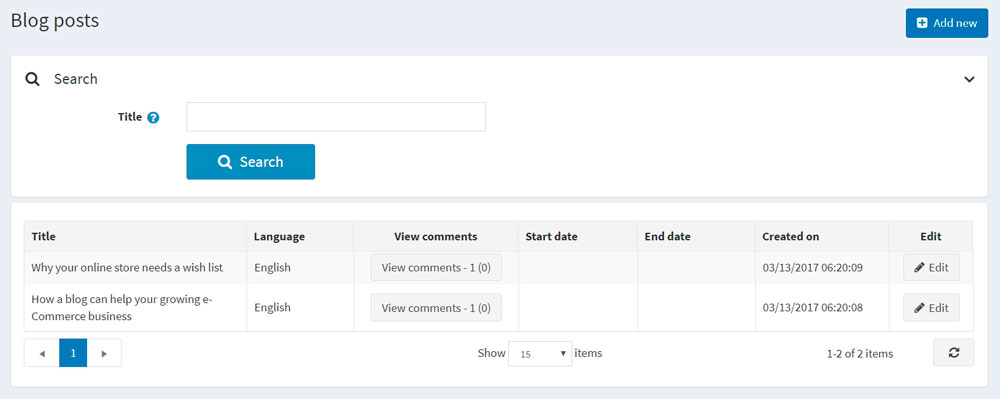
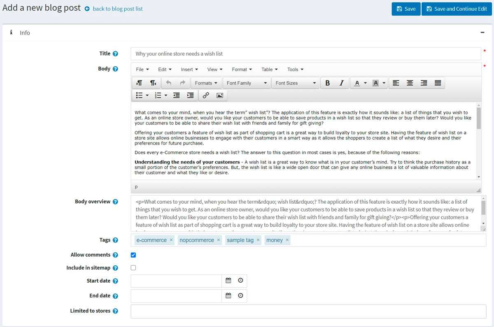
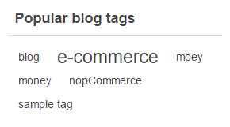
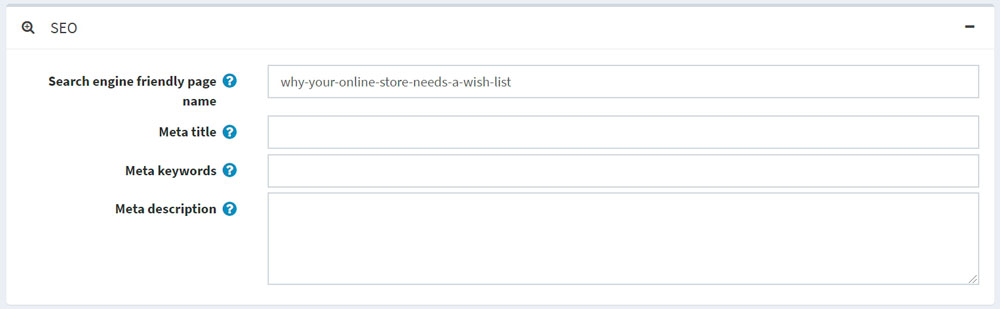
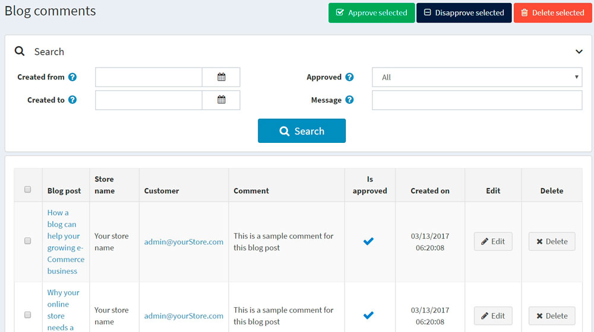
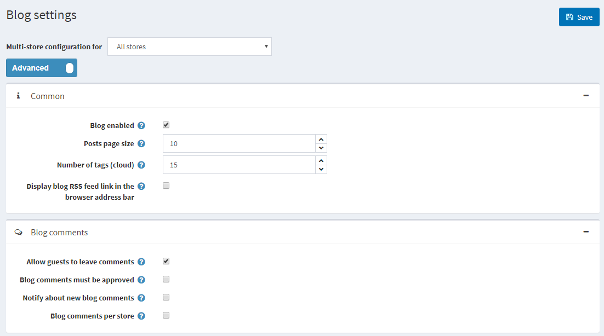

# 博客

博客是与现有客户建立联系、让他们了解最新产品或对他们进行教育以及寻找新客户的好方法。

要管理博客文章，请转到**内容管理→博客文章**。

## 添加新博客文章

单击**添加按钮**并填写有关新博客文章的信息。

### 信息

在信息面板中，定义以下博客文章详细信息：

- 如果启用了多种语言，请从**语言**下拉列表中选择此博客文章的语言。客户只能看到所选语言的博客文章。

- 输入此博客文章的**标题**。

- 输入此博客文章的**正文**。

- 如果您希望在列出所有博客文章的主博客页面上仅显示部分文本，则可以指定**正文概述**。

- 输入要在公共商店的博客页面上显示的**标签**。标签是此博客文章也可以用来识别的关键字。输入与此博客文章关联的标签列表（以逗号分隔）。与特定标签关联的博客文章越多，它在博客页面侧栏上显示的“热门标签”区域中的尺寸就越大。

- 选中**允许评论**复选框以使客户能够向该博客文章添加评论。

- 选中**包含在站点地图中**复选框以将博客文章包含在站点地图中。

- 以协调世界时 (UTC)输入显示此博客文章的**开始日期**和**结束日期**。

> [!NOTE|style:flat]
> 如果您不想定义博客文章的开始和结束日期，可以将这些字段留空。

- 在**仅限商店**字段中选择商店，以便仅为特定商店启用此博客文章。如果不需要此功能，请将此字段留空。

为了使用此功能，您必须禁用以下设置：**目录设置 → 忽略“每个商店限制”规则（全站）**。在此处阅读有关多商店功能的更多信息。

在编辑现有博客文章或单击新博客文章的**保存并继续编辑**按钮后，您可以单击右上角的**预览**按钮查看博客文章在网站上的显示方式。

### 搜索引擎优化

在SEO面板中，定义以下博客文章详细信息：

- **定义搜索引擎友好的页面名称**。例如，输入“the-best-news”作为您的 URL http://yourStore.com/the-best-news。将此字段留空，以便根据博客文章的标题自动生成它。
- 在**Meta标题**字段中覆盖页面标题（默认标题是博客文章的标题）。
- 输入要添加到博客文章标题的**元关键词**。它们代表页面上最重要主题的简短列表。
- 输入要添加到博客文章标题的**元描述**。元描述标签是页面内容的简短摘要。

## 管理博客评论

要管理博客评论，请选择**内容管理 → 博客评论**。

使用**批准所选**按钮批准所选评论，使用**不批准所选**按钮不批准所选评论。您还可以编辑或删除博客评论。如果删除，该评论将从系统中删除。

## 博客设置

您可以在**配置 → 设置 → 博客设置**中管理博客设置。此页面有两种模式：高级和基本。

此页面启用多商店配置；这意味着可以为所有商店定义相同的设置，也可以为各个商店定义不同的设置。如果您想要管理某个商店的设置，请从多商店配置下拉列表中选择其名称，然后选中左侧所需的所有复选框以为其设置自定义值。有关更多详细信息，请参阅多商店。

### 常见的

定义以下常用设置：

- 选中**博客已启用**复选框以启用商店中的博客功能。
- 在**帖子页面大小**字段中，设置每页的帖子数量。
- 在**标签数（云）**字段中，输入标签云中出现的标签数。
- 选中**在浏览器地址栏中显示博客 RSS 提要链接**复选框以在浏览器地址栏中显示博客 RSS 提要链接。

### 博客评论

定义以下博客评论设置：

- 选中**允许访客发表评论**复选框，以使非注册用户可以向博客添加评论。
- 如果博客评论必须经过管理员批准，请选中**博客评论必须得到批准**复选框。
- 选中通知**有关新的博客评论**复选框以通知店主有关新的博客评论。
- 选中**每个商店的博客评论**复选框以仅显示在当前商店中撰写的博客评论。

单击**保存**。

> [!NOTE|style:flat]
> 出于安全考虑，您可以为博客评论启用 CAPTCHA。有关更多信息，请继续参阅CAPTCHA部分。

