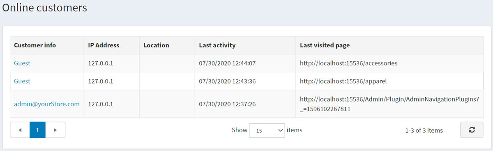

# 在线客户

在线客户部分使店主能够查看过去 20 分钟内在线的客户。此信息对店主很有用，因为它显示了上次访问的页面，并有助于决定将访客转化为买家所需的操作。

要访问此窗口，请转到**客户 → 在线客户**。

在线客户窗口包括以下列：

- **客户信息**：您可以通过点击链接查看和编辑客户信息。
- **IP 地址**：客户的当前 IP 地址
- **位置**：客户的 IP 地址位置。
- **上次活动**：在线客户上次登录的日期和时间。
- **上次访问的页面**：客户上次访问的页面。

> [!NOTE|style:flat]
> 要查看最后访问的页面，您需要在**配置 → 设置 → 客户设置**页面（帐户面板）上启用**存储最后访问的页面**设置。

