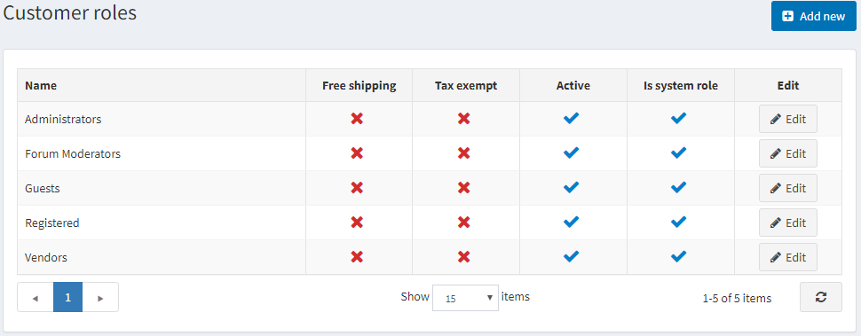
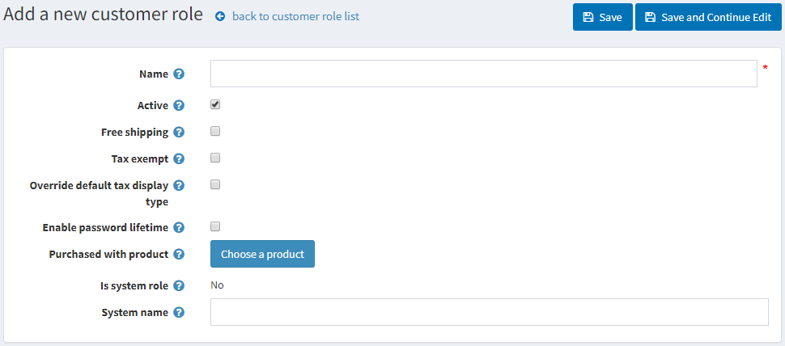

# 客户角色

本系统 中的客户角色可让您组建网店用户组。您可以创建各种组，例如商店管理员、购物者、[供应商](./供应商管理.md)等。您还可以使用[访问控制列表](./访问控制列表.md)授予这些组某些权利，例如折扣定价和其他特殊状态（例如免税、免费送货等）。

要管理客户角色，请转到**客户 → 客户角色**。客户角色窗口将显示如下：

单击**添加按钮**以添加新的客户角色。将显示“添加新客户角色”窗口：

定义以下信息：

- 客户角色的**名称**。

- 选择**Active**以使该角色处于活动状态。

- 选中**免费送货**复选框以使具有此角色的客户的订单能够享受免费送货。

- 选中**免税**复选框以使具有此角色的客户可以进行免税购买。

- 选择**覆盖默认税收显示类型**，然后从**默认税收显示类型**下拉列表中选择一种税收类型：
    - *含税*
    - *不含税*

- 选择**启用密码有效期**以强制客户在指定时间后更改密码。

- **随产品一起购买**。单击**选择产品**按钮以选择特殊产品。购买（付款）此产品后，客户将添加到此客户角色。

> [!NOTE|style:flat]
> 如果退款或取消订单，您必须手动从该角色中删除客户。

- **是否为系统角色**。此设置显示此角色是否在代码中使用。它是预定义的，无法修改。

- 客户角色的**系统名称**。

单击**保存**。