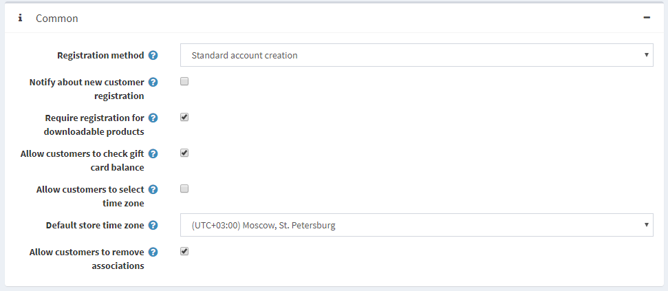
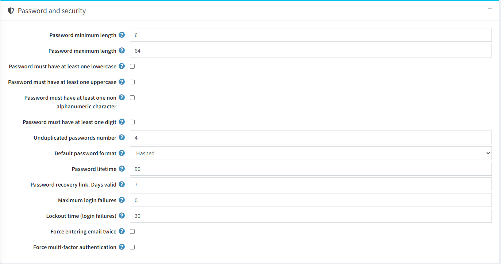
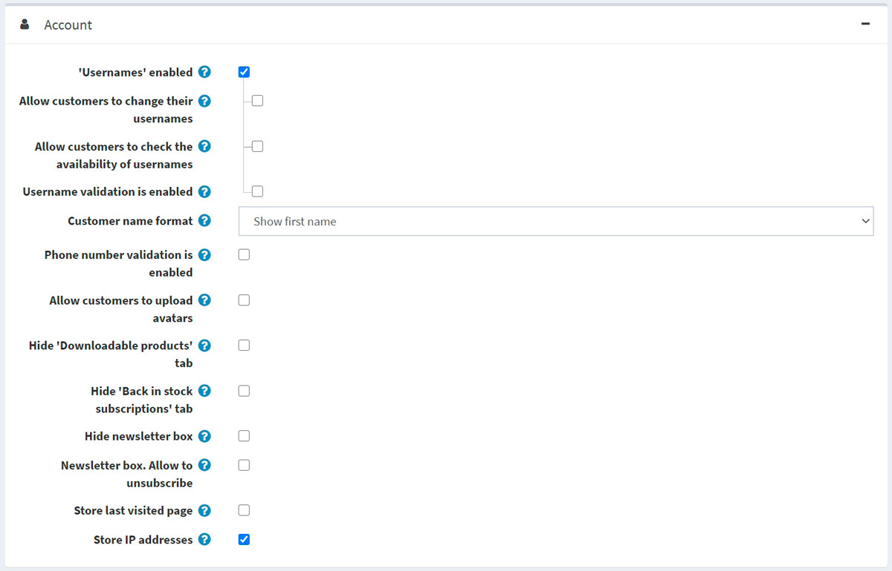
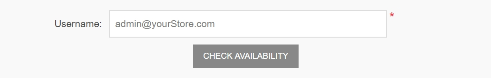
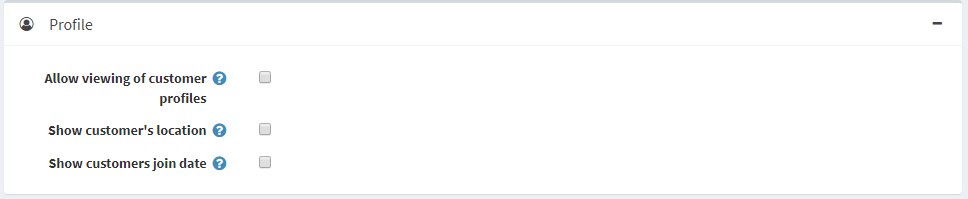
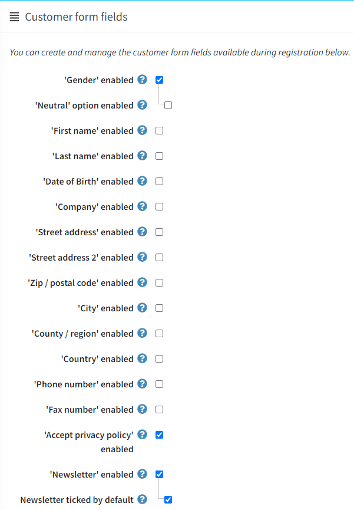
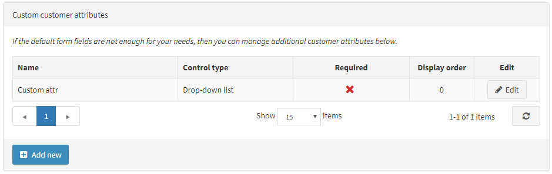
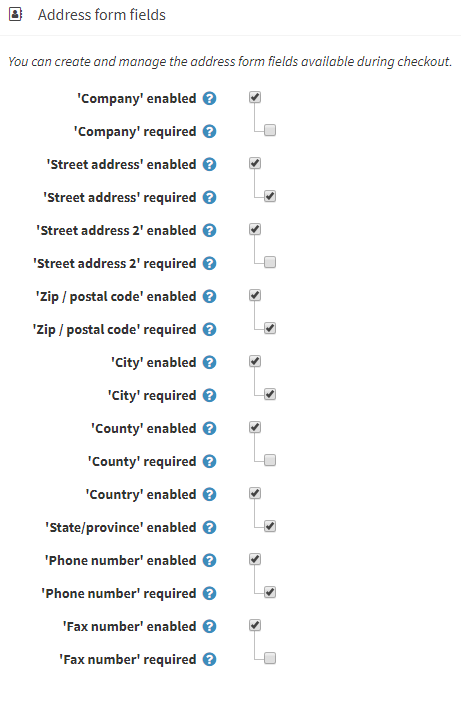
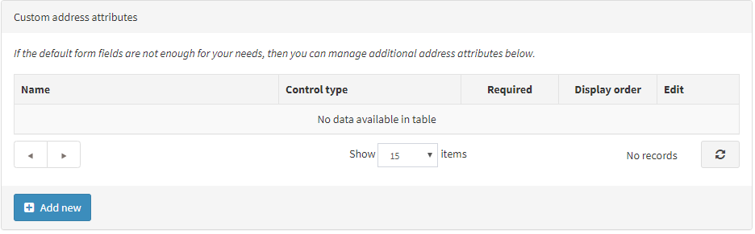

# 客户设置

客户设置包括允许客户上传头像、显示客户位置、更改姓名格式或加入日期等。

要定义客户设置，请转到**配置 → 设置 → 客户设置**。将显示客户设置窗口。此窗口包含六个面板：常用、密码和安全、帐户、个人资料、客户表单字段和地址表单字段。

1. 常用面板包含**常规**客户设置。
2. **密码**和**安全面板**包含可用于配置安全设置和密码复杂性的字段。
3. 帐户面板包含用于设置客户帐户的字段。
4. **个人资料**面板包含用于配置客户个人资料的字段。
5. **客户表单字段**面板包含客户注册页面上使用的字段。
6. **地址表单字段**面板包含用于在结账时详细填写客户地址的字段。

## 常见的

定义**常见的客户**设置如下：

- 选择**注册方法**如下：

    - **标准帐户创建**：用户可以注册；无需批准。
    - **注册后需要进行电子邮件验证**：用户可以注册；但是，他们必须接受发送给他们的确认电子邮件，然后他们的帐户才能获得批准。
    - **客户必须得到管理员批准**：用户可以注册；需要管理员批准。
    - **注册已禁用**：选择此选项可禁用注册。

- 选中**通知新客户注册**复选框，以使店主能够在新客户注册时收到电子邮件通知。

- 如果客户必须完成注册才能购买可下载产品，请选中**需要注册才能购买可下载产品**复选框。

- 使用**允许客户检查礼品卡余额**字段允许客户检查礼品卡余额。

> [!NOTE|style:flat]
> 如果选择了**允许客户查看礼品卡余额**字段，则必须在管理区域启用 CAPTCHA 设置（**配置 → 设置 → 常规设置 → CAPTCHA 面板**）。此功能可能不安全，需要 CAPTCHA 来防止和复杂化暴力破解。有关更多详细信息，请参阅CAPTCHA 设置。

- 在账户页面选择是否允许客户在公共商店中**选择时区**。**否则，将使用默认时区**。

- 从下拉列表中选择**默认商店时区**。

> [!NOTE|style:flat]
> 自动显示当前时区。

- 选择**允许客户删除关联**以允许客户删除外部身份验证关联。

## 密码和安全

- 设置**密码最小长度、密码最大长度、密码必须至少有一个小写字母、密码必须至少有一个大写字母、密码必须至少有一个非字母数字字符、密码必须至少有一个数字**来更改密码复杂性。

- **不重复密码数**是指一定数量的密码不能与之前的密码相同。

- 选择**默认密码格式**如下：
    - *清除*
    - *哈希值*
    - *加密*

> [!NOTE|style:flat]
> 此设置用于存储客户的密码，仅适用于新注册的客户。

- 在**密码有效期**中，输入密码过期的天数。

> [!NOTE|style:flat]
> 要使用**密码有效期**功能，请不要忘记在客户角色编辑页面（**客户 → 客户角色**）上为需要更改密码的角色**选择启用密码有效期**。[客户角色](./客户角色.md)

- 在**密码恢复链接**。**有效天数**字段中，输入密码恢复链接的有效天数。如果您不希望链接过期，请将其设置为 0。

- 输入**最大登录失败次数**。设置为 0 可禁用此功能。

- 在锁定时间（登录失败）中，输入锁定用户的分钟数。

- 如果您希望客户在注册期间输入两次电子邮件，请选中**强制输入两次电子邮件**复选框。

- **强制多重身份验证**。强制为访问控制列表中指定的客户角色激活多重身份验证（至少一个 MFA 提供程序必须处于活动状态）。

## 帐户

- 选中**用户名启用**复选框以使用用户名而不是电子邮件进行登录和注册。
    当选中‘用户名’启用复选框时，将显示以下选项：

    - **允许客户更改其用户名**：如果允许客户更改其用户名，请选择此选项。
    - **允许客户检查用户名是否可用**：选择此选项允许客户在点击“我的帐户 - 客户信息”页面上的“保存”按钮之前检查用户名是否可用。在这种情况下将显示“检查可用性”按钮；请参见下面的示例。

 danger 危险
不建议在生产环境中更改此选项。

- 如果您想启用用户名验证（在公共商店的“我的帐户”页面上注册或更改时），请选择**用户名验证已启用**字段。选中此复选框后，将显示以下选项：
    - **用户名验证规则**：在此字段中设置用户名的验证规则。您可以指定允许的字符列表或正则表达式。如果使用正则表达式，请选择下面描述的使用正则表达式进行用户名验证字段。
    - 选择**使用正则表达式进行用户名验证**字段以使用正则表达式进行用户名验证（在公共商店的“我的帐户”页面上注册或更改时）。

- 选择**客户名称格式**如下：
    - *显示电子邮件*
    - *显示用户名*
    - *显示全名*
    - *显示名字* 客户姓名将显示在商店中客户的新闻和博客评论旁边、论坛页面等上。

- 如果您想启用电话号码验证（在公共商店的“我的帐户”页面上注册或更改时），请选中**电话号码验证已启用**复选框。选中此复选框后，将显示以下选项：
    - **电话号码验证规则**：在此字段中设置电话号码的验证规则。您可以指定允许的字符列表或正则表达式。如果使用正则表达式，请选择下面描述的**使用正则表达式进行用户名验证**字段。
    - 选择**使用正则表达式进行电话号码验证**字段以使用正则表达式进行电话号码验证（在公共商店的“我的帐户”页面上注册或更改时）。
- **允许客户上传头像**：客户的头像将显示在商店的新闻和博客评论旁边、论坛页面等处。如果选择此选项，将显示以下复选框：
    - 选中**默认头像启用**复选框以显示默认用户头像。
- 选中**隐藏可下载产品选项卡**复选框以在“我的帐户”页面上隐藏此选项卡。
- 选中**隐藏重新进货订阅标签**复选框以在“我的帐户”页面上隐藏此标签。
- 如果您不想显示新闻通讯订阅框，请选中**隐藏新闻通讯框**复选框。
- 选中**新闻通讯框**。**允许取消订阅**复选框可在新闻通讯块中显示“取消订阅”选项。例如，在德国这是必需的。
- 选中**存储上次访问的页面**复选框以存储客户上次访问的页面。然后您可以在**客户 → 在线客户**页面上查看客户上次访问的页面。您可以清除此复选框以提高站点性能。
- 选中**存储 IP 地址**复选框以存储客户的最后一个 IP 地址。禁用时，它可以提高性能。

## 轮廓

- **允许查看客户资料**：此设置可以查看公共商店中其他客户的详细信息。
- 如果需要，请选择**显示客户位置**复选框。
- 如果需要，选中**显示客户加入日期**复选框。

## 客户表单字段

在客户表单字段面板中，定义系统是否启用以下表单字段：

- **已启用性别**
- **已启用中性选项**。如果启用此选项，您将能够指定三个性别选项之一：- 男性、女性、中性（根据德国法律）。
- **名字已启用**。启用后，您还可以决定此字段是否为必填项。
- **姓氏已启用**。启用后，您还可以决定此字段是否为必填项。
- **已启用出生日期**。启用后，您还可以决定此字段是否为必填项，并输入允许的最低年龄（例如，确保客户年龄在 18 岁以上）。
- **已启用公司**。启用后，您还可以决定此字段是否为必填项。
- **街道地址已启用**。启用后，您还可以决定是否需要此字段。
- **如果启用了第二个街道地址**，则启用“街道地址 2”。启用后，您还可以决定是否需要此字段。
- **已启用邮政编码**。启用后，您还可以决定此字段是否为必填项。
- **已启用城市**。启用后，您还可以决定此字段是否为必填项。
- **已启用县/地区**。启用后，您还可以决定此字段是否为必填项。
- **已启用国家/地区**。启用后，您还可以决定是否需要此字段。
- **已启用州/省**。启用后，您还可以决定是否需要此字段。注意：仅当启用“国家/地区”字段时，此字段才可见。
- **电话号码已启用**。启用后，您还可以决定此字段是否为必填项。
- **已启用传真号码**。启用后，您还可以决定是否需要此字段。
- 选中**接受隐私政策**复选框，要求客户在注册期间接受隐私政策。
- 选中**新闻通讯启用**复选框，以便在注册期间为客户提供新闻通讯订阅服务。
    - 当选中**新闻通讯启用**复选框时，将显示默认选中的新闻通讯复选框。这会自动将注册页面上的“新闻通讯”复选框设置为选中状态。

### 自定义客户属性

如果默认表单字段不能满足您的要求，您可以使用此表管理其他客户属性。客户属性的创建方式与结帐属性相同。有关更多详细信息，请参阅[结帐属性](./结帐属性.md)。

## 地址表单字段

在地址表单字段面板中，店主可以管理注册期间可用的地址表单字段。您可以从以下字段中选择启用和必填字段：

- **已启用公司**。启用后，您还可以决定此字段是否为必填项。
- **街道地址已启用**。启用后，您还可以决定是否需要此字段。
- **如果启用了第二个街道地址**，则启用“街道地址 2”。启用后，您还可以决定是否需要此字段。
- **已启用邮政编码**。启用后，您还可以决定此字段是否为必填项。
- **已启用城市**。启用后，您还可以决定此字段是否为必填项。
- **已启用县/地区**。启用后，您还可以决定此字段是否为必填项。
- **已启用国家/地区**。启用后，您还可以决定是否需要此字段。
- **已启用州/省**。启用后，您还可以决定是否需要此字段。注意：仅当启用“国家/地区”字段时，此字段才可见。
- **电话号码已启用**。启用后，您还可以决定此字段是否为必填项。
- **已启用传真号码**。启用后，您还可以决定是否需要此字段。

### 自定义地址属性

> [!NOTE|style:flat]
> 如果默认地址字段不能满足您的要求，您可以使用此表管理其他地址属性。地址属性的创建方式与结帐属性相同。有关更多详细信息，请参阅[结帐属性](./结帐属性.md)。

单击页面顶部的**保存**。