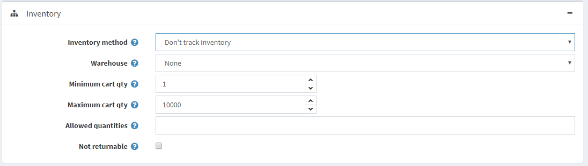
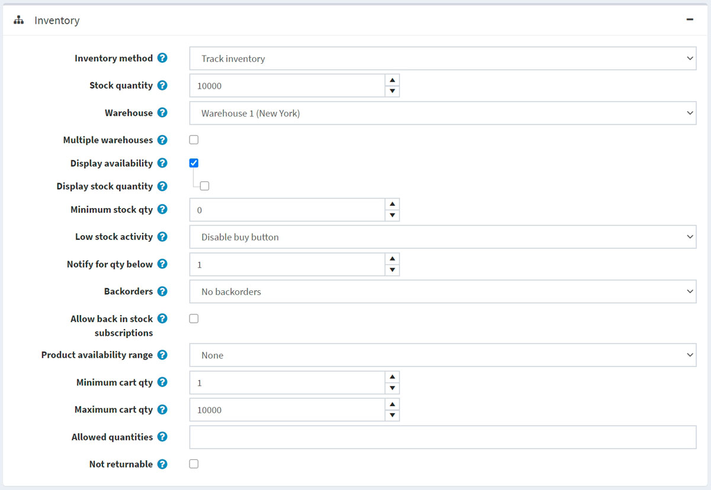
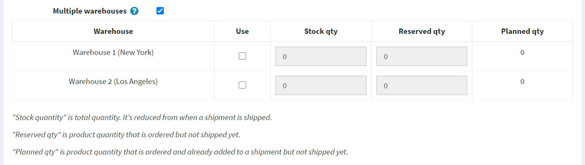
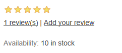
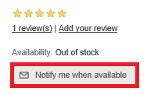
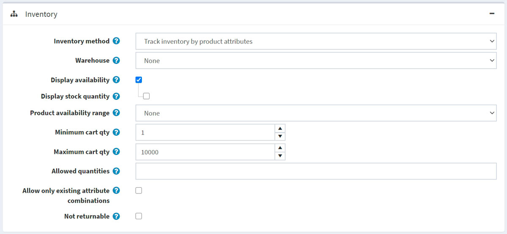
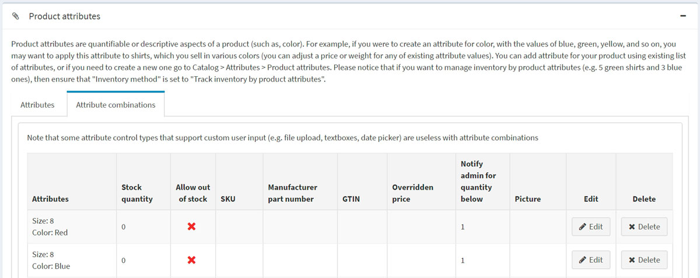
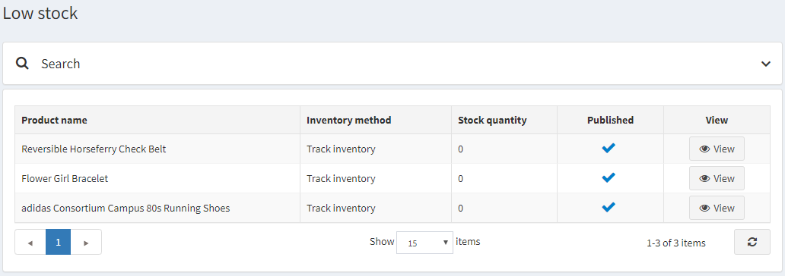

# 库存管理

库存管理是库存水平控制系统。包括设置库存和跟踪低库存。

要设置库存，请转到**目录 → 产品 → 编辑产品**。在编辑产品详细信息窗口中，转到库存面板。在此面板中，您可以选择以下三种库存方法之一：

- [库存管理](#库存管理)
  - [不跟踪库存](#不跟踪库存)
  - [追踪库存](#追踪库存)
  - [按产品属性跟踪库存](#按产品属性跟踪库存)

在接下来的部分中，我们将看到这些方法之间的区别。

## 不跟踪库存

有些产品可能不需要库存跟踪。例如服务、二手或定制商品。在这种情况下，店主可以选择不跟踪库存，方法是在**库存方法字段中选择**不跟踪库存选项。

在这种情况下，店主可以定义：

- 计算运费时使用的仓库。
- **购物车最小数量**是客户购物车中允许的数量，例如，设置为 3 表示只允许客户购买 3 件或更多件该产品。
- **购物车最大数量**是客户购物车中允许的数量，例如，设置为 5 表示仅允许客户购买 5 件或更少的该产品。
- 在**允许数量**字段中，输入您希望限制此产品的数量（以逗号分隔）。他们将收到一个下拉列表，其中包含您在此处输入的值，而不是允许他们输入任意数量的数量文本框。
- 如果此产品不可退货，请选中**不可退货**复选框。在这种情况下，客户将不允许提交退货请求。

## 追踪库存

如果需要跟踪库存，店主可以在两个选项中选择一种**库存方法**：跟踪库存（按产品）或按产品属性跟踪库存。跟踪库存选项适用于那些没有产品变体并且只需要知道剩余多少件商品的人。在本节中，我们将描述跟踪库存选项。选择此选项后，该部分将展开，显示新字段：

按如下方式设置库存：

- **库存数量**是总数量。每当订单发货时，库存数量就会减少。

- 选择计算运费时使用的**仓库**。您可以在**配置 → 运输 → 仓库**页面管理仓库。

- 如果您想要支持多个仓库的运输和库存管理，请选中“多个仓库”复选框。这样，您就可以按仓库管理库存： 如果您想要将此仓库用于产品，请单击相应行中的“使用” 。

    - 输入**库存数量**，即总数量。每次发货时，库存数量都会减少。
    - 输入**预留数量**，即已订购但尚未发货或尚未添加到货件中的产品数量。
    - **计划数量**是已订购且已添加到货件但尚未发货的产品数量。

    

- 为了防止客户下订单后发现产品缺货，您可以采取某些措施。选中**显示可用性**复选框以显示公共商店的库存可用性。
    - 如果需要，请选中**显示库存数量**复选框，以便客户在产品详细信息页面上看到产品库存数量（仅当选中**显示可用性**复选框时才会显示此复选框）。以下屏幕截图演示了客户在公共商店中将看到的内容：
    

- 在**最小库存数量**字段中，输入最小值，低于该值将采取进一步措施。

- 从**低库存活动**下拉列表中，选择当库存数量低于最低库存数量值时要采取的操作，如下所示：

    - **不采取任何行动**：店主仍然可以选择不采取任何行动。这意味着客户可以继续订购产品。
    - **禁用购买按钮**：库存不足时，购买按钮将被禁用。因此，客户无法购买此产品，但仍可以在商店中看到它。
    - **取消发布**：产品不再出现在商店中。当产品即将完全停止销售时使用。

- 在**通知以下数量**字段中，输入一个值，低于该值时将向管理员发送通知电子邮件。

- 店主可以设置**延期交货**，即购买时无法履行的订单。从延期交货下拉列表中，选择所需的延期交货模式，如下所示：
    - **无延期交货**：当没有库存时客户无法购买该产品。
    - **允许数量低于 0**：即使没有库存，客户也可以购买该产品。
    - **允许数量低于 0 并通知客户**：即使没有库存，客户也可以购买此产品。此外，他们还会收到以下消息的通知：缺货 - 已延期交货，一旦有货就会发货（在这种情况下，还应启用**显示可用性**选项） 。

- 选择**允许补货订阅**，以使客户能够订阅有关产品可用性的通知，如下面的屏幕截图所示：

- 选择当产品暂时缺货时向客户显示的**产品可用性范围**。您可以在配置 → 发货 → 日期和范围页面的产品可用性范围面板中设置可用性范围。有关更多详细信息，请参阅日期和范围页面。

- **购物车最小数量**是客户购物车中允许的数量，例如，设置为 3 表示只允许客户购买 3 件或更多件该产品。

- **购物车最大数量**是客户购物车中允许的数量，例如，设置为 5 表示仅允许客户购买 5 件或更少的该产品。

- 在**允许数量**字段中，输入您希望限制此产品的数量（以逗号分隔）。他们将收到一个下拉列表，其中包含您在此处输入的值，而不是允许他们输入任意数量的数量文本框。

- 如果此产品不可退货，请选中**不可退货**复选框。在这种情况下，客户将不允许提交退货请求。

## 按产品属性跟踪库存

如果您有多种产品属性组合，并且需要跟踪其库存数量，请选择按产品属性跟踪库存方法。选择此选项后，该部分将展开并显示新字段：

- 选择计算运费时使用的**仓库**。您可以在**配置 → 运输 → 仓库**页面管理仓库。

- 为了防止客户下订单后发现产品缺货，您可以采取某些措施。选中**显示可用性**复选框以显示公共商店的库存可用性。

    - 如果需要，请选中**显示库存数量**复选框，以便客户在产品详细信息页面上看到产品库存数量（仅当选中“显示可用性”复选框时才会显示此复选框）。以下屏幕截图演示了客户在公共商店中将看到的内容：
    

- 选择当产品暂时缺货时向客户显示的**产品可用性范围**。您可以在**配置 → 发货 → 日期和范围**页面的产品可用性范围面板中设置可用性范围。有关更多详细信息，请参阅日期和范围页面。

- **购物车最小数量**是客户购物车中允许的数量，例如，设置为 3 表示只允许客户购买 3 件或更多件该产品。

- **购物车最大数量**是客户购物车中允许的数量，例如，设置为 5 表示仅允许客户购买 5 件或更少的该产品。

- 在**允许数量**字段中，输入您希望限制此产品的数量（以逗号分隔）。他们将收到一个下拉列表，其中包含您在此处输入的值，而不是允许他们输入任意数量的数量文本框。

- 选择**仅允许现有属性组合**以仅允许将库存数量大于 0 的现有属性组合添加到购物车/愿望清单中。在这种情况下，您必须创建库存中的所有产品属性组合。

- 如果此产品不可退货，请选中不**可退货**复选框。在这种情况下，客户将不允许提交退货请求。

> [!NOTE|style:flat]
> 要为不同的属性组合设置**库存数量**，请转到编辑产品详细信息页面上的产品属性面板的属性组合选项卡。在此选项卡中，您可以定义是否允许某个属性组合缺货，以便即使产品缺货也能批准订单。
> 

> [!NOTE|style:flat]
> 要跟踪当前库存不足的产品，请转到**报告 → 库存不足**。库存不足报告包含当前库存不足的产品列表，即库存数量等于或小于产品详细信息页面 库存
> 
> 部分中设置的最低库存数量。 单击**查看**以查看产品详细信息页面，您可以在其中更改这些库存设置。有关本系统中报告的更多详细信息，请访问报告页面。

