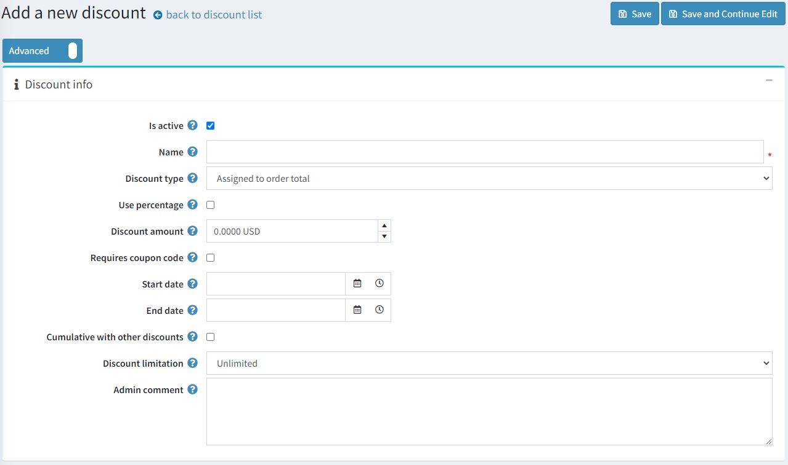

# 折扣

您可以使用折扣来获得特别优惠。它们可以应用于某些类别、产品、总金额等。

产品可以附加任意数量的折扣。如果应用了多个折扣，将根据所有可用折扣和团体会员资格自动为客户计算出最优惠的价格。

使用折扣的最常见方式是使用优惠券代码。客户在结账前在购物车页面上输入优惠券代码。

要查看折扣列表，请转到**促销→折扣**：

您可以在页面顶部按照各种搜索条件搜索折扣：

- 这些日期之间创建的折扣的**开始日期**和**结束日期**。
- **折扣类型**。
- **优惠券代码**。
- **折扣名称**是完整的折扣名称或其片段。
- **活跃**。

> [!NOTE|style:flat]
> 默认情况下本系统中没有给予折扣，因此您可以从头开始创建折扣并遵循自己的营销策略。

## 添加新折扣

要添加新折扣，请转到**促销 → 折扣**，然后单击**添加新折扣**。

此页面有两种模式：高级模式和基本模式。保留基本模式（仅显示主要字段），或切换到高级模式（显示所有可用字段）。

- 如果要将此折扣设置为有效，请选择**有效**复选框。

- 输入折扣**名称**。

- 从**折扣类型**下拉列表中，将折扣分配给所需选项，如下所示：

    - **分配给订单总额**：这些折扣应用于整个客户订单（订单总额）。
    - **分配给产品**：创建此折扣后，店主可以在产品详细信息页面将其分配给产品，或者在“应用于产品”面板中添加产品，保存新折扣后，该面板将显示在下方。
    - **已分配至类别**：创建此折扣后，店主可以在类别编辑页面上将其分配给类别，或在已应用于类别面板中添加类别，保存新折扣后，该面板将显示在下方。这样可以将折扣应用于此类别中的所有产品。
        - 如果选中，则会显示“应用于子类别”字段，以允许将此折扣应用于子类别。
    - **分配给制造商**：创建此折扣后，店主可以在制造商编辑页面上将其分配给制造商，或在应用于制造商面板中添加制造商，该面板将在保存新折扣后显示在下面。这样可以将折扣应用于此制造商的所有产品。
    - **分配给运费**：这些折扣适用于运费。
    - **分配给订单小计**：这些折扣适用于订单小计值。

- 如果您想应用百分比折扣，请选中**使用百分比**复选框。
    - 如果选中了上一个复选框，则会显示**折扣百分比**字段。
    - 您还可以**设置最大折扣金额**。将此字段留空以允许任何折扣金额。如果您使用分配给产品折扣类型，则它将分别应用于每个产品。

- 如果**清除使用百分比**复选框，您可以将折扣金额应用于订单或 SKU 。

- 选中**需要优惠券代码**复选框，以便客户使用优惠券代码来获得折扣。
    - 选中复选框后，将出现**优惠券代码**选项。您可以在此字段中输入所需的优惠券代码。这使客户能够在结账时输入优惠券代码以应用折扣。

> [!NOTE|style:flat]
> 如果条件合适，客户可以在订单中使用无限数量的优惠券代码。

- 如果您想指定折扣的**开始日期**和**结束日期**，请在协调世界时 (UTC) 的日历字段中选择它们。

- 与**其他折扣叠加选项**允许客户同时使用多种折扣。如果选择，此折扣可与其他折扣同时使用。

> [!NOTE|style:flat]
> 此功能仅适用于同类型的折扣。目前，不同类型的折扣已经可以累积。

- 您还可以限制折扣的使用次数。从**折扣限制**下拉列表中，选择有关折扣的所需限制：
    - **无限制**。
    - **仅限 N 次**：选择此选项并输入此折扣可用的次数。
    - **每位顾客可享受 N 次折扣**：选择此选项并输入每位顾客可享受此折扣的次数。

- 在**最大折扣数量**字段（仅当**折扣类型**设置为**已分配给产品、类别或制造商**时才可见）中，指定可以打折的最大产品数量。它可用于“买 2 送 1”之类的场景。

- 如果需要，请输入**管理员评论**。客户看不到该评论。

单击**保存**以保存更改或单击**保存并继续编辑**以继续编辑其他面板。

## 添加折扣要求

创建折扣后，如果您希望对折扣应用某些特定规则，则可以添加折扣要求。如果您想根据客户角色、消费金额或其他因素将折扣限制在某些用户类别，请设置要求。您可以使用单一要求类型或将多种类型分组并同时应用它们。

要添加折扣要求，请转到要求面板：

要添加新要求，请从下拉列表中选择**折扣要求类型**。

- 本系统有一种现成的需求类型：必须分配给客户角色。这允许您为某些客户组（角色）配置折扣。其他需求可作为插件在我们的市场上使用。

- 此外，您还可以创建一组需求来处理具有多个规则的复杂需求。需求组是创建折扣需求模板的有用功能。您只需创建一次需求组，然后在需要应用此限制时使用它。如果需要，您可以将一个需求组包含到另一个需求组中。需求使用布尔逻辑设置。例如，如果您希望将折扣分配给特定客户角色，或者在客户花费一定金额的情况下。此类需求和更多需求可作为插件在我们的市场上使用。

您可以设置无限数量的要求组，一个在另一个中。例如，更复杂的情况是，当您希望您的客户在他们是供应商并且花费了一定金额时获得折扣，或者当他们是论坛版主并且他们同时将某种产品放入购物车时。

当顾客在结账时使用折扣时，将显示如下内容：

## 常见的折扣类型

### 黑色星期五促销

黑色星期五总是在感恩节后的第二天。这是一个相当常见的折扣活动；几乎每个网上商店都会有黑色星期五促销。

- **名称**：您可以输入任何名称；它仅供内部使用。
- **折扣类型**：此处，当在添加所有费用（如运费和税费）之前对整个订单金额应用折扣时，它被分配到小计类型。这在这里很重要，因为我们希望购物车中的所有产品都打折。
- 我们可以按百分比应用折扣，或者直接输入所选货币的金额。这里是 10%。
- 最大**折扣金额**也可以受到限制，因此即使购物车中产品的总成本为 300 美元，客户也只能获得 10 美元的折扣。
- 此折扣需要**优惠券代码**。您无需输入优惠券代码即可申请折扣，但出于营销目的，不建议这样做。优惠券代码可让您查看活动结果。
- 折扣通常与时间有关。在这里，我们在**开始日期**和**结束日期**字段中输入了黑色星期五周末日期。
- 与其他折扣累积选项允许客户同时使用多种折扣。
- 最后一个设置是折扣限制使用。例如，每个客户可以应用一次此折扣。

### 购买一件商品，第二件可享受 50% 折扣

通常，您需要销售更多特定产品。在这种情况下，为了鼓励您的客户购买多件商品，您可以为他们提供折扣。让我们看看如何在您的商店中使用“购买一件商品，第二件可享受 50% 折扣”的折扣。

- **折扣类型**为已分配给产品。在已应用于产品面板中，您可以添加它们；在这里，它将是一件“超大号 T 恤”。
- 我们希望我们的客户购买第二件 T 恤可获得 50% 的折扣。
- 此折扣每位顾客可使用一次，因此**最大折扣数量**为 1。
- 您可以在需求面板中设置产品数量的要求。添加需求类型客户拥有所有这些产品，并添加一件数量为 2 的 T 恤。此需求类型可以在此处作为插件下载。阅读插件部分中的有关如何安装插件的信息。

如果您设置了 100% 的折扣，则可以使用此场景设置另一个流行的折扣“买一送一”。
