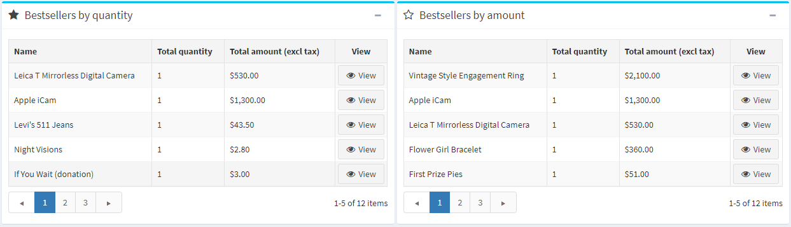
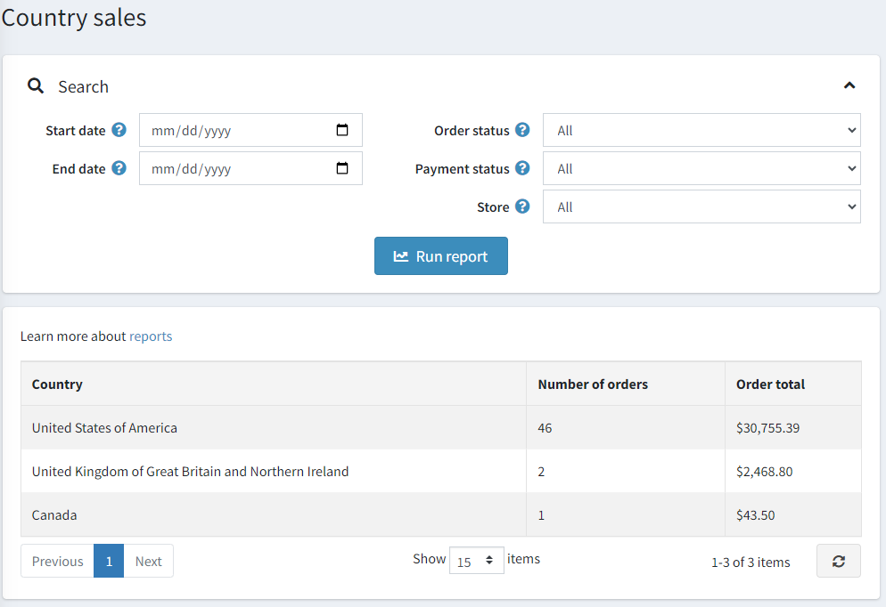

# 报告

报告对于管理很重要；它们允许监控商店的表现，跟踪关键指标并支持决策。本系统 报告提供对销售和客户信息的访问。

## 仪表板

仪表板是您访问管理区时看到的第一个页面。它使您能够查看商店统计信息，包括在选定时间段（年、月、周）内处理的订单总数、注册客户、库存不足的产品以及商店中最受欢迎的产品。

仪表板由几个块组成：

### 常见统计数据

在这里，您可以找到更详细报告的链接：

- 销售 → 订单
- 销售 → 退货请求
- 客户 → 注册客户
- 报告 → 库存不足

### 命令

该图表显示了过去一周、一个月、一年处理的订单数量。

### 新客户

该图表显示了过去一周、一个月、一年内注册的客户数量。

### 订单总数

此部分显示过去一天、一周、一月、一年处理的订单总数。订单按订单状态显示。

### 订单不完整

此部分显示当前未完成的订单数量。

### 最新订单

最新订单部分显示您最近下达的订单。

### 热门搜索关键词

此块显示最常用的关键字。

### 畅销书报告

此部分按数量和金额显示畅销商品。

## 销售摘要

此报告显示订单总数摘要。要生成报告，您可以使用以下过滤器：

- 搜索的**开始日期**。
- 搜索的**结束日期**。
- **订单状态**按特定订单状态搜索，例如“完成”。
- **付款状态**按特定付款状态搜索，例如“已付款”。
- **类别**，在特定类别中搜索。
- **制造商**：按特定制造商进行搜索。
- **帐单国家/地区**按订单帐单国家/地区进行筛选。
- 按特定供应商搜索**供应商**。
- 按特定产品进行搜索的**产品**。
- **分组依据**用于按时间段分组。当此选项设置为“天”时，将显示所选时间段（开始/结束日期）的日期列表。例如，“2020 年 11 月 8 日”、“2020 年 11 月 7 日”等。当设置为“周”时，将显示周列表（例如，“2020 年 12 月 7 日 - 2020 年 12 月 12 日”等）。当设置为“月”时，将显示月列表（例如，“2020 年 12 月”、“2020 年 11 月”等）。

然后点击**运行报告**。

## 低库存报告

低库存报告包含当前库存不足的产品列表。在下面的示例中，最低库存数量设置为 20，库存数量为 0；因此会为该产品生成低库存报告。您可以在添加产品时设置低库存设置。

要查看库存不足报告，请转到**报告 → 库存不足**。库存不足报告窗口将显示如下内容：

低库存报告可以通过**已发布**属性进行过滤，该属性代表产品的已发布属性。

在显示的表格中，单击**查看**可查看产品详情页，可更新库存数量。

## 畅销书，但从未购买过

了解最畅销的产品和从未购买的产品对于任何店主来说都是必不可少的。

首先，这可以帮助你做出更好的购买决定：你可以增加热门商品的数量，并从产品列表中排除不受欢迎的商品。在分析时，请考虑某些颜色是否卖得更快，或者你的产品销售是否取决于季节。

其次，定义最畅销和最不畅销的商品可以帮助您重新评估产品设计和营销。也许您的最佳商品卖得更快，只是因为它们在您的网店中的位置或更好的描述。想出各种选择并测试它们。为了更有效地做到这一点，请与您的客户互动。进行各种调查，找出畅销商品受青睐的原因，以及它们对您的买家来说有什么特别之处。利用这些见解来改善您的营销并增加销售额。

### 最畅销

要查看本系统中的畅销书，请转到**报告 → 畅销书**。输入以下一个或多个搜索条件来运行报告：

- **开始日期**或**结束日期**。
- 如果您想选择其中一个商店，请选择**商店**。
- **订单状态**，例如全部、待处理、处理中、完成或已取消。
- **付款状态**，例如全部、待处理、已授权、已付款、已退款、部分退款或作废。
- 选择**类别**。
- 选择**制造商**。
- 选择**帐单国家**。
- 选择**供应商**。

然后点击**运行报告**。

该报告将根据销售量和收入对最畅销产品进行细分：

### 从未购买过的产品

要查看从未购买的产品，请转至报告 → 从未购买的产品。输入以下一个或多个搜索条件来运行报告：

- 选择**类别**。
- 选择**制造商**。
- 如果您想选择其中一个商店，请选择**商店**。
- 选择**供应商**。
- **开始日期**或**结束日期**。

然后点击**运行报告**。

## 国家销售

国家/地区报告包含订单列表，其中包括每个国家/地区的订单数量和订单总额。这使店主可以查看每个国家/地区的订单。

要查看国家销售报告，请转到**报告→国家销售**。

要设置报告，请输入以下一个或多个搜索条件：

- 搜索的**开始日期**。
- 搜索的**结束日期**。
- **订单状态**，例如全部、待处理、处理中、完成或已取消。
- **付款状态**，例如全部、待处理、已授权、已付款、已退款、部分退款或作废。
- 如果您想选择其中一个商店，请选择**商店**。

然后点击**运行报告**。

## 客户报告

客户报告为店主提供有关注册客户及其订单的一般信息。您可以在**报告 → 客户报告**菜单中找到各种报告。

### 注册客户

要运行此报告，请转到**报告 → 客户报告 → 注册客户**。此报告显示一定时期内的注册客户数量。您可以跟踪过去一天、一周、两周、一个月和一年内注册的用户数量。

### 客户订单总额

要运行此报告，请转到**报告 → 客户报告 → 按订单总额划分的客户**。在此报告中，您可以查看订单总支出和客户下达的订单数量。

输入一个或多个搜索条件来编制报告：

- 注册**开始日期**。
- 注册**结束日期**。
- **订单状态**，例如全部、待处理、处理中、完成或已取消。
- **付款状态**，例如全部、待处理、已授权、已付款、已退款、部分退款或作废。
- **运输状态**，例如全部、无需运输、尚未运输、部分运输、已运输、已交付。

然后点击**运行报告**。

### 按订单数量划分的客户

要运行此报告，请转到报告 → 客户报告 → 按订单数量显示客户。此报告根据发出的订单总数显示前 20 名客户。

输入一个或多个搜索条件来编制报告：

- 注册**开始日期**。
- 注册**结束日期**。
- **订单状态**，例如全部、待处理、处理中、完成或已取消。
- **付款状态**，例如全部、待处理、已授权、已付款、已退款、部分退款或作废。
- **运输状态**，例如全部、无需运输、尚未运输、部分运输、已运输、已交付。

然后点击**运行报告**。

