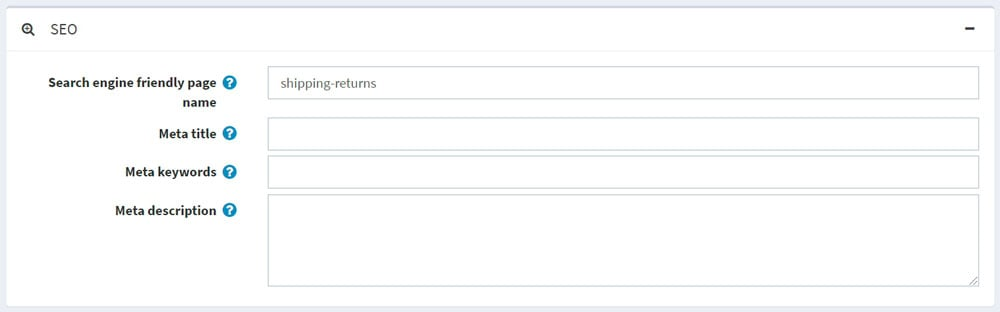

# 搜索引擎优化

SEO 代表搜索引擎优化；这是一个从搜索引擎上的“免费”、“有机”、“编辑”或“自然”搜索结果中获取流量的过程。所有主要搜索引擎都有主要搜索结果，其中网页和其他内容（如视频或本地列表）根据搜索引擎认为与用户最相关的内容进行显示和排名。

本系统支持商店中各种页面的 SEO 技术。

## SEO 设置

本系统有一些常规 SEO 设置可以应用于整个商店。

要编辑 SEO 设置，请转到**配置 → 设置 → 常规设置**。然后进入SEO面板：

- 在**默认页面标题**字段中，输入商店页面的默认标题。
- 在**页面标题 SEO 调整**字段中，选择所需的页面标题 SEO 调整，如下所示：
- 页面名称位于标题中的商店名称之后： YOURSTORE.COM| PAGENAME
- 商店名称位于标题中的页面名称之后：PAGENAME |YOURSTORE.COM
- 指定**页面标题分隔符**。
- 输入商店页面的**默认元关键字**。这可以被各个类别、制造商、产品和其他一些页面覆盖。
- 输入商店页面的**默认元描述**。这可以被各个类别、制造商、产品和一些其他页面覆盖。
- 输入您商店主页的主页**标题**。
- 输入商店主页的主页**元描述**。
- 选择**生成产品元描述**以根据产品的简短描述自动生成产品元描述（如果未在产品详细信息页面上指定）。
- 选择**WWW 前缀要求**。例如，http://yourStore.com/可以自动重定向到http://www.yourStore.com/。选择以
- 选项之一：
    - 无所谓
    - 页面应该有 WWW 前缀
    - 页面不应带有 WWW 前缀
- 选中**转换非西方字符**复选框以删除 SEO 名称中的重音符号。例如，将 é 转换为 e。
- 选中**启用规范 URL**复选框可将 URL 转换为规范 URL，从而确定两个语法不同的 URL 是否可以指向具有相同内容的页面。
- 选中**Twitter META 标签**复选框以在产品详细信息页面上生成 Twitter META 标签。
- 选中**Open Graph META 标签**复选框以在产品详细信息页面上生成 Open Graph META 标签。
- 选中**微数据标签**复选框以在产品详细信息页面上生成微数据标签。
- 输入**自定义 `<head>` 标签**。例如，一些自定义 `<meta>` 标签。或者留空以忽略此设置。

## SEO面板

本系统中有多种类型的页面，您可以为其设置单独的 SEO 设置，包括元关键字、元描述、元标题和搜索引擎友好的页面名称。这可以在相应管理区域部分的 SEO 面板上完成。

- 在**搜索引擎友好页面名称**字段中，输入搜索引擎使用的页面名称。如果您不输入任何内容，则网页 URL 将使用页面名称形成。如果您输入custom-seo-page-name，则将使用以下自定义 URL：`http://www.yourStore.com/custom-seo-page-name`。

- 在**Meta 标题**字段中，输入所需的标题。标题标签指定网页的标题。它由网络浏览器检索，也由搜索引擎（例如 Google）使用，以在搜索结果中显示网页：

- 输入所需的**Meta 关键字**。它们简明扼要地描述网页内容，因此是搜索引擎了解网站内容的重要指标。Meta 关键字有助于告诉搜索引擎该网页的主题是什么。关键字通常是小写的。

- 在**元描述**字段中，输入页面描述。元描述提供了网页的摘要。搜索引擎（例如 Google）通常会在搜索结果中显示元描述，这会影响点击率：
    元描述可以是任意长度，但 Google 通常会将摘要截断为约 155-160 个字符。最好将元描述保持足够长以提供足够的描述性，因此建议将描述写在 50-160 个字符之间。请注意，“最佳”长度会因情况而异，您的主要目标应该是提供价值并推动点击。

## 搜索引擎友好的页面名称

要查看商店中使用的所有搜索引擎友好页面名称，请转到**系统 → 搜索引擎友好页面名称**。

在这里，您可以按**名称**、**语言**或**是否处于活动状态属性**筛选搜索引擎友好页面名称。您还可以使用**删除所选**按钮删除一个或多个选定的搜索引擎友好页面名称。在**编辑页面**列中，您可以看到用于导航到相应页面的按钮。