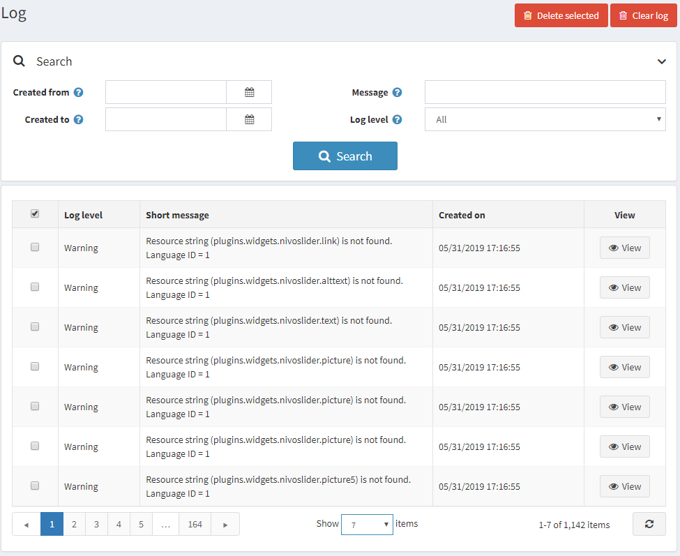
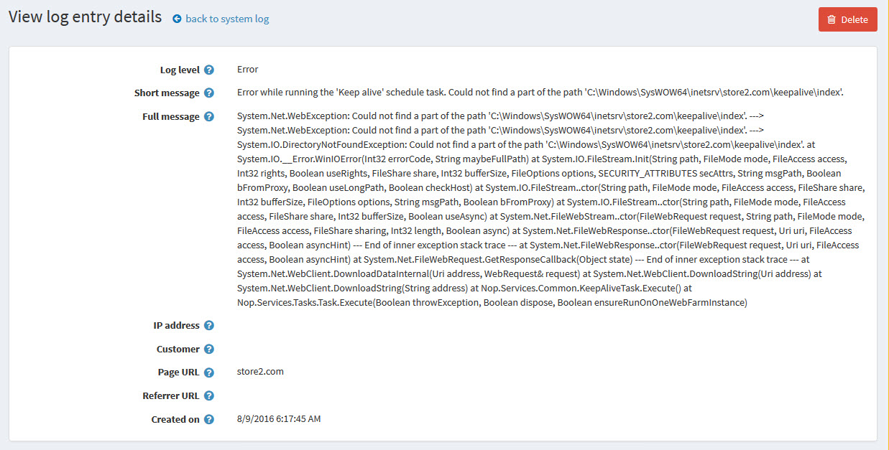

# 日志

系统日志报告显示系统中创建的所有错误、警告和信息消息的列表。要查看日志，请转到**系统 → 日志**。日志窗口将显示如下内容：

日志项包括日志类型、错误描述和日期。您可以点击**删除所选**按钮删除所选日志项，或点击**清除日志**按钮清除整个日志。

要搜索系统日志，请输入以下一条或多条信息：

- 在**创建日期**字段中，选择搜索的开始日期。
- 在**创建日期**字段中，选择搜索的结束日期。
- 在**消息**字段中，选择要搜索的消息或其片段。
- 从**日志级别**下拉列表中，选择要显示的日志信息类型，如下所示：
    - *全部*
    - *调试*
    - *信息*
    - *警告*
    - *错误*
    - *致命的*

点击**搜索**，根据搜索条件显示日志系统窗口。

## 查看系统日志详细信息

单击**查看**将显示所发生错误的更多详细信息，如下所示：

如果需要，您可以单击**删除**从系统中删除日志。