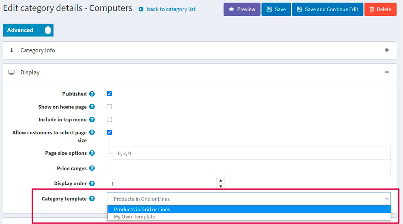

# 模板

在本站中，您可以为类别、制造商、产品和主题指定备用布局模板。您可以在**系统 → 模板**页面上查看现有模板的列表：

系统默认有一个类别模板、一个制造商模板、一个主题模板、两个产品模板。

管理区域中的每个类别、制造商、产品和主题详细信息页面都允许您在编辑实体时选择模板。例如：

> [!NOTE|style:flat]
> 仅当您为类别、制造商和主题创建了多个模板时，您才会看到模板下拉列表。

> [!NOTE|style:flat]
> 由于我们有两种产品类型：简单产品和分组产品（带有变体的产品），因此我们默认创建了两个适当的产品模板：
> 
> 因此，要查看产品详细信息页面上的模板下拉列表，您需要创建两个适合所选产品类型的产品模板。请参阅下文了解如何执行此操作。

## 添加新模板

让我们看看如何在产品模板示例中创建模板。假设您要为简单产品类型创建模板。

1. 首先，您需要创建一个合适的模板文件。如果您已经在正确的文件夹中放置了一个模板文件，请跳过此步骤。

- 前往`Views\Product`文件夹。
- 复制`ProductTemplate.Simple.cshtml`文件并重命名。假设它为`ProductTemplate.MyNewOne.cshtml`。
- 修改文件的代码`ProductTemplate.MyNewOne.cshtml`以满足您的需要。

2. 转到**系统 → 模板**页面并进入产品模板面板：

3. 在添加新记录块中，填写以下表格：

- 输入模板的**名称**`My New One`。在我们的例子中，它是。
- 输入**视图路径**。在我们的例子中，它是`ProductTemplate.MyNewOne`。
- 输入此模板的**显示顺序**。1代表列表顶部。
- 仅适用于产品模板。不适用于其他模板：输入**忽略的产品类型 ID（高级）**。默认情况下，我们有两种产品类型和适当的产品类型 ID：简单（ID 5）和分组（ID 10） 。由于我们正在为简单产品类型创建模板，因此我们应该忽略ID 为 10 的分组产品类型。

因此表单看起来如下：

4. 单击**添加新记录**按钮保存新模板。

保存新模板后，您将在产品详细信息页面上看到它，现在您可以从两个产品模板中进行选择：

> [!NOTE|style:flat]
> 无需使用**忽略的产品类型 ID（高级）**字段来限制产品模板。如果将此字段留空，您将能够将产品模板用于所有类型的产品。

