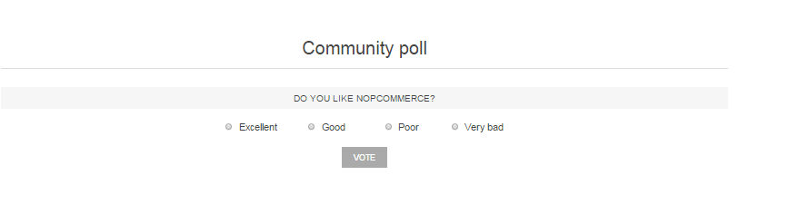
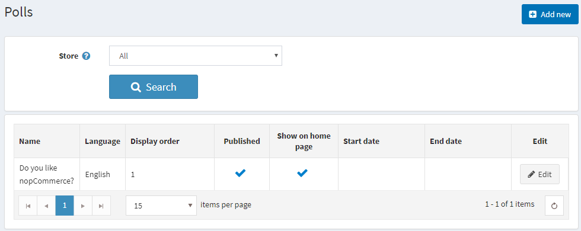
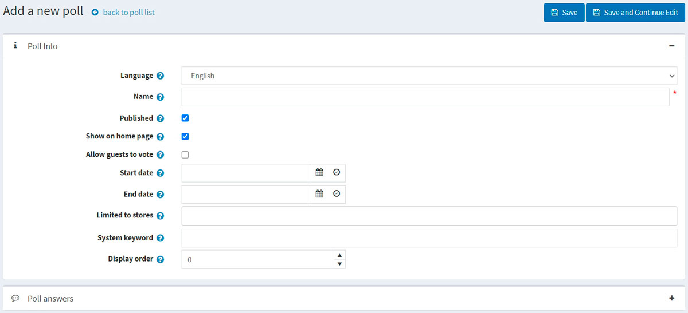
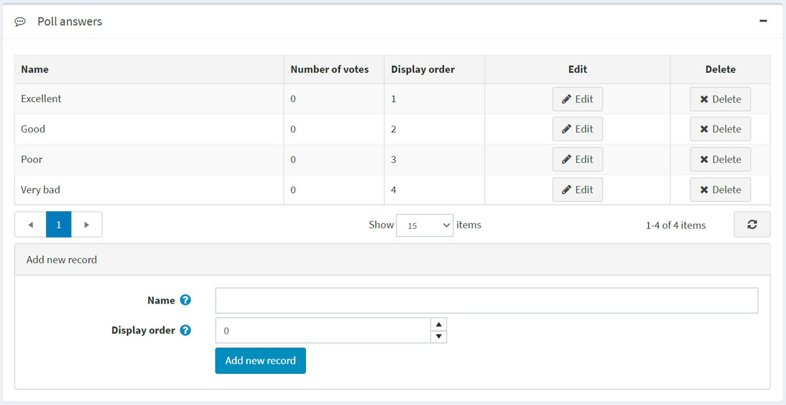

# 民意调查

投票功能可让您的电子商务网站更具互动性。您可以在电子商务网站上使用投票功能，方法有很多。一种流行的方法是将其用作简短的客户满意度调查。人们喜欢被征求反馈，这是一个了解您作为在线商家表现如何的好机会。

民意调查如下所示：

要查看所有民意调查并添加新的民意调查，请转到**内容管理→民意调查**。

要搜索某个商店使用的投票，请从列表中选择商店名称。

## 添加民意调查

要添加新的投票，请点击右上角的**添加按钮**。

### 投票信息

为新民意调查定义以下详细信息：

- 如果启用了多种语言，请从**语言**下拉列表中选择此投票的语言。客户只能看到所选语言的投票。

- 输入此调查的描述性**名称**。这是客户将看到的文本。例如，“您对我们的商店有什么看法？”

- 选中**已发布**复选框以使此投票处于活动状态。

- 如果您想在主页上**显示投票**，请选中在主页上显示投票复选框。

- 选中**允许访客投票**复选框以使未注册用户可以在民意调查中投票。

- 以协调世界时 (UTC)输入**开始日期**和**结束日期**。

> [!NOTE|style:flat]
> 如果您不想定义投票的开始和结束日期，可以将这些字段留空。

- 在**仅限商店**字段中选择商店，以仅对特定商店启用此投票。如果不需要此功能，请将此字段留空。

为了使用此功能，您必须禁用以下设置：**目录设置 → 忽略“每个商店限制”规则（全站）**。

- 在系统关键字字段中，您可以指定民意调查的显示位置。例如，LeftColumnPoll。
- 输入投票的**显示顺序**。值1代表列表顶部。

单击**保存并继续编辑**以进入投票答案面板。

### 民意调查答案

填写以下民意调查答案信息：

- 将显示给客户的**名称**。
- **显示顺序**。值为1表示位于列表顶部。

然后点击**添加新记录**按钮保存答案。

完整的答案列表如下：

然后，您可以**编辑**记录并在需要时**删除**它们。
