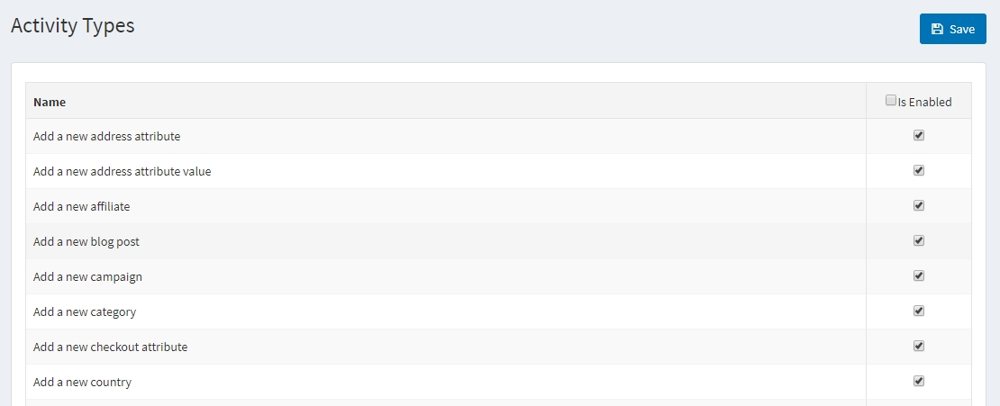
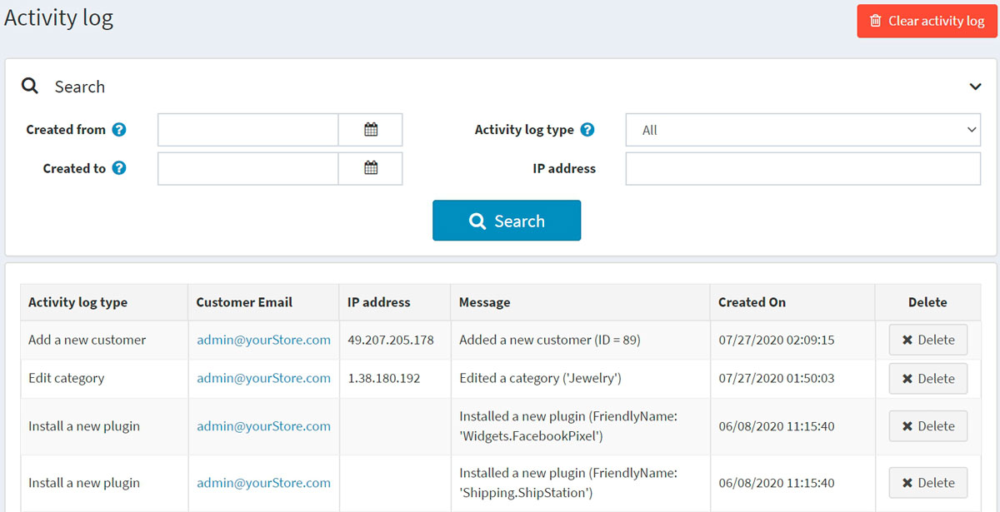

# 活动日志

活动日志用于跟踪系统中的用户活动。默认情况下，本系统启用了所有活动类型的跟踪。店主可以通过清除相关复选框来禁用它们。列出的大多数活动类型仅供管理员使用，并记录管理区域中的操作。但是，有些是供公共商店使用的，并跟踪购物者的操作（例如添加到购物车/愿望清单或下订单）。

## 客户活动类型

要启用/禁用活动类型，请转到**客户→活动类型**。

选中要启用的活动类型旁边的**已启用**复选框。然后点击右上角的**保存**。

## 客户活动日志

要搜索活动日志，请转到**客户 → 活动日志**。

使用以下一个或多个字段定义搜索条件：

- 要按日期范围搜索，请在**创建日期**和**创建日期**字段中输入日期范围。或者，您可以点击下拉日历并选择所需的日期范围。
- 客户活动的**活动日志类型**。
- **IP 地址**，通过 IP 地址搜索客户。

您可以通过单击旁边的**删除按钮**来清除某个活动日志项，或者通过单击右上角的“清除活动日志”按钮来清除整个活动日志。
