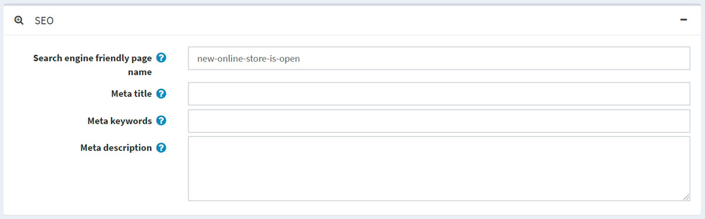
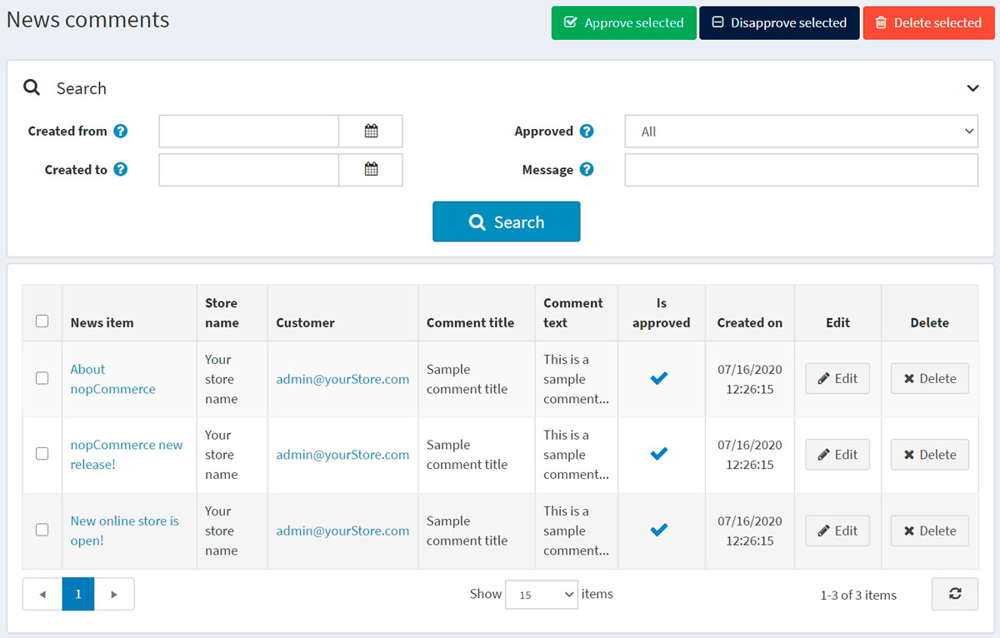

# 消息

您可以在商店中**发布新闻**。可以是任何重要消息，例如**最新发布的信息**、**公司更新**等。

新闻将显示在您的商店主页或网站页脚菜单中。

要管理新闻，请转到**内容管理 → 新闻项目**。所有新闻列表将显示如下：

## 添加新闻

要添加新的新闻，请单击**编辑**按钮并填写有关新闻的信息。

### 信息

在信息面板中，定义以下新闻项目的详细信息：

- 如果启用了多种语言，请从**语言**下拉列表中选择此新闻项目的语言。客户将只能看到所选语言的新闻。

- 输入此新闻的**标题**。例如：“我们新的本系统商店开业。”

- 在**简短描述**字段中，输入此新闻的摘要。这是访问者将在公共商店的新闻列表中看到的文本。

- 在**完整描述**字段中，输入此新闻项目的文本。

- 选中**允许评论**复选框以使客户能够向新闻项目添加评论。

- 以协调世界时 (UTC)输入显示此新闻的**开始日期**和**结束日期**。

> [!NOTE|style:flat]
> 如果您不想定义新闻项目的开始和结束日期，可以将这些字段留空。

- 在**仅限商店**字段中选择商店，以仅向特定商店启用此新闻项目。如果不需要此功能，请将此字段留空。

> [!NOTE|style:flat]
> 为了使用此功能，您必须禁用以下设置：目录设置 → 忽略“每个商店限制”规则（全站） 。在此处阅读有关多商店功能的更多信息。

- 选中**已发布**复选框以在您的商店中发布该新闻。

在编辑现有新闻项目或单击新闻的**保存并继续编辑**按钮后，您可以单击右上角的**预览**按钮查看新闻项目在网站上的**显示方式**。

### 搜索引擎优化

在SEO面板中，定义以下新闻项目详细信息：

- 定义**搜索引擎友好的页面名称**。例如，输入“the-best-news”作为您的 URL http://yourStore.com/the-best-news。将此字段留空，以便根据新闻标题自动生成。
- **覆盖元标题**字段中的页面标题（默认标题是新闻项目的标题）。
- 输入要添加到新闻标题的**元关键词**。它们代表页面最重要主题的简短列表。
- 输入要添加到新闻标题的**元描述**。元描述标签是页面内容的简短摘要。

## 管理新闻评论

要管理新闻评论，请转到**内容管理→新闻评论**。

使用**批准所选**按钮批准所选评论，使用“不批准所选”按钮不批准所选评论。您还可以编辑或删除评论。如果删除，该评论将从系统中删除。

## 新闻设置

您可以在**配置 → 设置 → 新闻设置**中管理新闻设置。此页面有两种模式：高级和基本。

此页面启用多商店配置；这意味着可以为所有商店定义相同的设置，也可以为各个商店定义不同的设置。如果您想要管理某个商店的设置，请从多商店配置下拉列表中选择其名称，然后选中左侧所需的所有复选框以为其设置自定义值。

### 常见的

定义以下常用设置：

- 选中**新闻已启用**复选框以启用商店中的新闻功能。
- 选择**在主页上显示**以在商店主页上显示您的新闻项目。
- 输入主页上**显示的项目数**。
- 输入**新闻档案页面大小**。即一页显示的新闻数量。
- 选择**在浏览器地址栏中显示新闻 RSS 提要链接**以在客户的浏览器地址栏中启用新闻 RSS 提要链接。

### 新闻评论

定义以下新闻评论设置：

- 选中**允许访客发表评论**复选框，以允许未注册用户对新闻发表评论。
- 如果新闻评论必须经过管理员批准，请选中**新闻评论必须得到批准**复选框。
- 选中**通知新新闻评论**复选框以通知店主有关新的新闻评论。
- 选中**每个商店的新闻评论**复选框以仅显示在当前商店中撰写的新闻评论。

单击**保存**。