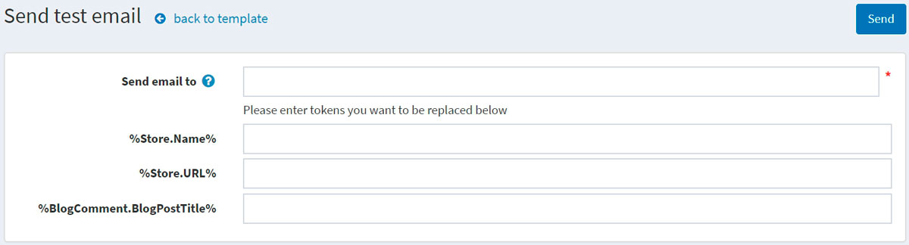

# 消息模板

消息模板定义从您的商店发送的自动消息的布局、内容和格式。它们被称为交易电子邮件，因为每个邮件都与特定类型的交易相关联。

本系统 默认提供多种消息模板，用于通知用户和店主订单状态等信息。要访问消息模板，请转到**内容管理 → 消息模板**。

筛选：

- 您可以通过关键字或商店搜索消息模板。关键字用于在消息模板的名称、正文或主题中进行搜索。如果您有多个商店，并且目录设置页面上的**性能 → 忽略每个商店的限制规则（站点范围）**设置未激活，则会显示可用商店列表。

- 您还可以通过“是否有效”来过滤消息模板。

## 编辑消息模板

找到需要编辑的消息模板，点击**编辑**，编辑消息模板详情窗口如下：

如果您安装了多种语言，请选择所需的**语言选项卡**。

> [!NOTE|style:flat]
> 默认情况下，系统仅使用英语。您可以在配置 → 语言中管理语言。

编辑消息模板详细信息如下：

- 编辑邮件的**主题**。您可以在主题中包含令牌。您可以在页面顶部看到允许的所有令牌的列表。
- 编辑消息**正文**。
- 如果需要，请在**密件抄送**字段中输入此电子邮件消息的密送收件人。
- 从**电子邮件帐户**下拉列表中，选择用于发送此消息模板的电子邮件帐户。
- 您可以通过点击**测试模板**按钮来测试此消息模板。点击后，发送测试电子邮件将显示如下： 在**发送电子邮件至**字段中输入您的电子邮件，用一些测试值填充令牌，然后单击**发送**按钮。

> [!NOTE|style:flat]
> 电子邮件账户在**配置 → 电子邮件账户**中配置。

- 选择**是否活动**选项以指示应发送此消息。
- 如果您希望立即发送此电子邮件， 请选中**立即发送**复选框。
    - 如果清除前一个复选框，则会显示**延迟发送**字段。
- 选中**附加的静态文件**复选框以上传将附加到每封发送的电子邮件的文件。
- 如果消息模板仅适用于**特定商店**，请在**仅限商店**字段中选择商店。如果不需要此功能，请将此字段留空。

> [!NOTE|style:flat]
> 为了使用此功能，您必须禁用以下设置：**目录设置 → 忽略“每个商店限制”规则（全站）**。

单击**保存**。

> [!NOTE|style:flat]
> 要创建消息模板的完整副本，请点击右上角的**复制模板**。如果您配置了多个商店并希望为**每个商店创建不同的模板**，这将非常有用。

