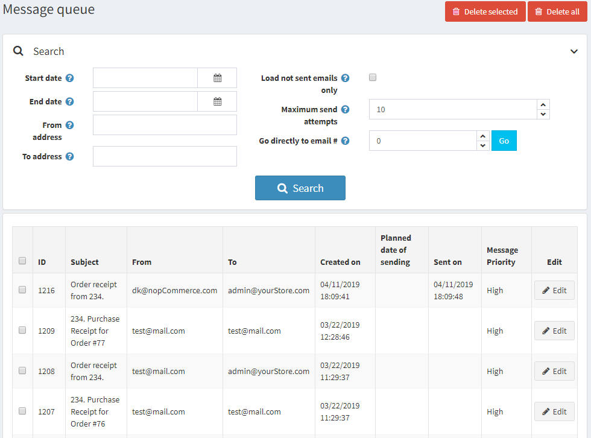
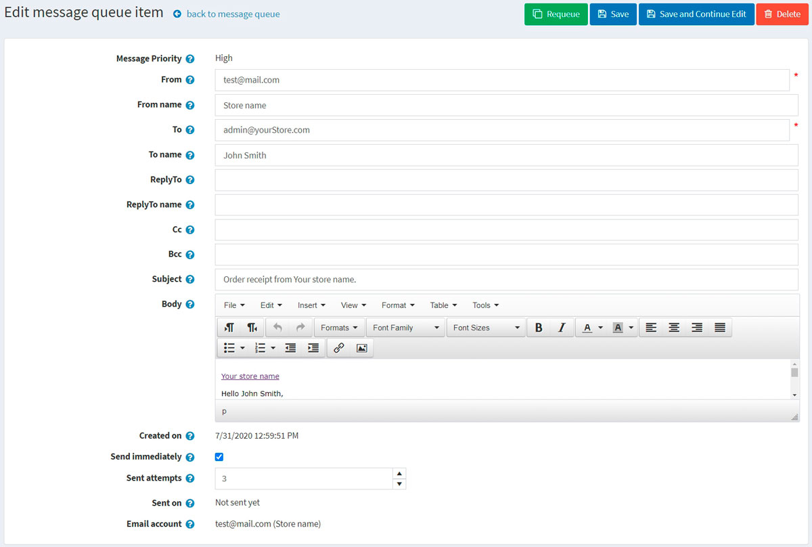

# 消息队列

本站中的电子邮件不会立即发送。它们会被排队。消息队列包含所有已发送或尚未发送的电子邮件。

要加载消息队列，请在**系统菜单**中选择**消息队列**。消息队列窗口将显示如下：

输入以下一个或多个条件来搜索消息：

- 在**开始日期**字段中，选择开始日期。
- 在**结束日期**字段中，选择结束日期。
- 在**发件人地址**字段中，输入邮件的源地址。
- 在**收件人地址**字段中，输入邮件的目标地址。
- 选中**仅加载未发送的电子邮件**复选框以仅加载尚未发送的电子邮件。
- 在**最大发送尝试次数**字段中，输入发送消息的最大尝试次数。
- 在**直接转到电子邮件**字段中，输入电子邮件号码，然后单击**转到**以显示所需的电子邮件。

单击**搜索**加载符合条件的消息队列。

在此页面上，您可以点击**删除所选**按钮从网格中删除所选电子邮件。您可以点击“**全部删除**以删除所有电子邮件。

## 消息队列项目详细信息

要查看消息队列项详细信息，请单击消息旁边的**编辑**按钮。将显示编辑消息队列项窗口：

在此窗口中，您可以点击**删除**按钮删除该消息。或者，您也可以使用**重新排队**按钮重新排队该消息。

在此页面上，您可以编辑以下消息详细信息：

- **发件人**电子邮件地址。
- **来自名字**。
- **至**电子邮件地址。
- **命名**。
- **回复**电子邮件地址。
- **回复姓名**。
- **抄送**电子邮件地址。
- **密送**电子邮件地址。
- 电子邮件**主题**。
- 电子邮件**正文**。
- 选中**立即发送**复选框以立即发送该消息。
- **输入发送尝试次数**。这是发送此消息的尝试次数。

单击**保存**或**保存并继续编辑**以保存消息详细信息。
