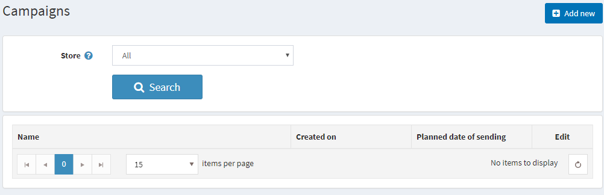
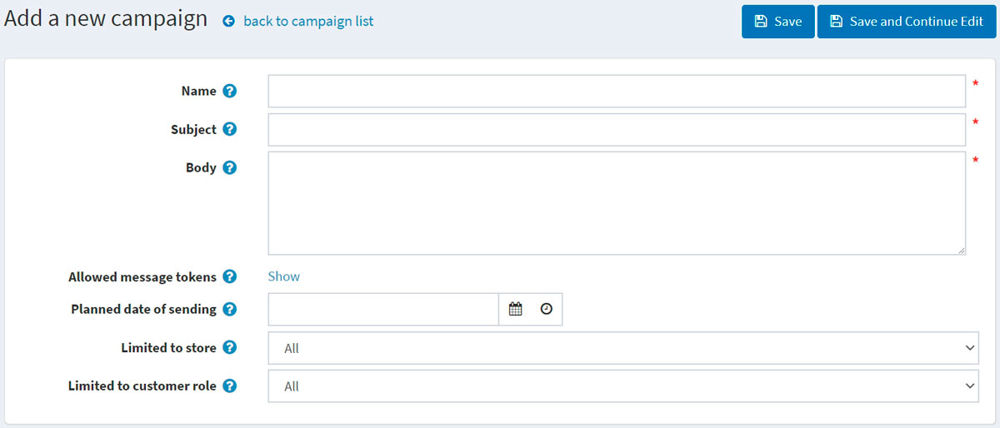
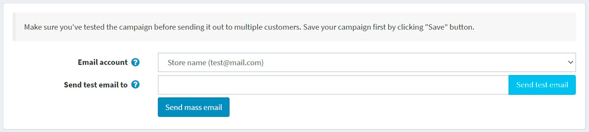
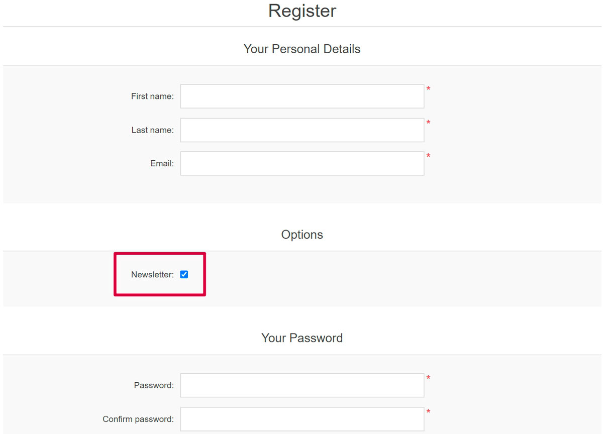
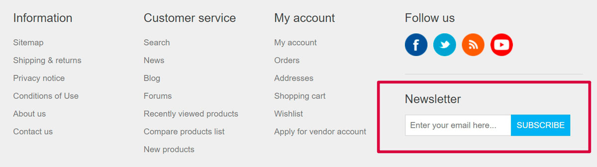
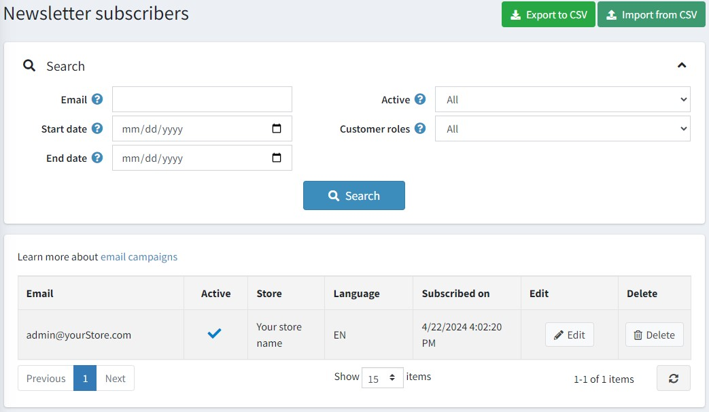

# 电子邮件活动

在注册期间，客户可以选择“新闻通讯”选项来接收您商店的新闻通讯。或者，稍后可以使用页脚中的表单订阅新闻通讯。填写电子邮件订阅者的另一种方法是将订阅者列表从外部 CSV 文件导入本系统。您还可以将订阅者列表从本系统导出到外部 CSV 文件。

使用您的订阅者列表创建电子邮件活动，轻松快速地接触目标受众，无需额外的营销活动。活动有助于提升对公司的信任和忠诚度，同时增加销售额。

您可以在商店中使用多种电子邮件营销活动示例：从感谢订阅的欢迎电子邮件开始，定期发送公告、有关您公司的新闻、未来购买的优惠券等。

> [!NOTE|style:flat]
> 默认情况下没有可用的活动，因此您可以从头开始创建它们以遵循自己的营销策略。

要管理活动，请转到**促销 → 活动**。

## 添加新的电子邮件活动

要创建新的广告系列，请点击**添加按钮**。

定义以下活动详细信息：

- 活动**名称**。
- 活动**主题**。
- 输入您要发送的电子邮件的**正文**。
- 在**允许的消息令牌**中，您可以看到可以在电子邮件活动中使用的允许的消息令牌列表。单击显示即可查看所有令牌。
- 输入**计划发送的日期和时间**。
- 从**仅限商店**下拉列表中，选择哪个商店的订阅者将收到此电子邮件。
- 从**仅限于客户角色**下拉列表中，选择将接收此电子邮件的订阅者的角色。

单击**保存**或**保存并继续编辑**以继续发送您的活动。

## 发送活动

活动保存后，您可以将其发送给客户。您将在页面顶部看到新的面板：

> [!NOTE|style:flat]
> 在将活动发送给多个客户之前，请确保已经对其进行了测试。

首先，发送一封测试电子邮件以检查一切是否正确完成。为此，请选择将用于发送活动的**电子邮件帐户**。请参阅电子邮件帐户部分中如何创建电子邮件帐户。

然后在**发送测试电子邮件**到字段中输入您的电子邮件地址，然后单击**发送测试电子邮件**。

确保一切正常后，使用**发送群发电子邮件**按钮将您的活动发送给客户。

## 时事通讯订阅者

在注册期间，客户可以选择“新闻通讯”选项来接收来自您商店的新闻通讯：

或者可以稍后使用页脚中的表单订阅新闻通讯：

填写电子邮件订阅者的另一种方法是将订阅者列表从外部 CSV 文件导入本系统。您还可以将订阅者列表从本系统导出到外部 CSV 文件。

要导出/导入新闻通讯订阅者，请转到**促销 → 新闻通讯订阅者**。

您可以单击**从 CSV 导入**以导入 CSV 格式的订户列表。确保 CSV 文件的每一行都具有适当的格式：email_address、is_active、store_id（store_id 参数是可选的）。例如，test@test.com, true。您可以单击**导出到 CSV**以导出现有的订户列表。

## 寻找订阅者

在新闻通讯订阅者页面上，您可以使用以下搜索字段来找到特定的订阅者：

- 输入**订阅者的电子邮件**来查找或将此字段留空以加载系统中注册的所有新闻通讯订阅者。
- 指定客户订阅的**开始日期**和**结束日期**。
- 从**活动**下拉列表中，选择**活动**或**非活动**订阅者，或者加载全部。
- 从**商店**下拉列表中选择商店。
- 从**客户角色**下拉列表中，选择客户角色。

单击**搜索**。