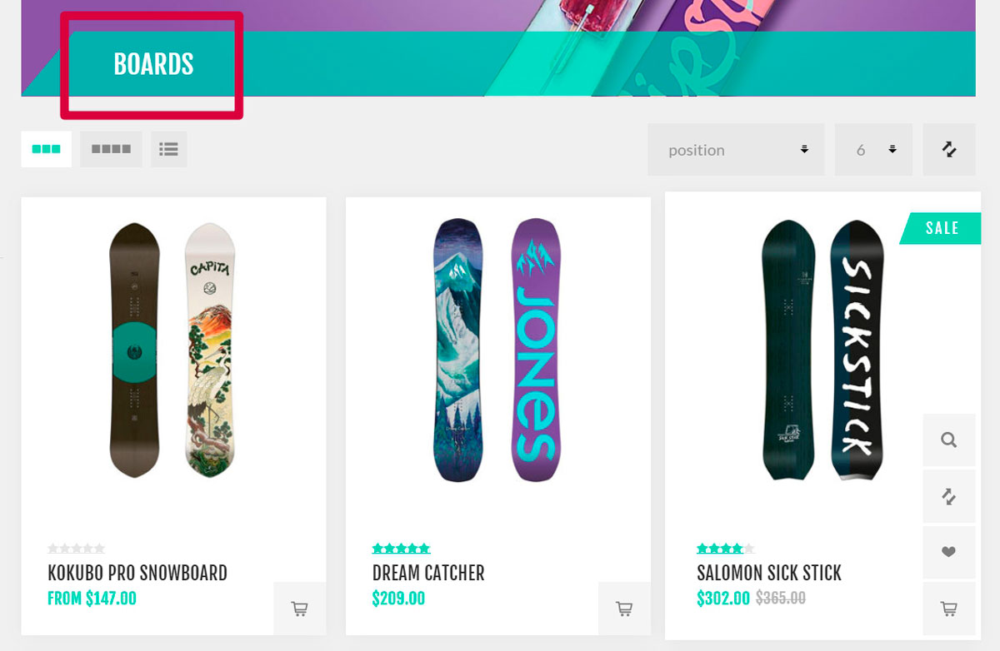
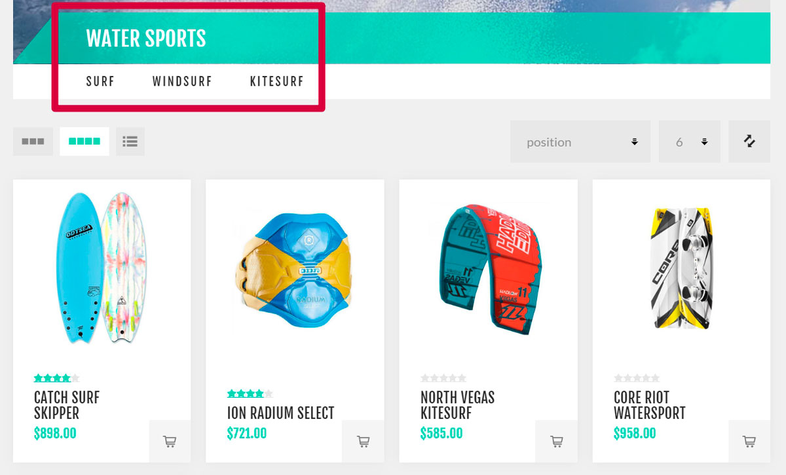
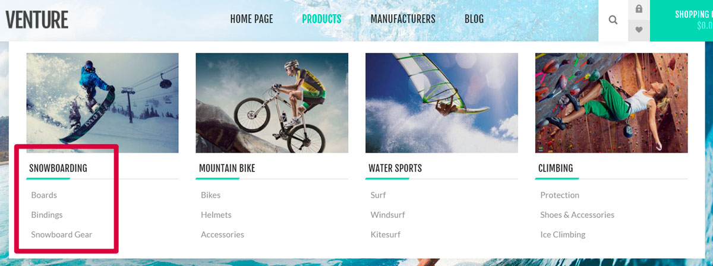
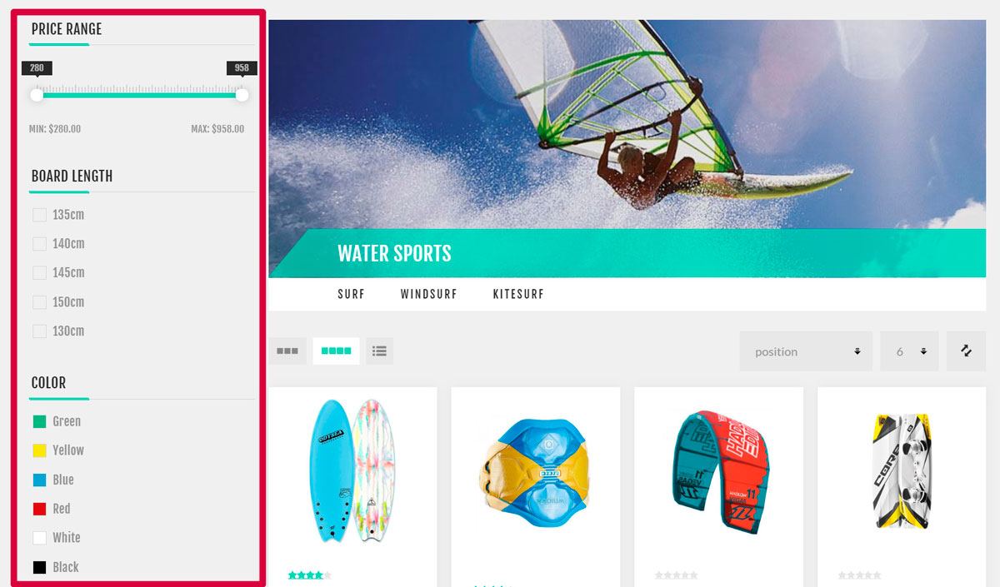
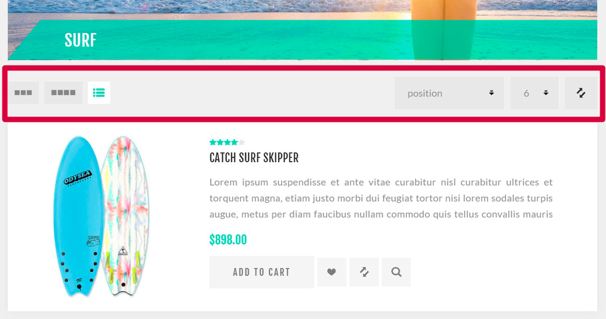

# 目录

产品是**网上商店的基础**，产品管理是**商店管理策略**中非常重要的一部分。产品信息可帮助客户**决定**是否要购买某件商品。因此，请确保商店中有高质量的产品内容，因为这会让客户相信买到的正是自己需要和期望的东西。

产品管理**最重要的组成部分**是添加产品、制造商、设置产品类别以方便导航、添加好的产品描述和吸引人的图片、列出所有可能的产品变体、定义产品标签以使产品搜索快速有效。

## 以实体店为例的目录

这里有一些技巧可以帮助您为客户创建**精心设计**的目录。

## 类别

- 在向商店添加类别时，请确保它们清楚地描述其包含的产品（或子类别）。如以下示例所示，Boards 类别仅包含板块： 使用**目录 → 类别页面上的添加新按钮创建类别**

- 当您需要将一般类别划分为特定类别时，请使用子类别。这可让您的客户更轻松地进行搜索。如下例所示，水上运动类别包含冲浪、风帆冲浪和风筝冲浪子类别：**在类别编辑页面上添加父类别，将其转变为子类别**。

- 将最受欢迎的类别添加到每个页面上可见的顶部菜单，以吸引更多客户： 

为此，**请使用类别编辑页面上的“包含在顶部菜单中”复选框**。

- 将最有趣的类别添加到主页。这些类别将是客户访问您的商店时首先看到的内容： 

为此，请使用类别编辑页面上的“在主页上显示”复选框。

- 允许您的客户使用过滤器在类别中搜索： 

过滤器功能使用[规范属性](./产品.md#规范属性)。

- 允许您的客户对产品进行排序并更改显示模式： 

有关排序的更多信息，请访问[目录设置 - 产品排序](./目录设置.md#产品分类)部分。使用类别编辑页面中的**允许客户选择页面大小**和**页面大小选项**字段来设置显示模式。
