# 目录设置

目录设置包括启用产品排序、更改查看模式、比较产品等选项。

要定义目录设置，请转到**配置 → 设置 → 目录设置**。目录设置页面有高级模式和基本模式（默认为高级模式）。

此页面启用多商店配置；这意味着可以为所有商店定义相同的设置，也可以为各个商店定义不同的设置。如果您想要管理某个商店的设置，请从多商店配置下拉列表中选择其名称，然后选中左侧所需的所有复选框以为其设置自定义值。

## 设置搜索

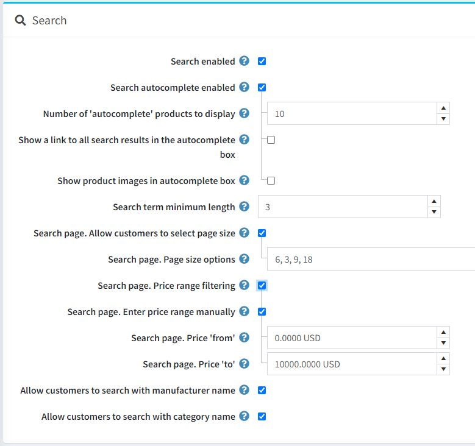

页面顶部面板设置搜索：

- 如果您希望在公共商店中启用搜索功能，请选中**搜索已启用复选框**。

- 选中**搜索自动完成已启用复选框**可在公共存储中显示自动完成搜索框，如下所示：
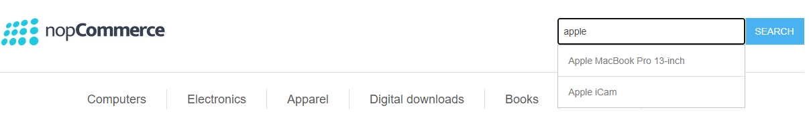

    启用此选项后，将显示以下附加字段：

    - 要显示的**自动完成产品的数量**设置了公共商店中搜索框的自动完成下拉列表中显示的结果数量。
    - 选中**在自动完成框中显示所有搜索结果的链接**复选框，在自动完成搜索框中显示所有结果的链接。如果找到的项目数大于自动完成框中显示的数量，则显示该链接。
    - 选中在**自动完成框中显示产品图像复选框**以在自动完成搜索框中显示产品图像。

- **搜索词最小长度**是搜索所需的最少字符数。

- 选择搜索页面。如果您希望允许客户从预定义的选项列表中**选择页面大小**，请选中**允许客户选择页面大小复选框**。
    - 在**搜索**页面的**页面大小选项**字段中，输入以逗号分隔的客户页面大小选项列表或您想要在搜索产品页面上显示的产品数量。
    - 如果**搜索页面-允许客户选择页面大小**设置被禁用，则将显示**搜索页面-每页产品数**字段。在此字段中，输入您想要在搜索页面上显示的产品数量。

- 选择搜索页面。如果要启用按价格范围过滤，请选中**价格范围过滤复选框**。
    - 如果您希望手动输入价格范围，请选择搜索页面的**手动输入价格范围**复选框。
        - 如果启用了上面的设置，则进入搜索页面。价格**从**。
        - 和搜索页面。价格**至**。

- 如果启用了**允许客户通过制造商名称搜索**，则客户可以按制造商名称进行搜索。

- 如果启用了**允许客户按类别名称搜索**，则客户可以按类别名称进行搜索。

> [!NOTE|style:flat]
> 标准搜索依赖于精确匹配，因此如果您想提高网站搜索的速度和相关性，我们建议您使用全文搜索。与标准搜索不同，全文搜索会分析整个网站的内容以检索最相关的结果。自动完成和拼写错误容忍度可优化搜索速度并帮助用户准确找到所需内容。

## 产品评论

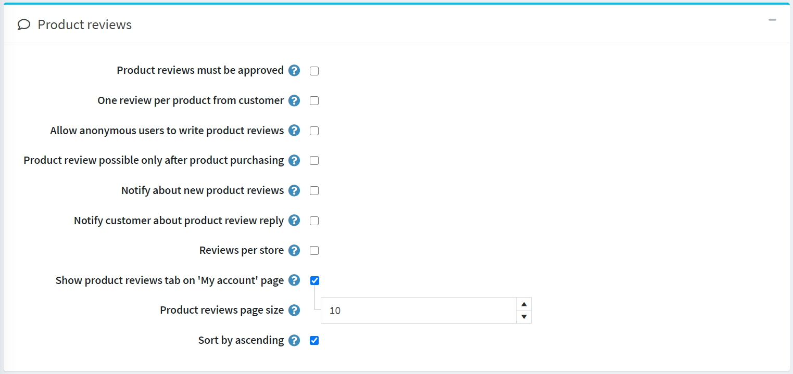

第二个面板设置产品评论。定义以下内容：

- **产品评论必须经过批准**，以强制产品评论在发布之前必须得到商店管理员的批准。
- **客户对每个产品只能添加一条评论**，以限制客户对每个产品只能添加 1 条评论。
- **允许匿名用户撰写产品评论**，以允许匿名用户撰写产品评论。
- **仅在购买产品后才可以进行产品评论**，以便只有已经订购的产品的客户才能对产品进行评论。
- **通知有关新产品评论**，以通知店主有关新的公开评论。
- **通知客户有关产品评论回复**，以通知客户有关产品评论回复。
- **每个商店的评论仅允许显示当前商店的评论**（在产品详细信息页面上）。如果您希望客户查看所有商店中撰写的产品评论，请清除此复选框。
- **在我的帐户页面上显示产品评论标签**，以便客户在“我的帐户”页面上查看所有评论。
- **产品评论页面大小**是每页的评论数。
- **按升序排序**，按创建日期的升序对产品评论进行排序。

## 评论类型

下一个区块设置了评论类型。如果您认为基本评论不够，您可以配置评论类型列表。

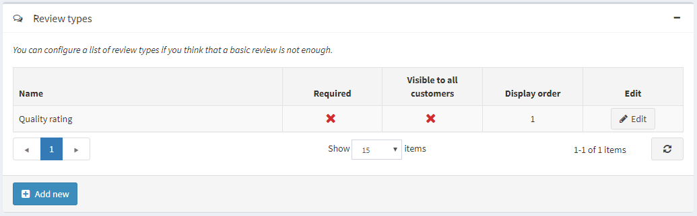

单击**添加按钮**按钮来创建新的评论类型。

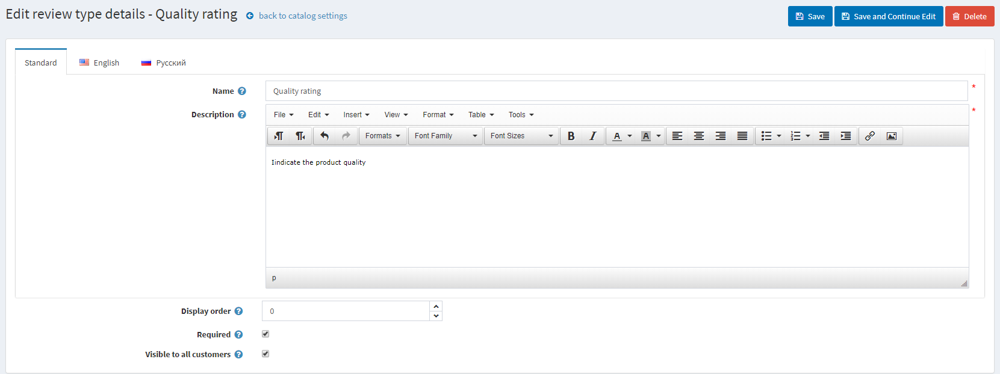

定义以下内容：

- 输入您的评论类型**名称**。
- 输入评论类型**描述**。
- 定义**显示顺序**。
- 当需要时，客户必须选择**合适的评级值**才能继续。
- 对所有客户可见将评论类型设置为**对所有客户可见**。

单击**保存按钮**添加新的评论类型。

现在，客户将能够在公共商店的产品评论页面上填写额外的评分。

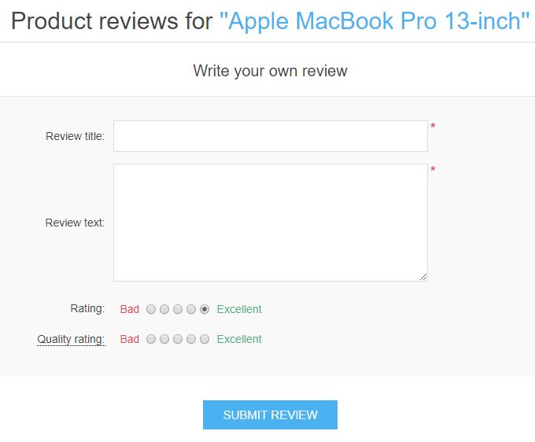

在此页面上，您还可以看到所有客户留下的反馈（如果此设置处于活动状态）。在客户个人帐户页面上，您还可以查看对产品留下的所有评论。

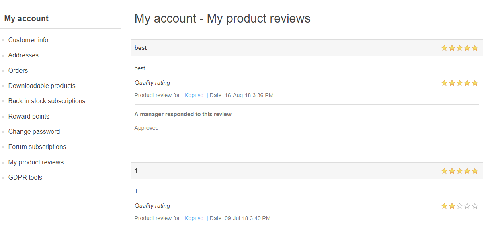

## 表现

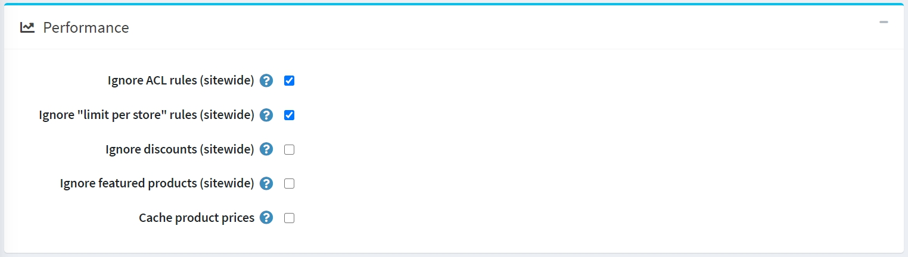

下一个面板设置性能。启用以下设置可以显著提高商店性能：

- **忽略 ACL 规则（站点范围）**关闭为实体配置的ACL 规则。
- **忽略每个商店的限制（全站）**允许忽略为实体配置的每个商店限制规则。如果您只有一家商店或没有特定于商店的限制，建议启用此设置。在多商店部分中了解有关多商店的更多信息。
- **忽略折扣（全站）**。
- **忽略特色产品（全站）**。
- **缓存产品价格**。如果您使用复杂的折扣、折扣要求规则或优惠券代码，则不应启用此功能。

## 分享

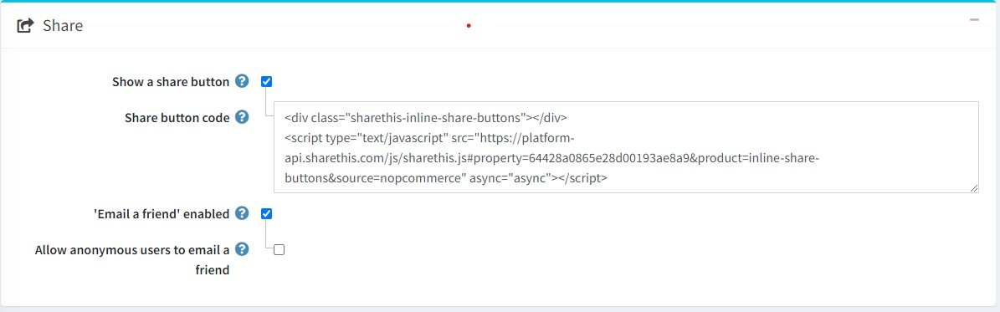

分享面板中的分享选项允许购物者在其社交媒体网络上分享产品。这些选项将以小图标的形式显示在产品页面上。设置分享选项：

- 选择**显示分享按钮**，在产品详情页显示分享按钮，选择此字段后，会显示分享按钮代码字段。

- **分享按钮代码**字段显示页面的按钮代码。

> [!NOTE|style:flat]
> 默认情况下使用 ShareThis 服务（https://sharethis.com/）。

分享链接如下：

- 选中启用**给朋友发送电子邮件复选框**以允许客户使用“给朋友发送电子邮件”选项。
- 如果需要，**允许匿名用户给朋友发送电子邮件**。

## 比较产品

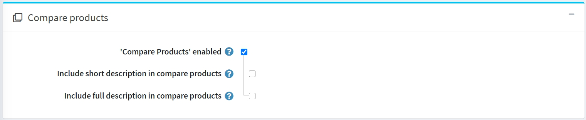

比较产品选项使客户能够根据产品特点和价格比较各种产品，以便做出最佳购物决策。按如下方式设置比较产品块：

- 选中**比较产品**复选框，使客户能够比较您公共商店中的产品选项。产品页面上将显示“添加到比较列表”按钮。
- 选中**在比较产品中包含简短描述**复选框以在比较产品页面上显示简短的产品描述。
- 选中**在比较产品中包含完整描述**复选框以在比较产品页面上显示完整的产品描述。

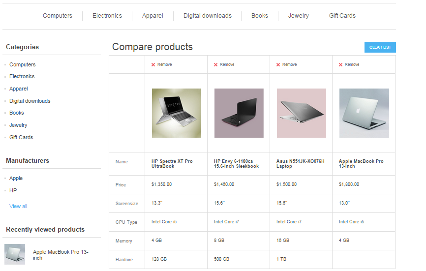

## 其他部分

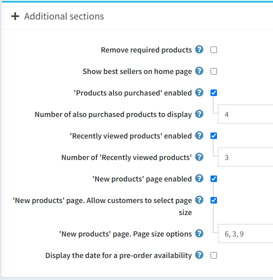

附加部分面板允许您设置以下选项：

- 选中**删除所需产品复选框**，以便在移除主产品时自动从购物车中删除所需产品。
- **在主页上显示畅销书**可让您在主页上显示畅销书。
    - 如果选中了上一个复选框，您将能够输入**主页上的畅销商品数量**。
- 选中**还购买了产品复选框**，以使客户可以查看购买上述产品的客户还购买的产品列表。
    - 启用上一个选项后，将显示要**显示的已购买产品数量**字段。在这里，店主可以设置要显示的产品数量。
- 选中**最近查看的产品**复选框，以使客户能够看到您商店中最近查看的产品。
    - 在**最近查看的产品**数量字段中，输入选中上一个复选框时显示的最近查看的产品的数量。
- 如果您希望在商店中启用 “新产品”页面，请选中“新产品”页面启用复选框。
    - 在**新产品**页面。页面大小选项字段，输入选择启用**新产品**页面时显示的最近添加的产品数量。
- 如果需要，请选中**显示预订可用日期复选框**。

## 产品领域

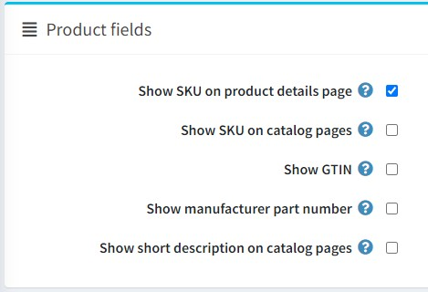

在产品字段面板中，您可以设置以下选项：

- **在产品详情页面显示SKU。**
- **在目录页面上显示 SKU。**
- **在公共商店中显示 GTIN。**
- 在公共商店中**显示制造商零件编号**。
- 在公共商店的**目录页面上显示简短的描述**。

## 产品页面

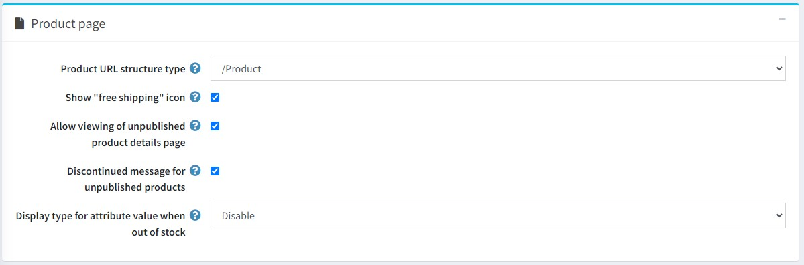

在产品页面面板中，您可以设置以下选项：

- **产品 URL 结构类型**。可能的值：
    - /产品
    - /类别/产品
    - /制造商/产品

- 启用此选项的产品将**显示“免费送货”图标**。

- **允许查看未发布的产品详细信息页面**。在这种情况下，SEO 不会受到影响，搜索爬虫将索引该页面，即使产品暂时未发布且对客户不可见。请注意，店主始终可以访问未发布的产品。

- 选中**未发布产品的停产消息**复选框，当客户尝试访问未发布产品的详细信息页面时，显示“产品已停产”消息。

- 选择**缺货时属性值的显示类型**。如果属性组合缺货，您可以将其显示为已禁用或正常。

> [!NOTE|style:flat]
> 请注意，应为产品启用“仅允许现有属性组合”选项。

## 目录页

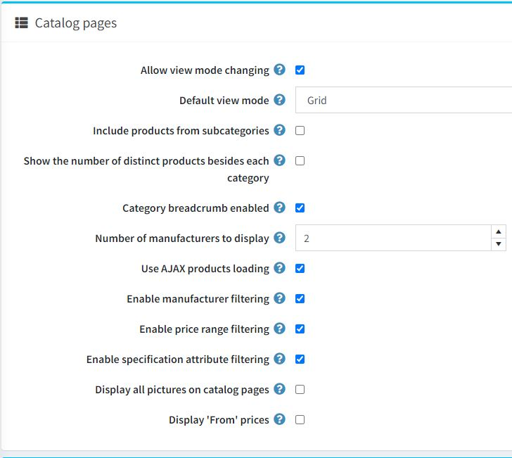

目录页面面板可让您设置：

- 允许在类别和制造商页面上**更改查看模式**。
- **默认视图**模式为网格或列表。
- 查看类别详细信息页面时包含**子类别的产品**。
- 在公共商店左栏的类别导航区域中， 显示**每个类别旁边的不同产品数量**。
    - 如果需要，请打开显示**每个类别旁边的不同产品数量**设置。
- **已启用类别面包屑导航**。选择以启用类别路径（面包屑导航）。这是屏幕顶部的栏，指示产品在产品页面上的哪些类别和子类别中被查看。栏中的每个子元素都是一个单独的超链接。
- 在制造商导航块中**显示的制造商数量**。
- **使用 AJAX 产品加载**在目录页面上异步加载产品（适用于“分页”、“过滤”、“查看模式”）。
- **启用制造商过滤**以在目录页面上启用制造商过滤。
- **启用价格范围过滤**以在目录页面上启用价格范围过滤。
- **如果需要，请在目录页面上启用规格属性过滤**。如果关闭，即使您创建了此类属性，规格属性过滤也不会显示在目录页面上。
- **在目录页面上显示所有图片**- 在目录页面上可以查看产品的所有图片。
- **显示起价**-勾选后可在目录页面上显示“起价”。这将根据属性和组合的价格调整显示产品的最低可能价格，而不是固定的基本价格。如果启用，还建议启用“缓存产品价格”设置。但请注意，如果您使用一些复杂的折扣、折扣要求规则等，它可能会影响性能。

> [!NOTE|style:flat]
> 要在目录页面上显示产品的简短描述，您需要激活此设置 - `catalogsettings.showshortdescriptiononcatalogpages`

## 标签

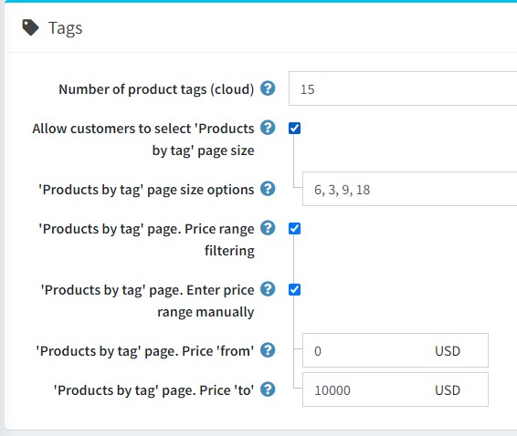

在标签面板中，您可以定义：

- **产品标签数量（云）**——标签云中出现的标签数量。
- 允许客户从店主预定义的选项列表中选择产品标签页面上的**按标签分类的产品**页面大小。禁用时，客户将无法选择页面大小，店主将输入该大小。
    - 如果选择了上一个选项，则**按标签分类的产品**页面大小选项字段将变为可见。您可以输入商店用户可以选择的值。数字应以逗号分隔。第一个值将是默认值。
    - 如果禁用了**允许客户选择按标签显示产品页面大小**设置，则将显示**按标签分类的产品**页面。将显示每页产品数字段。在此字段中，输入您想要在搜索页面上显示的产品数量。
- 选择**按标签分类的产品**页面。如果您想启用按价格范围过滤，请选中价格范围过滤复选框。
    - 如果您希望手动输入价格范围，请选择**按标签分类的产品**页面。手动输入价格范围复选框。
        - 如果启用了上面的设置，则进入**按标签分类的产品**页面。价格**从**。
        - 以及**按标签分类的产品**页面。价格**至**。

## 税

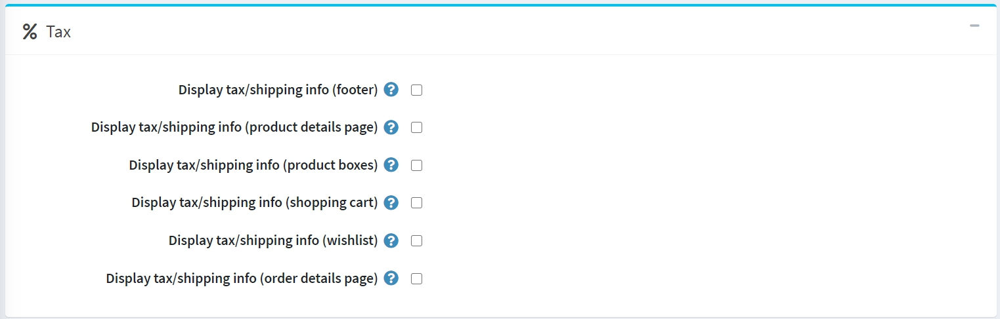

税务面板中提供了一些特定于德国的税务/运输信息选项：

- **显示税费/运输信息（页脚）**。
- **显示税务/运费信息（产品详情页面）**。
- **显示税费/运输信息（产品包装盒）**。
- **显示税费/运费信息（购物车）**。
- **显示税务/运输信息（愿望清单）**。
- **显示税费/运费信息（订单详情页面）**。

## 出口进口

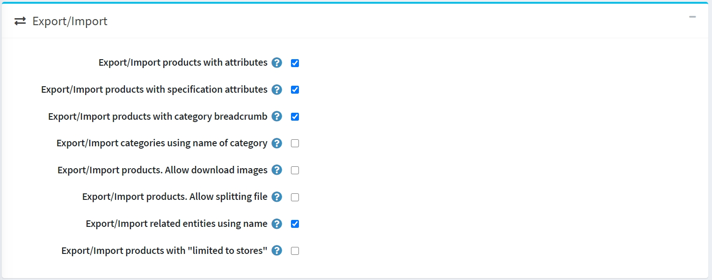

在导出/导入面板中，您可以定义：

- 如果您需要在每次导出/导入产品时导出/导入产品属性，请选中**导出/导入具有属性的产品复选框**。
- 如果产品需要随规格属性一起导出/导入，请选中**随规格属性一起导出/导入产品复选框**。
- 如果要导出/导入具有完整类别名称（包括其所有父类名称）的产品，请选中**导出/导入具有类别面包屑导航的产品复选框**。
- 如果要使用类别名称导出/导入类别，请选中**使用类别名称导出/导入类别复选框**。
- 选择**导出/导入产品**。如果在导出产品时可以从远程服务器下载图像，请允许*下载图像复选框*。
- 选中**导出/导入产品**。如果您想从主文件自动创建的单个最佳大小文件中导入产品，请允许拆分文件复选框。此功能将帮助您以较小的延迟导入大量数据。
- 如果要使用名称导出/导入相关实体，请选中**使用名称导出/导入相关实体复选框**。
- 如果产品需要以“仅限于商店”的属性导出/导入，请选中**以仅限于商店的属性导出/导入产品复选框**。

> [!NOTE|style:flat]
> 当您有两种或两种以上的语言时，导出/导入到 Excel/XML 可支持多语言数据。

## 产品分类

在产品排序面板中，您可以定义：

- 选中**允许产品排序复选框**以在类别和制造商页面上启用产品排序选项。您可以按位置、名称、价格和创建日期激活/停用排序。

> [!NOTE|style:flat]
> 选择“位置”值意味着对产品的排序不受任何限制。

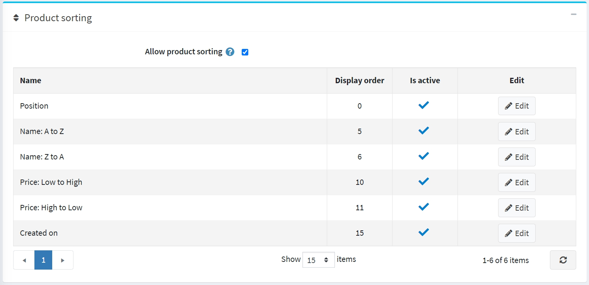

您可以通过单击**编辑按钮**来编辑每个选项的**显示顺序**和**是否活动**属性。
