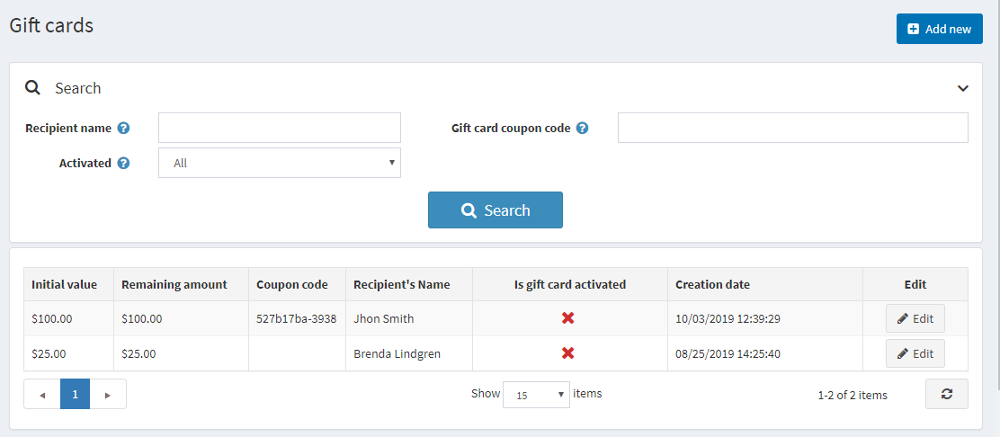
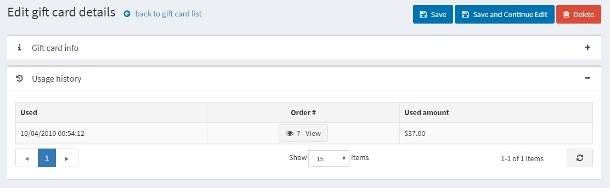
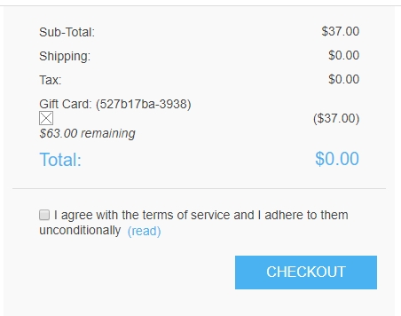

# 礼品卡

您可以销售礼品卡和其他类型的产品。

礼品卡是一种很好的营销工具，可让您接触更多客户并刺激更多购买。礼品卡是一种高度针对性的工具，因为接收者肯定会被激励使用它们，因为它就像是向他们提出的个人建议。

## 添加新礼品卡

您可以创建礼品卡产品，在**目录 → 产品 → 添加新 → 礼品卡**面板中创建产品时，选中“是礼品卡”复选框，将产品定义为礼品卡。

在此面板中，您还需要指定**礼品卡类型**：虚拟或实物。

> [!NOTE|style:flat]
> 不建议在“现场”商店中更改礼品卡类型。

## 激活礼品卡

当您的客户完成礼品卡产品的购买后，您可以在**销售 → 礼品卡**中搜索并查看所有**已购买的礼品卡的列表**。

要查看礼品卡详细信息，请点击旁边的**编辑**按钮。将显示“编辑礼品卡详细信息”窗口：

您应该选择**礼品卡是否已激活**复选框来激活礼品卡。然后生成优惠券代码。

> [!NOTE|style:flat]
> 为了在完成订单后自动激活礼品卡，请转到**配置 → 设置 → 订单设置**页面。找到礼品卡面板并选中**完成订单后激活礼品卡**复选框。在这种情况下，**优惠券代码**也将自动生成。请注意，此页面还有其他与礼品卡激活相关的设置。

您还可以定义以下礼品卡信息：

- 在**礼品卡类型**中，选择它是虚拟的还是实物的。
- 在**订单**字段旁边，单击**查看**以查看礼品卡的购买顺序。
- 在**初始值**字段中，如果需要，编辑卡的初始值。
- **剩余金额**字段可以查看此礼品卡的剩余金额。
- 礼品卡**是否已激活**字段确定此礼品卡是否已激活并可以使用。
- **优惠券代码**字段代表礼品卡优惠券代码（结账时使用）。
- 如果需要，请在相关字段中编辑**收件人姓名**、**收件人的电子邮件**（如果礼品卡类型为虚拟）、**发件人的姓名**和**发件人的电子邮件**（如果礼品卡类型为虚拟）。
- 在**消息**区域中输入可选消息。
- 点击**通知收件人**。一封包含礼品卡详细信息的电子邮件将发送给收件人。此按钮仅适用于虚拟礼品卡，不适用于实体礼品卡。

## 使用历史记录

在使用历史记录面板中，您可以看到使用此礼品卡优惠券的订单列表。礼品卡激活后，发送者收到优惠券代码，即可在结账时使用该优惠券代码。

## 使用礼品卡

礼品卡是在公共商店使用的，通过在购物车页面的框中输入序列号即可。

> [!NOTE|style:flat]
> 您可以通过清除**配置 → 设置 → 购物车设置**页面（常用面板）上的**显示礼品卡盒复选框来禁用购物车页面上的礼品卡盒**。

您还可以允许客户检查礼品卡余额。为此，请在**配置 → 设置 → 购物车设置**页面（通用面板）上选中**允许客户检查礼品卡余额**复选框。

> [!NOTE|style:flat]
> 此功能需要启用 CAPTCHA，因为它可能不安全，并且需要 CAPTCHA 来防止和复杂化暴力破解。要激活 CAPTCHA，请转到**配置→ 设置 → 常规设置**页面，然后在CAPTCHA面板中选中启用CAPTCHA复选框。要了解如何设置 CAPTCHA，请参阅安全设置 - CAPTCHA部分。

