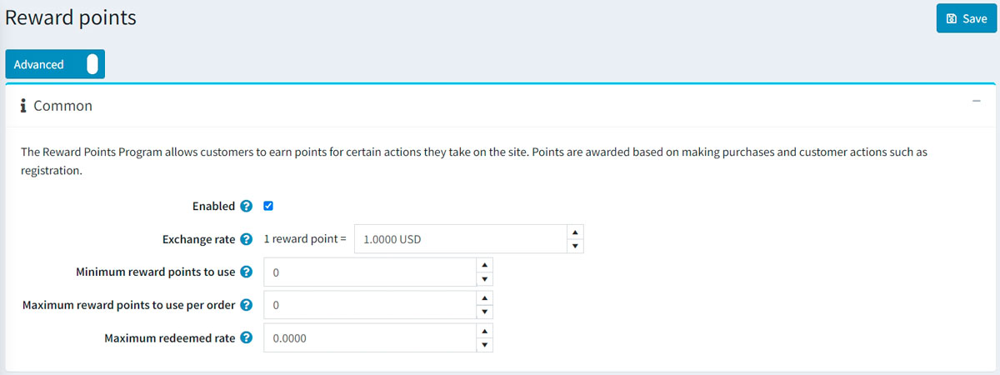
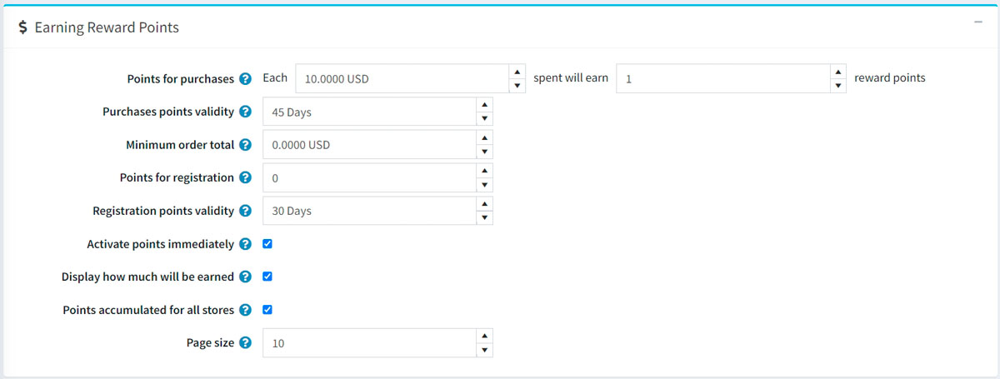
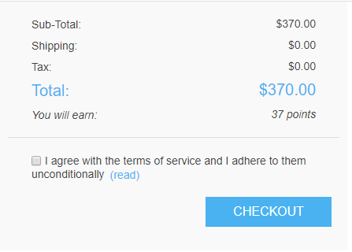
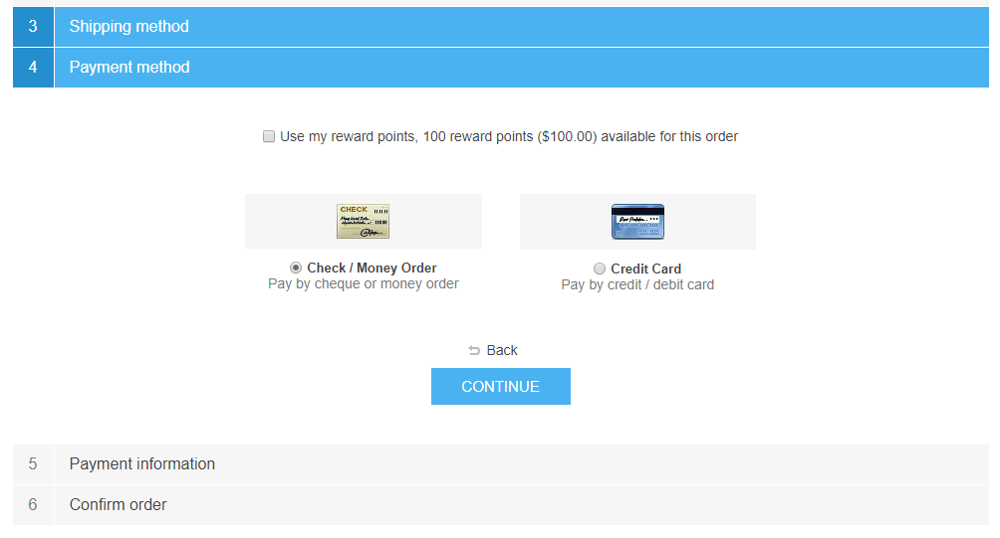

# 积分

此功能可让您创建和实施忠诚度计划，以改善客户体验并提高客户忠诚度。允许客户通过在网站上执行某些操作（例如注册和购买）来赚取积分。

奖励积分可用作付款方式之一。此选项显示在结帐的付款方式区域。可兑换的奖励积分可与其他付款方式一起使用，例如信用卡、礼品卡等。

如果客户取消订单或发送退货请求，积分也会被取消。

## 管理奖励积分

要管理奖励积分计划，请转到**配置 → 设置 → 奖励积分**。此页面有两种模式：基本模式和高级模式。

此页面启用多商店配置；这意味着可以为所有商店定义相同的设置，也可以为各个商店定义不同的设置。如果您想要管理某个商店的设置，请从多商店配置下拉列表中选择其名称，然后选中左侧所需的所有复选框以为其设置自定义值。有关更多详细信息，请参阅多商店。

要设置您的奖励积分计划，请定义以下设置：

### 常见的

- 选中**启用**复选框以使奖励积分计划处于活动状态。
- 在**汇率**字段中，指定奖励积分汇率（例如，1 积分 = 1 美元）。
- 在**最低奖励积分使用量**字段中，输入客户使用奖励积分所需的最低奖励积分数量。如果不需要定义此设置，请输入 0。
- 如果您指定**每笔订单可使用的最大奖励积分**字段，则客户每笔订单将无法使用超过 X 个奖励积分。如果您不想使用此设置，请设置为 0。
- 最高**兑换率**设置限制了可以用奖励积分支付的最高订单总额（百分比）。例如，如果设置为 0.6，则只能使用奖励积分支付订单总额的 60%，但不能超过**每个订单可使用的最高奖励积分**。如果您不想使用此设置，请设置为 0。

## 赚取奖励积分

- 在**购买积分**字段中，指定购买所授予的积分数量。
- 在**购买积分有效期**字段中，指定购买奖励积分的有效天数。默认值为45天。如果您指定的值为0，则奖励积分将无限期过期。
- 在**最低订单总额**字段中，指定最低订单总额（不包括运费）以奖励购买积分。
- 在**注册积分**字段中，指定客户注册时授予的积分数。
- 在**注册积分有效期**字段中，指定注册所获积分的有效天数。
- 如果您想让客户在获得奖励积分后立即使用积分，请选中**立即激活积分**复选框。如果清除此复选框，将出现另一个选项：
- 在**奖励积分激活**复选框中，指定奖励积分激活的期限（天数/小时数）。
- 选中**显示将获得多少积分**复选框，向您的客户显示将获得多少积分。它将显示在结帐页面上。
- 选中**为所有商店累积积分**复选框可将所有商店的所有奖励积分累积到一个余额中，以便可以在任何商店使用。
- 在**页面大小**字段中，设置**我的帐户**页面上奖励积分历史记录的页面大小

单击**保存**。

> [!NOTE|style:flat]
> 奖励积分仅适用于注册用户。

当客户在结账时使用奖励积分时，情况如下：

