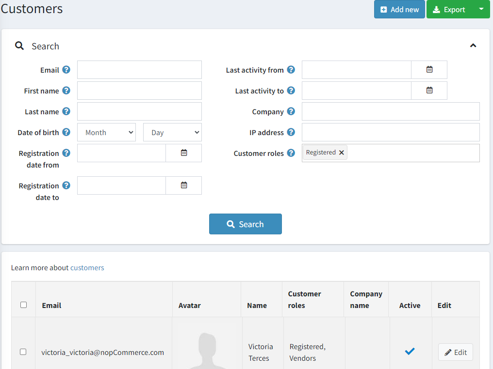
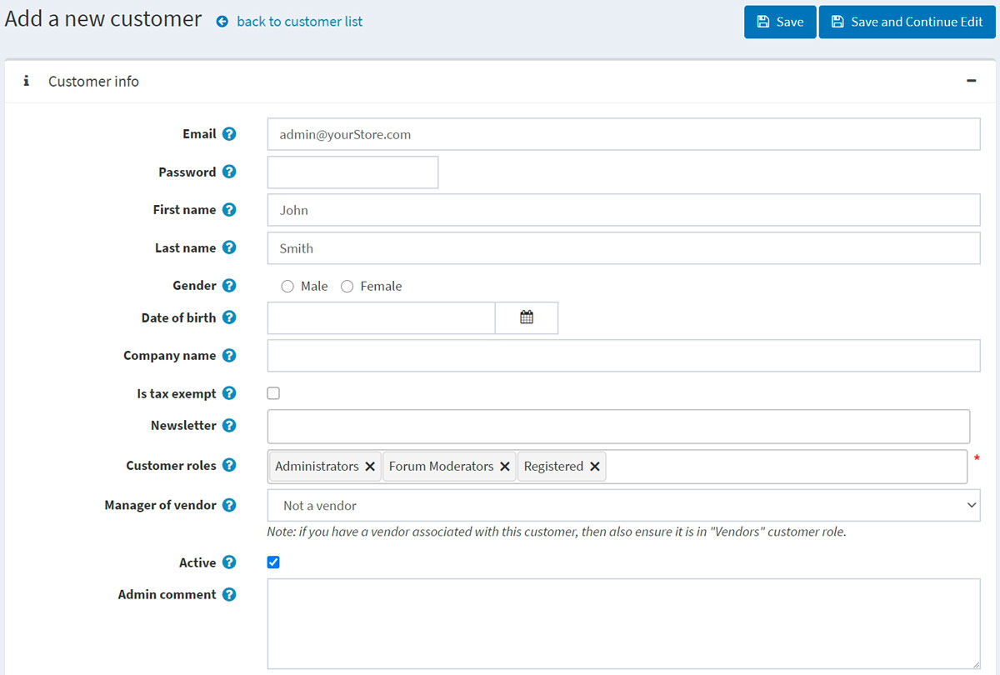
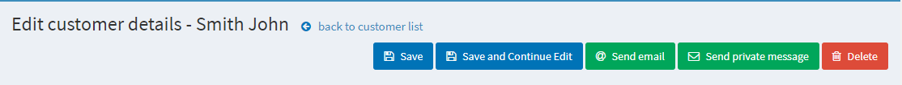
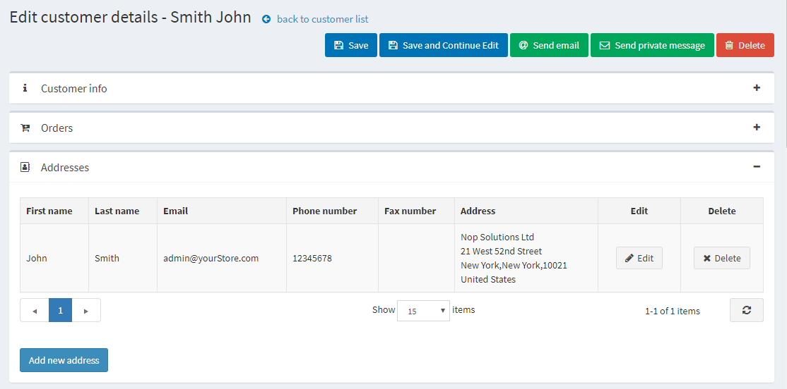
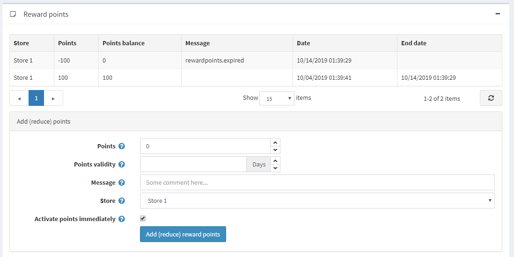

# 管理客户

客户列表包含所有现有客户的详细信息，并允许添加新客户。 客户列表包含所有现有客户的详细信息，并允许添加新客户。
本系统中客户包括所有用户，例如管理员、供应商和买家。
要管理客户，请转到**客户 → 客户**。将显示以下窗口：

要搜索客户，请在“客户”窗口中输入以下一个或多个搜索条件：

- **电子邮件**。
- **用户名**（如果在[客户设置](./客户设置.md)中启用）。
- **名**。
- **姓**。
- **出生日期**（如果在[客户设置](./客户设置.md)中启用）。
- **公司**（如果在[客户设置](./客户设置.md)中启用）。
- **电话**（如果在[客户设置](./客户设置.md)中启用）。
- **邮政编码**（如果在[客户设置](./客户设置.md)中启用）。
- **IP地址**。
- **客户角色**：您可以选择显示一个或多个客户角色。
- 注册日期**从**和注册日期**至**
- **最后活动开始于**和**最后活动结束于**

> [!NOTE|style:flat]
> 您可以通过点击**导出到 XML (全部)**或**导出到 Excel (全部)**将客户数据导出到外部文件。 您可以通过点击**导出到 XML (选定)**或**导出到 Excel (选定)**将选定的客户数据导出到外部文件。

然后单击**搜索按钮**。

## 添加新客户

要添加新客户，请在客户窗口中单击**添加新客户**。将显示添加新客户窗口。定义以下客户详细信息：

## 客户信息

客户信息面板允许输入客户的个人和账户信息，例如更改密码、分配/删除客户角色。

您可以编辑以下字段：

- **电子邮件**地址。
- **密码**。
- **名**。
- **姓**。
- **性别**。
- **出生日期**。
- **公司名称**。
- **免税**表示客户是否免税。
- 在**新闻通讯**多选框中选择合适的商店，以便客户订阅商店新闻通讯。
- **客户角色**：一个或多个客户角色。请注意，任何需要登录系统的角色（例如，管理员、供应商）都应具有“已注册”客户角色。您可以在客户角色部分设置客户角色。
- 如果需要，请从**供应商经理**下拉列表中选择与此客户帐户关联的供应商。关联后，此客户将能够登录所选供应商门户并管理其产品和订单。请注意，如果您有与此客户关联的供应商，则应确保此客户记录在供应商列表中。
- 选中**活动**复选框来激活客户。
- **管理员评论**：如有需要，管理员可进行内部评论。

单击**保存按钮**保存更改或单击**保存并继续编辑**按钮以继续获取更多客户信息。在这种情况下，您将在客户详细信息页面上看到新添加的面板。

您还将看到**发送电子邮件、发送私人消息**（如果启用了[论坛](./论坛.md)）和删除按钮。

单击**发送电子邮件**按钮后，将显示发送电子邮件窗口，店主可以向客户发送电子邮件。单击**发送私人消息**按钮后，将显示发送私人消息窗口，店主可以向客户发送消息。要使用私人消息，请在[论坛设置](./论坛.md)中允许私人消息。

## 订单

在订单面板中，您可以查看客户的订单详情。

## 地址

在地址面板中，您可以查看、编辑和创建客户的新的地址。

点击**添加新地址**按钮添加新的客户地址。填写相应字段并点击**保存**。新地址将添加到客户。

## 当前购物车和愿望清单

在当前购物车和愿望清单面板中，您可以查看客户的购物车和愿望清单。

## 活动日志

在活动日志部分中如何管理活动类型[活动日志 - 客户活动类型](./活动日志.md#客户活动类型)。

## 下订单（冒充）

在**下订单（模拟）**面板中，店主可以为客户创建订单，无需密码信息。这对于不想注册的客户或使用 CSR 通过电话下订单的大型网站非常有用。

面板包含下订单按钮。单击此按钮后，您将被重定向到公共商店。选择客户想要的产品，将它们添加到购物车中，就像客户在公共商店中所做的那样，然后使用**结帐**按钮继续执行通常的结帐流程，然后单击页面顶部的**完成会话链接以完成此会话**。

## 补货订阅

在“补货订阅”面板中，查看客户订阅的产品。

## 奖励分数

在奖励积分面板中，店主可以为客户添加奖励积分或查看他们的奖励积分使用历史记录。启用奖励积分计划后，此面板可见。有关更多信息，请参阅[奖励积分](./积分.md)部分。

### 加（减）分

在此面板中：

- 输入点数。要减少点数，请输入负值。
- 在**积分有效期**字段中，指定授予积分的有效天数（仅适用于正数的积分）。
- 输入**消息**或评论。
- 如果您想让客户在获得奖励积分后立即使用，请选中**立即激活积分**复选框。如果您不选中此复选框，则会出现另一个选项：
- 如果清除了之前的复选框，请在**奖励积分激活**字段中指定激活奖励积分的时间段（天数/小时数）。
