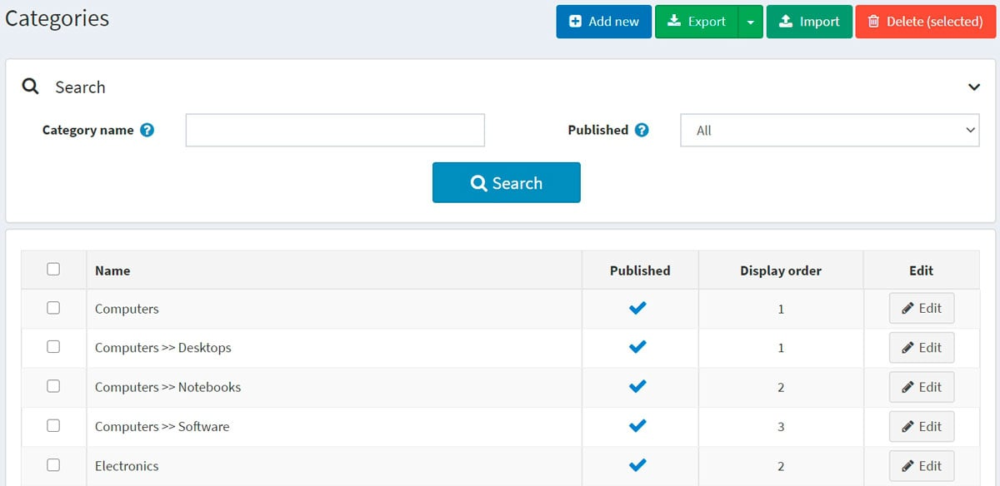
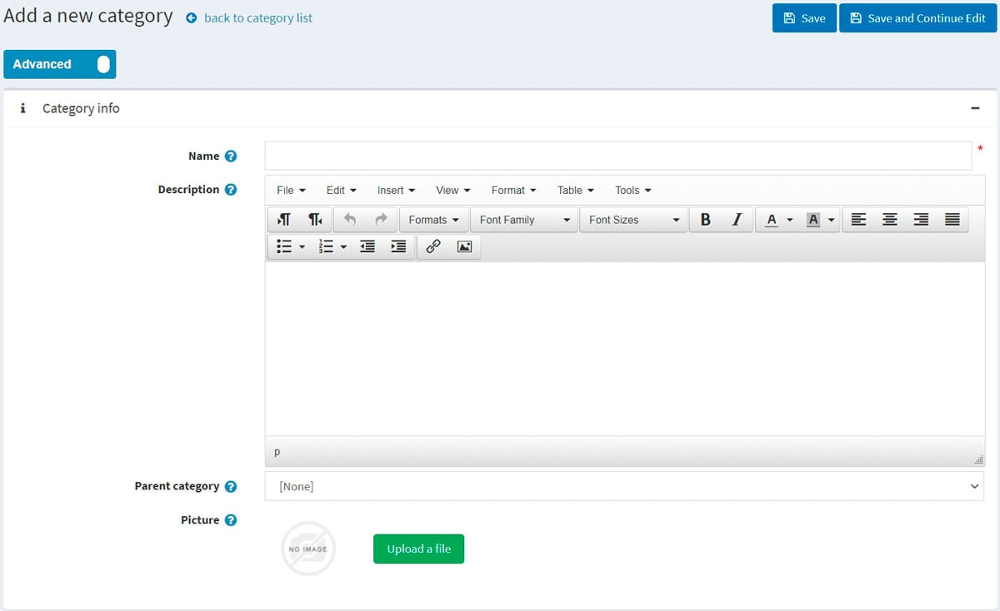
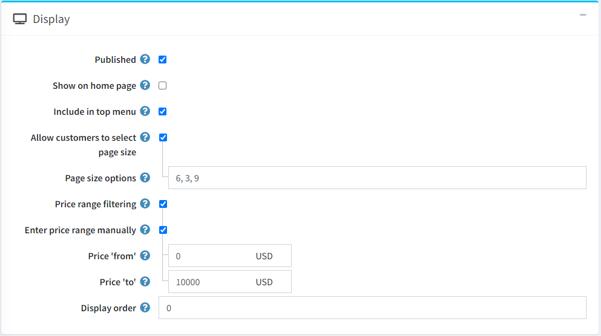
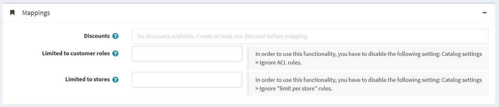
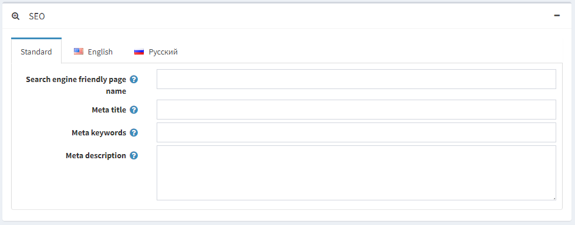
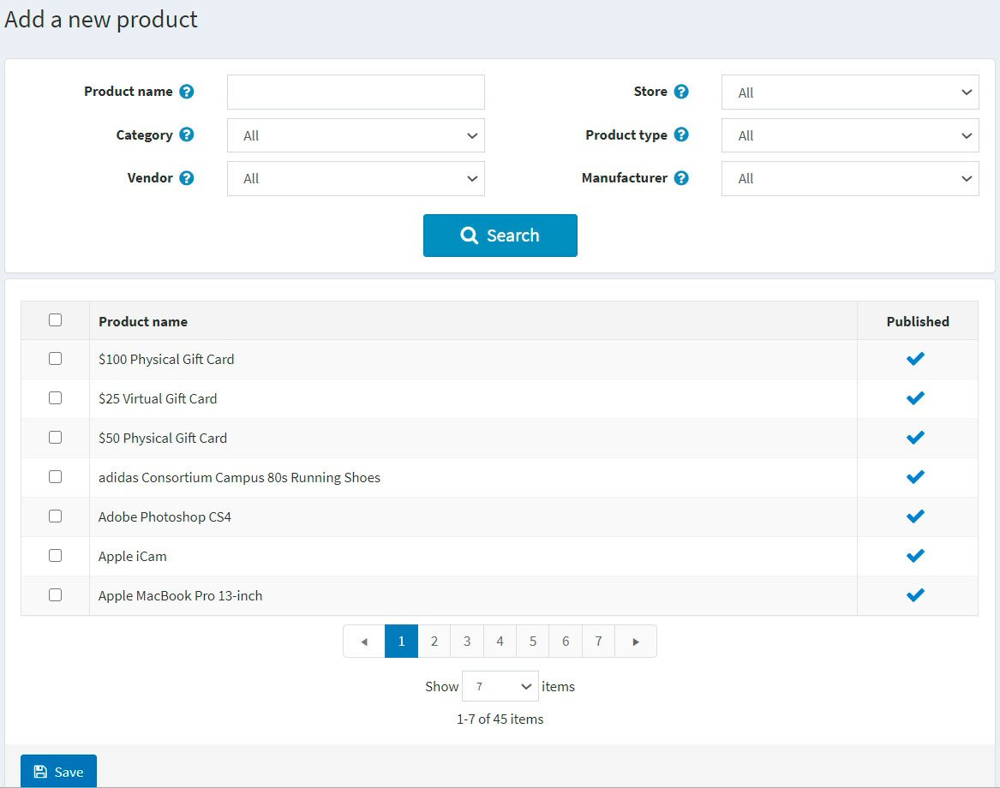
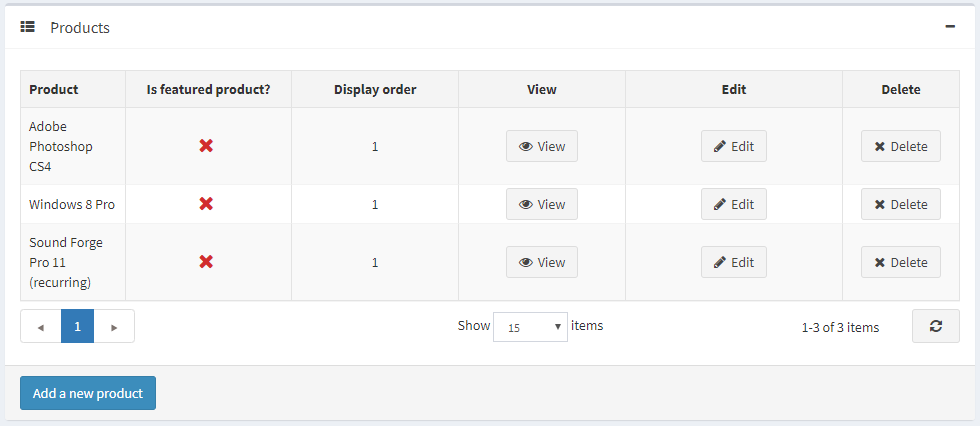

# 类别


在添加新产品之前，商店经理应该创建类别，以便稍后分配这些产品。要管理类别，请转到**目录 → 类别**。



通过输入**类别名称**、**已发布属性**或从某个**商店的所有类别**（如果启用了多个商店）在搜索面板中搜索类别。

> [!NOTE|style:flat]
> 要从列表中删除类别，请选择要删除的项目，然后**单击删除（选定）按钮**。您可以**单击导出按钮**将类别导出到外部文件以进行备份。单击导出按钮后，您将看到下拉菜单，使您可以**导出到 XML**或**导出到 Excel**。


## 添加新类别

要添加新类别，请点击页面顶部的**添加新按钮**。将显示添加新类别窗口。




此页面有两种模式：**高级模式**和**基本模式**。切换到基本模式（仅显示主要字段），或使用高级模式（显示所有可用字段）。


### 类别信息

在类别信息面板中，定义以下类别信息：

- **名称**：这是目录中显示的类别的名称。
- **描述**：类别的描述。使用编辑器进行布局和字体。
- 如果此类别是子类别，请从下拉列表中选择**父类别**。新类别将放置在公共商店中的此类别下。
- **图片**：代表类别的图像。从您的设备上传图像。

### 展示



在显示面板中，定义以下类别信息：

- 选中**已发布复选框**以使该类别在公共商店中可见。

- 选中**在主页上**显示复选框以在主页上显示该类别。

- 选中**包含在顶部菜单中复选框**以将该类别包含在主页的顶部菜单中。

- 选中**允许客户选择页面大小复选框**，使客户能够选择页面大小，即类别详细信息页面上显示的产品数量。客户可以从店主在**页面大小选项**字段中输入的页面大小列表中选择页面大小。

    - 如果选中上一个复选框，将显示**页面大小选项**。输入以逗号分隔的页面大小选项列表（例如，10、5、15、20）。如果未选择任何选项，则第一个选项是默认页面大小。
    - 如果清除**允许客户选择页面大小复选框**，将**显示页面大小选项**。它设置此类别中产品的页面大小，例如每页“4”个产品。

> [!NOTE|style:flat]
> 比如您为某个类目添加了七个产品，并设置其页面大小为三，则在公共店铺中，该类目详情页每页会显示三个产品，总页数为三页。


- 如果您想启用按价格范围过滤，请选中**价格范围过滤复选框**。
    - 如果您希望手动输入价格范围，请选中**手动输入价格范围复选框**。
        - 如果启用上述设置，请输入价格**从**。
        - 价格为**至**。
- **显示顺序**：显示类别的顺序编号。此显示编号用于对公共商店中的类别进行排序（升序）。显示顺序为 1 的类别将放置在列表顶部。
- 如果您在**系统 → 模板**页面上安装了自定义类别模板，则**类别模板**字段可见。此模板定义此类别（及其产品）的显示方式。

### 映射



在映射面板中，定义以下类别信息：

- **折扣**：选择与此类别相关的折扣。您可以在**促销 → 折扣**页面创建折扣。在[折扣](./折扣.md)章节中了解有关折扣的更多信息。

> [!NOTE|style:flat]
> 请注意，此处仅显示分配给类别类型的折扣。折扣映射到类别后，将应用于此类别中的所有产品。


> [!NOTE|style:flat]
> 如果您想使用折扣，请确保在**配置 → 设置 → 目录设置 → 性能面板**中**禁用忽略折扣（站点范围）设置**。


- 在**仅限客户角色**字段中，选择能够查看目录中类别的客户角色。如果不需要此选项，请将此字段留空，这样每个人都可以看到该类别。

> [!NOTE|style:flat]
> 为了使用此功能，您必须禁用以下设置：**配置 → 目录设置 → 忽略 ACL 规则（站点范围）** 。在[此处](./访问控制列表.md)阅读有关访问控制列表的更多信息。


- 如果该类别在**特定商店销售**，请在**仅限商店**字段中**选择商店**。如果不需要此功能，请将此字段留空。

> [!NOTE|style:flat]
> 为了使用此功能，您必须禁用以下设置：**目录设置 → 忽略每个商店限制规则（全站）** 。


### 搜索引擎优化



在SEO面板中，定义以下详细信息：

- **custom-seo-page-name**：搜索引擎使用的页面名称。如果您将此字段留空，则类别页面 URL 将使用类别名称形成。如果您输入 custom-seo-page-name，则将使用以下自定义 URL `http://www.yourStore.com/custom-seo-page-name`。

- **Meta title**：指定网页的标题。它是插入到网页标题中的代码：

```html
<head>
    <title> Creating Title Tags for Search Engine Optimization & Web Usability </title>
</head>
```

- **Meta 关键词**— 类别元关键词，代表页面最重要主题的简短列表。Meta 关键词标签如下所示： `<meta name="keywords" content="keyword, keyword, keyword phrase, etc.">`

- 元描述— 类别的描述。元描述标签是页面内容的简短摘要。元描述标签如下所示： `<meta name="description" content="Brief description of the contents of your page">`

单击**保存并继续编辑按钮**继续将产品添加到类别。

### 产品

产品面板包含与所选类别相关的产品列表。这些产品可以按目录中的类别进行筛选。店主可以向该类别添加新产品。请注意，您需要先保存类别，然后才能添加产品。

单击**添加新产品**以查找要包含在此类别中的产品。您可以按**产品名称、类别、供应商、商店、产品类型和制造商**进行搜索。




选择要添加到类别的产品并点击**保存**按钮。产品将显示在所选类别下。



将产品添加到类别后，通过单击产品旁边的**编辑按钮**在产品表中定义以下信息：

- 是**特色产品**。
- **显示顺序**。

> [!NOTE|style:flat]
> 点击**查看**后，您将被重定向到**编辑产品详细信息**页面。


点击**保存**。新类别将显示在公共商店的父类别下。


## 导入类别

如果您不想手动将所有类别添加到目录中，则可以使用导入选项。

> [!NOTE|style:flat]
> 在开始导入之前，您应该下载一个 Excel 格式的导入表格模板。为了准确无误地导入类别，正确命名表格中的所有列至关重要（与下载的表格完全相同）。


无需填写所有表格字段。类别将根据填写的字段创建。

导入需要大量内存资源。因此不建议一次导入超过 500-1000 条记录。如果您有更多记录，最好将它们拆分为多个 Excel 文件并分别导入。

