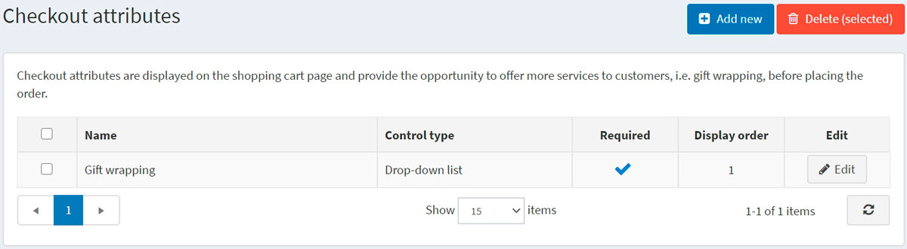

# 结帐属性

结帐属性代表在购物过程的最后阶段收集的额外订单信息。

> [!NOTE|style:flat]
> 使用结帐属性，店主可以指定所购买的产品是否需要礼品包装或小心处理（例如易碎商品）。

结帐属性显示在购物车页面上，并允许用户在结帐前选择它们（如果需要）。

要设置或编辑结帐属性，请转到**目录 → 属性 → 结帐属性**。

您可以选择结帐属性，然后单击**删除（已选择）**按钮将其删除。

## 添加新的结帐属性

要创建新的结帐属性，请单击**添加新**。添加新结帐属性窗口将显示如下内容：

此页面有两种模式：**高级模式**和**基本模式**。切换到基本模式（仅显示主要字段），或使用高级模式（显示所有可用字段）。

在属性信息面板中，定义以下信息：

- **名称**：属性名称。

- **文字提示**：将在购物车页面结帐区域显示的问题或评论。

- 从**控件类型**下拉列表中，选择显示属性值所需的方法，例如下拉列表、单选按钮列表、复选框、文本框。

> [!NOTE|style:flat]
> 下拉列表、单选列表、复选框和颜色方块需要店主定义值（例如绿色、蓝色、红色等）。文本框和日期选择器控件类型不需要店主定义值，因为客户将被要求填写这些文本框字段。此外，对于某些控件类型，您可以指定验证规则。例如，对于文本框属性，您可以定义**最小长度**、**最大长度**和**默认值**。对于文件上传属性，您可以定义**允许的文件扩展名**和**最大文件大小（KB）**。

- 如果在完成购买过程之前需要选择属性值，请选中**必需复选框**。

- **显示订单**：显示结帐属性的订单号。

- 如果此属性仅对需要运输的产品显示，请选中**必需可运输产品复选框**。

- 选中**免税**复选框表示此结帐属性不征税。

- 如果需要征税，请从**税收类别**下拉列表中选择结帐属性税收类别。

- **仅限于商店**使您能够将属性限制为一个或多个商店。

> [!NOTE|style:flat]
> 为了使用此功能，您必须禁用以下设置：**目录设置 → 忽略“每个商店限制”规则（全站）**。在此处阅读有关多商店功能的更多信息。

单击**保存并继续编辑**以进入“属性值”面板（如果适用）。

### 添加新的结帐属性值

在属性值面板中，单击**添加新的结帐属性值**以创建新的属性值。

在添加新的结帐属性值窗口中，定义以下信息：

- **名称**：属性值的名称。

> [!NOTE|style:flat]
> 例如，对于诸如“您是否需要易碎品处理？”之类的问题，回答“是”或“否” 。

- 如果选择了属性值，**价格调整将把输入的金额添加到总购买金额中**。

- 如果选择了属性值，**重量调整将根据输入的金额改变订单重量**。

- 选中**预选**复选框表示已为客户预先选择了属性值。

- **显示顺序**：属性值的显示顺序号。

您可以通过单击属性值面板中属性旁边的相应按钮来**编辑**和**删除**属性值。

## 添加条件

在条件面板中，店主可以指定结帐属性可见的条件（取决于其他属性）。仅当选择了上一个属性时，才会显示条件属性。

点击**保存**。新属性将显示在公共商店的购物车页面上。

