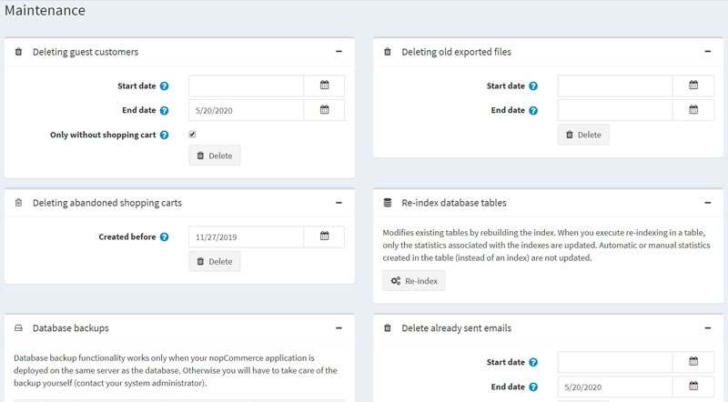

# 维护

在**系统菜单**中，选择**维护**。维护窗口将显示如下：

## 删除来宾客户记录

在删除来宾客户面板中，单击**删除**按钮。此选项可让您删除为来宾访客创建的客户记录。

> [!NOTE|style:flat]
> 只有没有订单或写有客户内容（如产品评论或新闻评论）的客人才会被删除。

## 删除旧的导出文件

在删除旧导出文件面板中，点击**删除**按钮。所有导出和生成的文件（如 PDF 和 Excel 文件）将被删除并从数据库中移除。

## 删除废弃的购物车和愿望清单

在删除废弃购物车面板中，点击**删除**按钮。在指定日期之前创建的所有购物车和愿望清单项目都将被删除。

## 重新索引数据库表

在重新索引数据库表面板中，单击**重新索引**按钮。此过程通过重建索引来修改现有表。在表中执行重新索引时，仅更新与索引相关的统计信息。在表中（而不是索引）创建的自动或手动统计信息不会更新。

## 数据库备份

在数据库备份面板中，单击**立即备份**按钮来创建数据库备份。

> [!NOTE|style:flat]
> 数据库备份功能仅当您的独立站与数据库部署在同一台服务器上时才有效。否则，您必须自行处理备份（联系您的系统管理员）。

