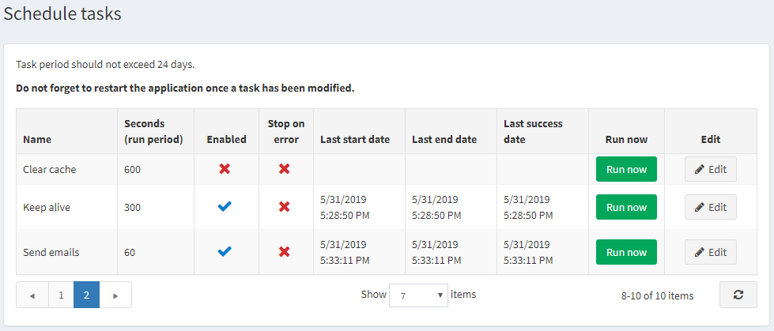
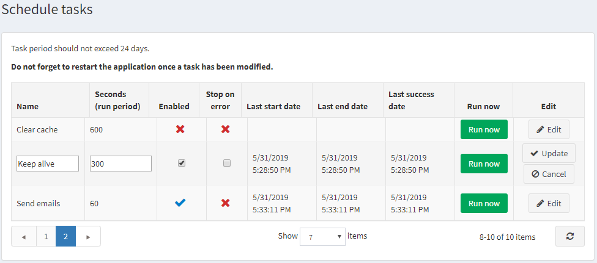

# 计划任务

计划任务窗口使店主能够安排任务在后台的某些时间段内运行，并查看有关该任务的有用信息以及该任务是否已成功完成。例如，本站会定期发送排队电子邮件。任务在来自 ASP.NET 线程池的单独线程上运行。

要查看计划任务，请在**系统菜单**中选择**计划任务**。计划任务窗口将显示如下内容：

要编辑计划任务，请点击任务旁边的**编辑**按钮。窗口将展开如下：

您可以按如下方式编辑计划任务：

- 编辑**名称**。
- 编辑秒数（**运行周期**）。任务周期不应超过 24 天。
- 选中**已启用**复选框以启用该任务。
- 选中**错误时停止**复选框以便在发生错误时停止任务。

单击**更新**以保存更改。

> [!NOTE|style:flat]
> 一旦任务被修改，请不要忘记重新启动应用程序。

如果需要，您可以单击**立即运行**来按需运行计划任务。