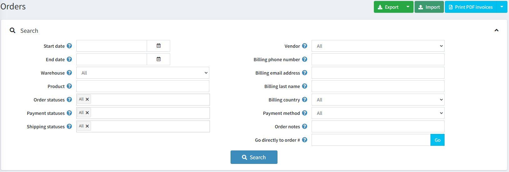
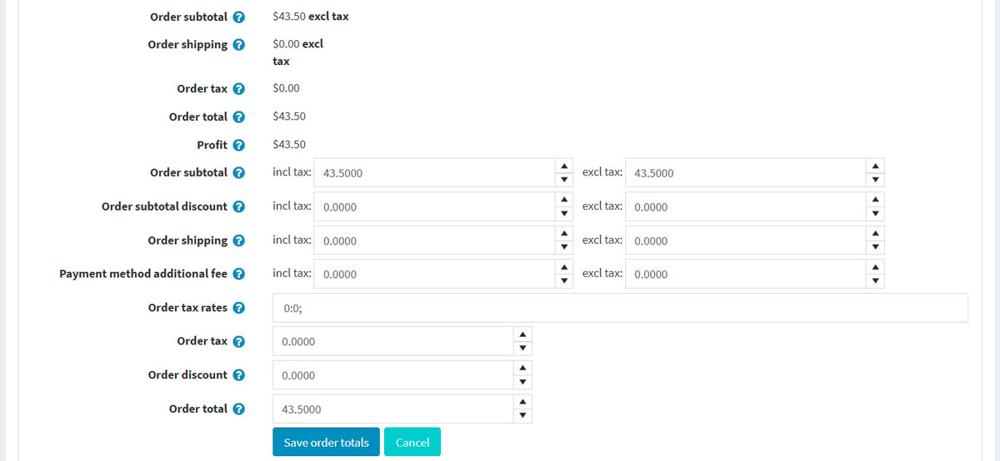
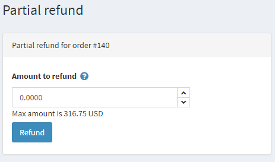
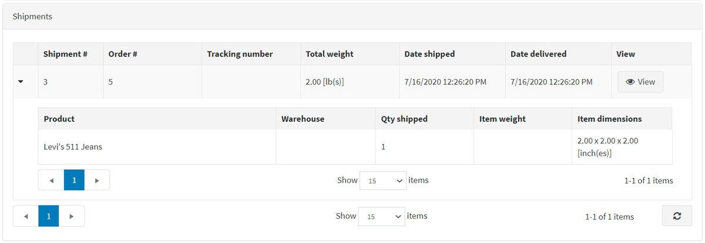
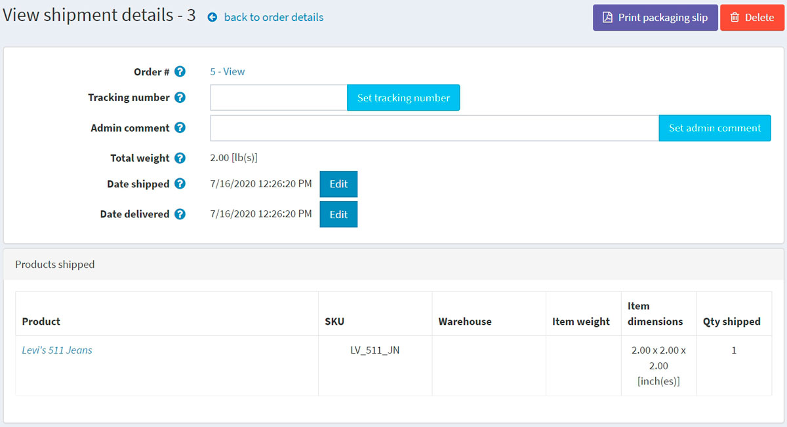
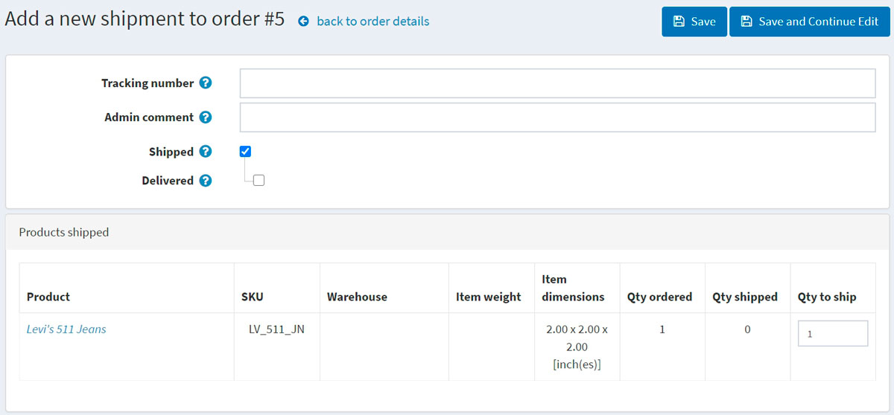
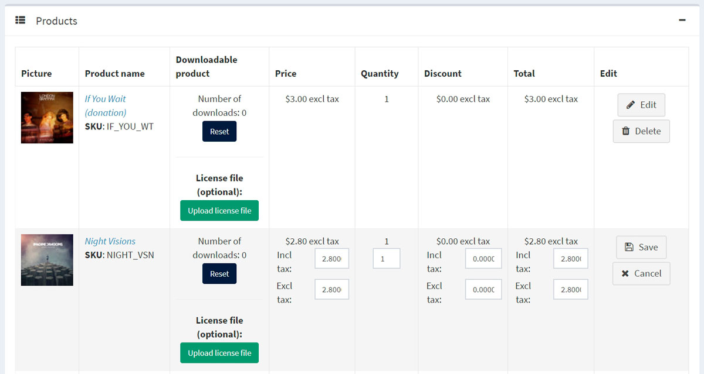
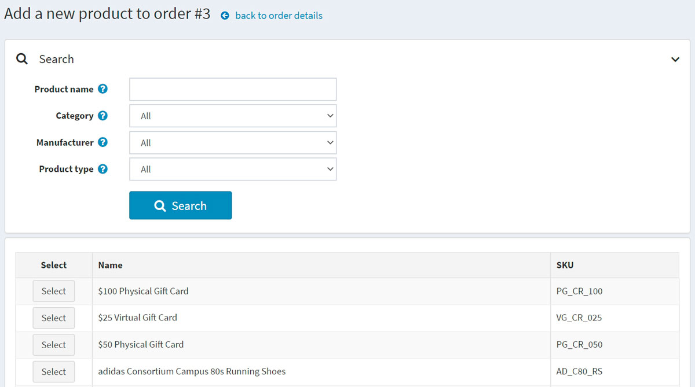
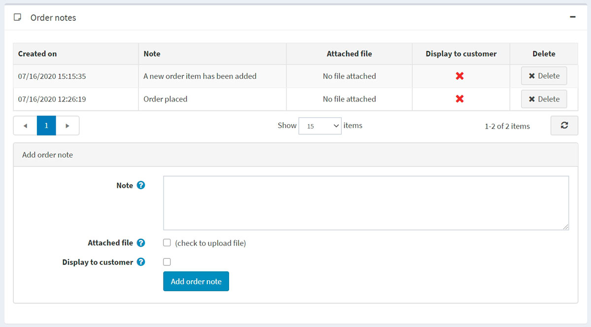

# 订单

要查看和管理订单，请转到**销售 → 订单**。订单页面列出所有当前订单。客户完成交易后，订单页面上会出现新订单。

页面顶部区域允许店主搜索订单。输入特定搜索条件并使用各种过滤器来查找商店中的任何订单。每次搜索完成后，搜索结果将显示在屏幕的下半部分。您可以单击“查看”以查看订单详细信息。

## 搜索订单

要搜索订单，请输入以下一个或多个搜索条件：

- **开始日期**和**结束日期**定义订单创建的时间段。
- **仓库**从指定仓库装载产品订单。
- **产品**：输入产品名称
- **订单状态**：选择以下之一：全部、待定、处理中、完成、已取消。
- **付款状态**：选择要搜索的特定付款状态：全部、待定、已授权、已付款、部分退款、已退款、作废。
- **运输状态**：选择特定的运输状态进行搜索：全部、无需运输、尚未发货、部分发货、已发货、已交付。
- **商店**：设置下订单的特定商店。
- **供应商**：按特定供应商搜索。您将看到包含指定供应商产品的订单。
- **帐单电话号码**：客户的电话号码。
- **帐单电子邮件地址**：客户的电子邮件地址。
- **账单姓氏**：客户的姓氏。
- **帐单国家**：客户的国家。
- **付款方式**：设置结账时使用的特定付款方式。
- **订单备注**：在订单备注中搜索。留空则加载所有订单。
- **直接转到订单号**：输入订单号，然后单击“转到”显示所需订单。

### 出口订单

您可以通过点击页面顶部的**导出按钮**将订单导出到外部文件。点击导出按钮后，您将看到下拉菜单，使您可以导出到**XML（找到的所有）**或**导出到 XML（选定）**以及**导出到 Excel（找到的所有）**或**导出到 Excel（选定）**。

### 导入订单

您可以通过**点击导入**从 Excel 导入订单，选择文件，然后点击从 Excel 导入按钮。导入的订单通过订单 GUID 进行区分。如果订单 GUID 已经存在，则其详细信息将被更新。

> [!NOTE|style:flat]
> 导入需要大量内存资源。因此不建议一次导入超过 500 - 1,000 条记录。如果您有更多记录，最好将它们拆分为多个 Excel 文件并分别导入。

## 订单详细信息

要查看完整的订单信息，请单击列表中订单旁边的**查看**。

点击右上角的**发票（PDF）**按钮，可以生成该订单的PDF发票。如需删除该订单，请点击**删除**。

### 信息

在信息面板中，店主可以执行以下操作：

- 查看**订单号**，这是一个唯一的订单号码。
- 查看**创建日期**下达/创建订单的日期/时间。
- 查看下订单的**客户**。
- 查看**订单状态**。仅当付款状态设置为已付款且发货状态设置为已发货时，订单状态才会为已完成。可以通过单击**更改状态按钮**手动更改订单状态。但是，此选项仅推荐高级用户使用，因为在这种情况下必须手动执行所有适当的操作（例如库存调整、发送通知电子邮件、奖励积分、礼品卡激活/停用）。
- **取消订单**。屏幕上将显示一条确认消息；单击**是**即可从系统中删除该订单。

> [!NOTE|style:flat]
> 当客户使用手动信用卡付款方式（允许将信用卡信息存储在数据库中）时，编辑信用卡按钮将变为可见。如果使用其他付款方式，则此按钮将不可见。

- 查看**订单小计、订单运费、订单税、订单总额、利润**。如果您单击**编辑订单总额按钮**，您将能够编辑订单总额，如下面的屏幕截图所示：

- 查看此订单使用的**付款方式**。

- 查看**付款状态**。可以是以下状态之一：待处理、已授权、已付款（已捕获）、已退款、部分退款或已作废。

> [!NOTE|style:flat]
> 并非所有支付网关都支持所有这些状态。有关支付方式的更多信息，请参阅支付方式章节。

如果付款状态为已授权，则可以使用相关按钮来**取消**和捕获订单。捕获用于从客户处收取资金。取消订单将取消尚未捕获的订单。

如果付款状态为**待处理**，则所有者可以点击**标记为已付款**以表明订单已付款。

如果付款状态为已付款，则将提供退款和部分退款按钮。单击退款后，将显示一个确认窗口。单击部分退款按钮后，将显示部分退款窗口。此窗口使所有者能够退还订单总额的部分金额，如下所示：

- 查看下达此订单的**商店**。
- 查看显示的供内部使用的**订单 GUID**。
- 查看客户下订单时使用的**客户 IP 地址**。

### 帐单和运费

在**账单和运输面板**中，查看并编辑账单和运输信息（如果需要）。

- 查看**帐单地址和送货地址**。您也可以点击**Google 地图上的查看地址**链接来查找所需的送货地址。点击**编辑**按钮来编辑帐单地址或送货地址。
- 如果需要，查看并编辑**运输方式**。
- 查看**运输状态**。

> [!NOTE|style:flat]
> 店主可以为每个订单创建多个发货。如果您创建了发货但未发货所有产品，则订单的发货状态将为**部分发货**。所有产品发货后，状态将更改为**已发货**。所有货物送达后，状态将更改为**已发货**。

- **查看货件**列表。

点击货件旁边的**查看**可查看其详细信息。将显示货件信息窗口：

**添加发货**按钮可为每个订单创建多个发货，当订单中至少有一个未发货产品时可见。单击添加发货按钮向订单添加新发货，您将看到**向订单添加新发货**窗口：

- 在**跟踪号**字段中，输入货件的跟踪号。跟踪号可让您和您的客户通过电话或由货运代理（邮局或私人快递服务，如 FedEx 或 UPS）运营的在线系统查看货件的进度。每当货件经过其路线上的某些点时，货运代理的系统都会识别它，并且跟踪数据库将使用新的位置和时间信息进行更新。
- 如果需要，请填写**管理员评论**字段。
- 选中**已发货**复选框可使用当前日期将货件标记为已发货。
- 如果选中前一个复选框，则**已交付**复选框将可用。选中此复选框可使用当前日期将货件标记为已交付。
- 在**发货产品**面板中：在**发货数量**栏中，输入需要发货的具体订单项目的数量。

### 产品

在产品面板中，店主可以：

- **查看商品信息**，包括价格、数量、总价。
- 单击**产品名称**链接可查看产品详细信息页面。如果产品可下载，请单击**重置**以重置下载次数或**上传许可证**文件。此外，当产品的下载激活类型设置为手动时，管理员可以选择单击激活以启用从站点下载产品或单击停用以禁用从站点下载产品。
- **编辑**产品的**价格**、**数量**、**折扣**和**总额**。
- 从系统中**删除产品**。

- 单击**添加产品**。从列表中选择产品。然后，在添加新产品到订单窗口中，找到所需的产品。然后继续填写所需的值并单击**添加产品**。在将新产品添加到订单后，不要忘记更新订单总额。

### 订单备注

在订单备注面板中，店主可以查看添加到订单中的备注以供参考，删除备注并添加新备注。备注可能包含**附加文件**，并可在公共商店中**向客户显示**。

