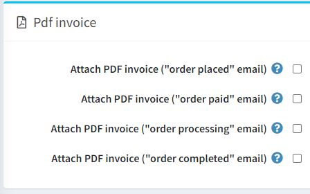

# 订单设置

要定义订单设置，请转到**配置 → 设置 → 订单设置**。将显示订单设置窗口。

此页面启用多商店配置；这意味着可以为所有商店定义相同的设置，也可以为各个商店定义不同的设置。如果您想要管理某个商店的设置，请从多商店配置下拉列表中选择其名称，然后选中左侧所需的所有复选框以为其设置自定义值。

在此窗口中，您可以定义以下订单设置：

## 查看

在Checkout面板中定义以下设置：

- **结帐已禁用**以禁用结帐流程。
- **允许匿名结账**，使客户无需注册/登录即可购买产品。
- **使用一页结账**，这是您的客户用来从您这里购买产品或服务的单个网页。
- **付款信息选项卡上的订单总额**，以在付款信息选项卡中显示产品列表和订单总额（一页结帐）。
- 是否要求客户在处理订单之前（**在购物车页面**）接受**服务条款**。
- 是否要求客户在处理订单之前接受**服务条款（在确认订单页面）**。
- **结账时禁用账单地址步骤**。账单地址将使用默认注册数据预先填写并保存（不能在选择访客结账时使用）。在**配置 → 设置 → 客户设置**中，确保无法预填的相应地址字段不是必填项（或已禁用）。
- **禁用“订单完成”页面**，以便在下订单后自动将客户重定向到订单详细信息页面。
- 在“送货方式”页面或送货地址页面**显示店内取货**。

## 订单总数

在订单总计面板中定义以下设置：

- **最低订单分项总额**。低于此金额的订单将不会被发出。
- **计算“最低订单小计金额”（含税）**。在这种情况下，在验证上一步中指定的最低订单小计金额字段时，将计算含税的订单小计。
- **最低订单总金额**。低于此金额的订单将不予发货。
- **自动更新订单总数**，以便在管理区域编辑订单时自动更新订单总数（目前处于BETA 测试阶段）。

## 常见的

在“常用”面板中定义以下设置：

- **订单ID计数器**。如果您希望订单以某个数字开头，则此功能很有用。这只会影响定义后创建的订单。该值必须大于当前最大订单 ID。
- 在**订单号掩码**中，您可以创建自定义订单号。例如，以 `{YYYY}` 开头 — 订单创建日期的年份。
- **是否允许重新订购**，以便客户重新订购。重新订购机制会自动将之前订购的所有商品添加到购物车中。
- **送达时完成订单**，仅当订单运输状态为“已送达”时，才将订单状态设置为“完成”。否则，“已发货”状态就足够了。
- **随产品出口订单。**
- **允许管理员购买“致电询价”产品**，以允许管理员（以模拟模式）购买标记为“致电询价”的产品。
- **在订单详情页中显示产品缩略图**。

## PDF发票

在PDF 发票面板中定义以下设置：

- **附加 PDF 发票（“订单已下”电子邮件）**。
- **附加 PDF 发票（“订单已付款”电子邮件）**。
- **附上 PDF 发票（“订单处理”电子邮件）**。
- **附加 PDF 发票（“订单完成”电子邮件）**。

## 礼品卡

在礼品卡面板中定义以下设置：

- **订单完成后激活礼品卡**。
- **取消订单后停用礼品卡**。
- **删除订单后停用礼品卡**。
- **订单取消后删除礼品卡使用历史记录**。

## 退货请求设置

在退货请求设置面板中，您可以设置退货请求。有关更多详细信息，请参阅[退货请求](./退货请求.md#退货请求设置)设置部分。
