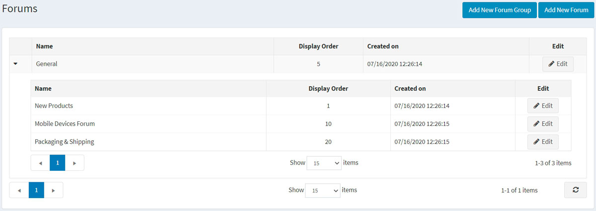
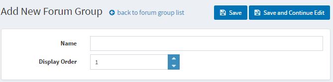
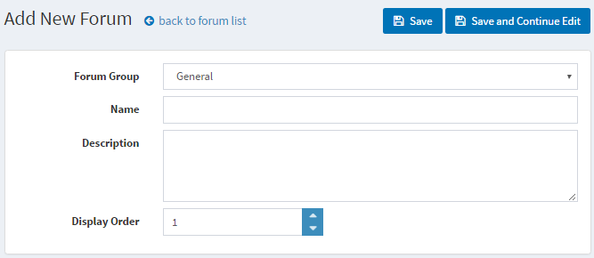
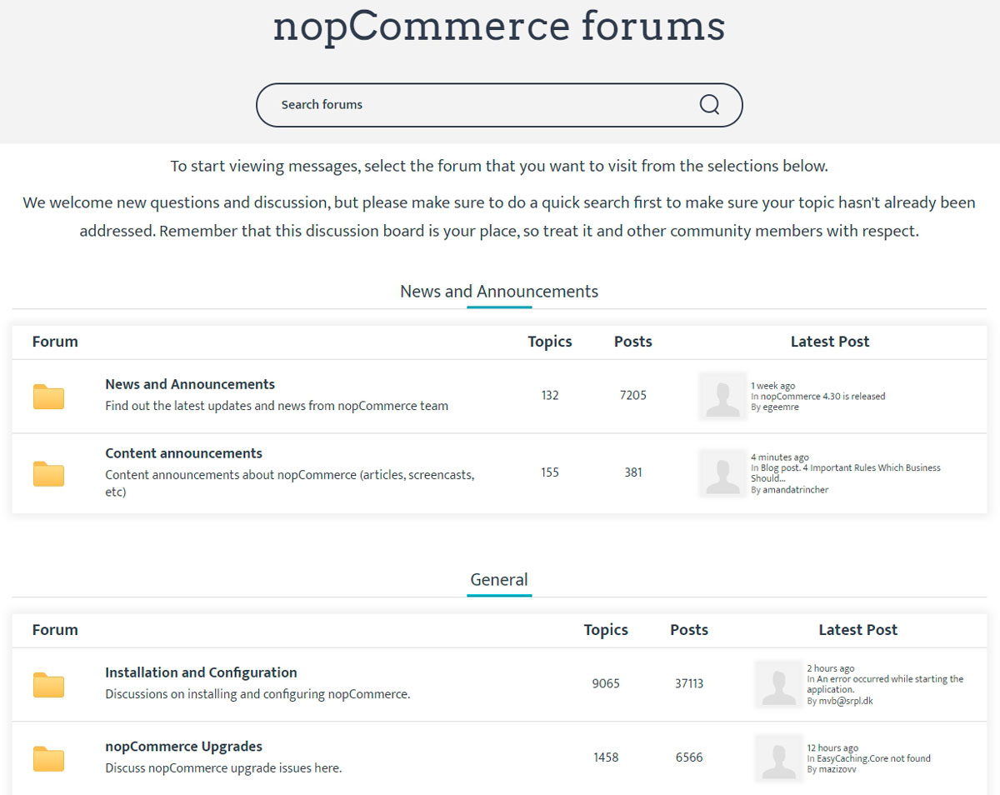
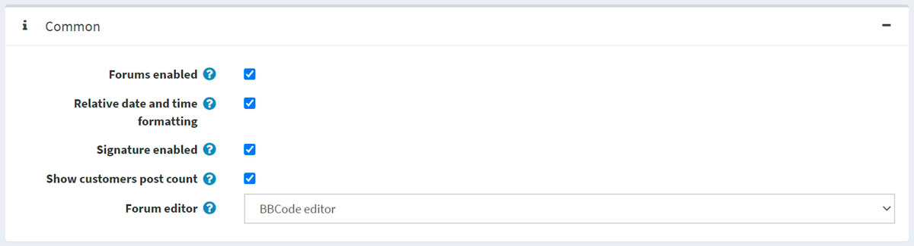
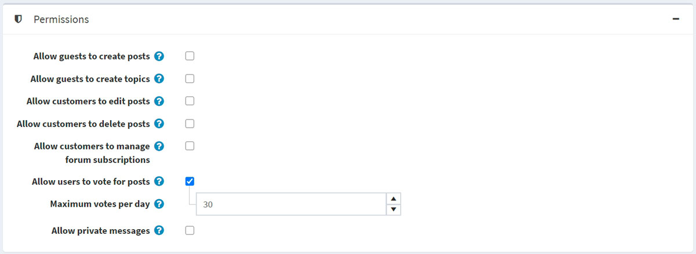
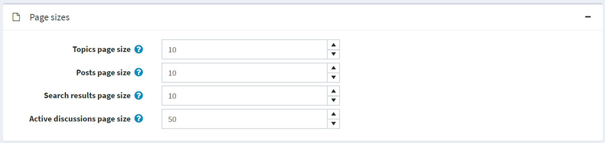
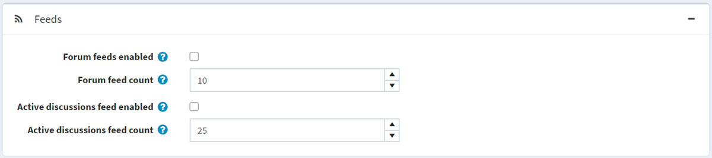

# 论坛

论坛是一个在线讨论网站，人们可以在此以发布消息的形式进行对话。论坛可能包含多个子论坛，每个子论坛都有多个主题。

> [!NOTE|style:flat]
> 在本系统中，论坛默认是禁用的。要启用论坛，请转到**配置 → 设置 → 论坛设置**，然后选择**论坛已启用**复选框。公共商店的菜单中应显示“论坛”链接（默认主题中的顶部菜单或页脚）。

要管理论坛组和论坛（论坛组内），请转到**内容管理 → 论坛**。

## 添加新论坛组

单击**添加新论坛组按钮**。

- 定义一个新的论坛组**名称**。
- 在**显示顺序**字段中，输入论坛组的显示顺序。值 1 表示列表顶部

单击**保存**。

## 添加新论坛

- 从**论坛组**下拉列表中，选择所需的论坛组。
- 输入新论坛的**名称**。
- 输入新论坛的**描述**。
- 选择论坛组的**显示顺序**。值1表示位于列表顶部

单击**保存**。

## 论坛设置

要访问论坛设置，请转到**配置 → 设置 → 论坛设置**。此页面有两种模式：高级和基本。

此页面启用多商店配置；这意味着可以为所有商店定义相同的设置，也可以为各个商店定义不同的设置。如果您想要管理某个商店的设置，请从多商店配置下拉列表中选择其名称，然后选中左侧所需的所有复选框以为其设置自定义值。

### 常见的

在常用面板中定义以下论坛设置：

- 通过选中**论坛已启用**复选框来启用论坛。
- 选中**相对日期和时间格式**复选框以启用相对日期和时间（例如，2 小时前、1 天前）。
- 您可以通过选择**已启用签名**来指定客户的签名。
- 选中**显示客户帖子数**复选框以显示客户创建的帖子数量。
- 从**论坛编辑器**下拉列表中，选择要使用的论坛编辑器类型：
    - 简单的文本框。
    - BBCode 编辑器。

> [!NOTE|style:flat]
> 不建议在生产环境中更改论坛编辑器类型。

### 权限

在权限面板中定义以下论坛设置：

- **允许访客创建帖子**。
- **允许嘉宾创建话题**。
- **允许客户编辑帖子**。
- **允许客户删除帖子**。
- **允许客户管理论坛订阅**。
- 选中**允许用户对帖子投票**复选框以启用投票。
    - 如果启用了之前的设置，则**每日最大投票数**字段将设置用户每天可以投票的数量。
- 选中**允许私人消息**复选框以启用私人消息。如果启用，将显示以下两个设置：
    - 选中**显示 PM 警报**复选框，以便在收到新的私人消息时启用警报弹出窗口。
    - 如果需要通过电子邮件通知客户有关新的私人消息，请选择“通知私人消息” 。

### 页面大小

在页面大小面板中定义以下论坛设置：

- **主题页面大小**：论坛中主题的页面大小，例如每页10个主题。
- **帖子页面大小**：主题中帖子的页面大小，例如每页10个帖子。
- **搜索结果页面大小**：搜索结果的页面大小，例如每页10个结果。
- **活跃讨论页面大小**：活跃讨论页面的页面大小，例如每页10个结果。

### 信息流

在Feeds面板中定义以下论坛设置：

- 选中**论坛提要已启用**复选框以为每个论坛启用 RSS 提要。
- 在**论坛提要计数**字段中，设置每个提要中要包含的主题数量。
- 选中**活动讨论源已启用**复选框以启用活动讨论主题的 RSS 源。
- 在**活跃讨论提要计数**字段中，设置要包含在“活跃讨论”提要中的讨论数量。
