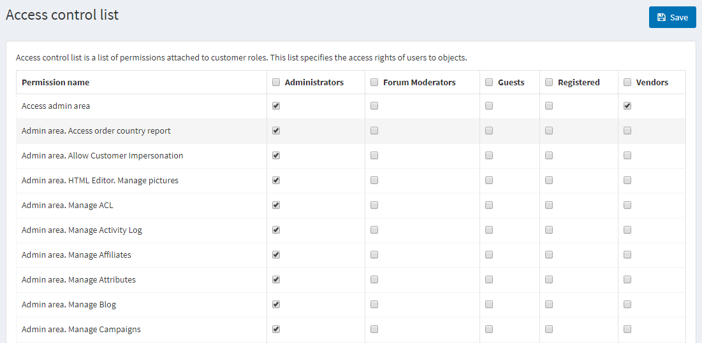

# 访问控制列表

访问控制列表 (ACL) 限制或授予用户对站点某些区域的访问权限。此列表由管理员管理。因此，用户必须具有管理员权限才能访问它。访问列表具有以下特点：

- 访问控制列表是基于角色的，即管理角色，例如全局管理员、内容管理员等。可以在**客户 → 客户角色**页面上管理此角色列表。有关更多详细信息，请参阅[客户角色](./客户角色.md)。
- 访问控制列表出现在管理区域。确保用户必须是管理员才能访问 ACL。
- 有一些预定义的管理员操作。其中包括管理订单、管理客户等等。

要管理访问控制列表，请转到**配置 → 访问控制列表**。将显示访问控制列表窗口：

在权限项目旁边选择所需的角色。所选角色将有权访问所选操作。

单击**保存**。

> [!NOTE|style:flat]
> 示例：我们需要一个名为“内容经理”的角色。内容经理必须有权访问新产品和制造商管理、编辑网站上的评论、博客、活动，但不能访问购物车。要做到这一点：

1. 在客户 → 客户角色页面创建一个名为内容经理的客户角色。
2. 在 ACL 中，选中以下权限旁边的复选框：访问管理区域、管理区域。管理博客、管理区域。管理活动、管理区域。管理论坛、管理区域。管理新闻、管理区域。管理新闻稿订阅者、公共商店。允许导航、公共商店。显示价格。
3. 保存更改。

