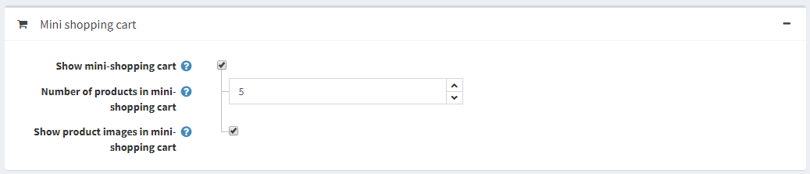
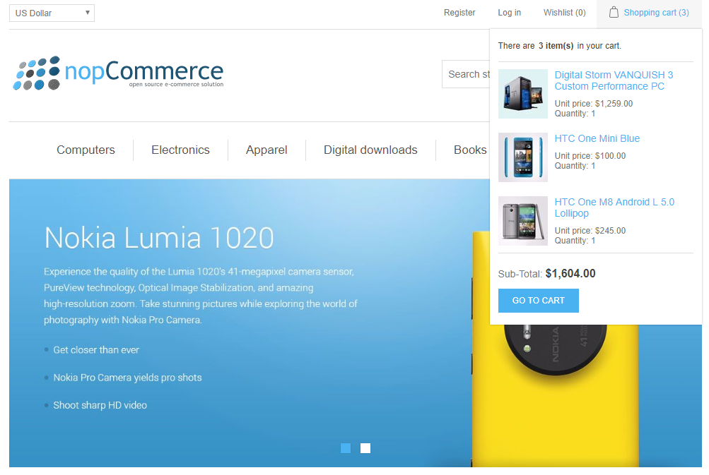

# 购物车和愿望清单

“购物车和心愿单”部分使店主能够在一个页面上查看所有商店中所有客户的所有现有购物车和心愿单。要访问此页面，请转到**销售 → 购物车和心愿单**。

在页面顶部的搜索区域中，选择所需的**购物车类型**：购物车或愿望清单。

您可以通过点击第一列中的以下图标来​​展开产品：。

从列表中，您可以点击客户链接进入客户详细信息页面。您还可以点击产品名称访问编辑产品详细信息页面，或点击删除按钮从购物车中删除**产品**。

## 购物车

在**销售 → 购物车和愿望清单**的购物车类型下拉列表中选择购物车，然后单击**搜索**以查看购物车列表。此列表包含所有已放入购物车但未购买的产品。

以下屏幕截图显示了客户在公共商店中看到的购物车页面：

购物车页面上有几个元素。 如果需要，可以禁用其中一些元素：

1. **删除**列中的按钮允许从购物车中删除商品。
2. **数量**列中的按钮允许客户通过在数量字段中输入适当的数字来更改产品的数量。
3. **继续购物按钮**允许顾客继续浏览目录。
4. **估算运费按钮**允许客户估算运费。单击此按钮后，将显示以下弹出窗口： 在此窗口中，客户可以输入送货地址并查看适当的送货选项。您可以通过清除**配置 → 设置 → 送货设置页面上的启用估算运费（购物车页面）复选框**来禁用购物车页面上的运费估算。

5. 您可以在上面提供的购物车屏幕截图中看到**礼品包装下拉菜单**。这是结帐属性。在[结帐属性](./结帐属性.md)章节中了解有关如何管理结帐属性的更多信息。
6. 折扣代码部分允许客户输入折扣代码。您可以通过清除**配置 → 设置 → 购物车设置**页面上的显示折扣框复选框来禁用此功能。在[折扣](./折扣.md)章节中了解有关折扣的更多信息。
7. 礼品卡部分允许客户使用礼品卡。您可以通过清除**配置 → 设置 → 购物车设置**页面上的显示礼品卡框复选框来禁用此功能。在[礼品卡](./礼品卡.md)章节中了解有关礼品卡的更多信息。
8. 在购物车总计部分，客户可以看到运费。
9. 在同一部分中，客户可以看到税务信息。
10. 在同一部分中，客户可以看到将获得多少奖励积分。在[奖励积分](./积分.md)部分中了解如何设置奖励积分。
11. 在同一部分中，客户可以看到服务条款。您可以通过清除**配置 → 设置 → 订单设置页面上的服务条款（购物车页面）复选框**来禁用此功能。

> [!NOTE|style:flat]
> 如果您不想让客户将某个产品添加到购物车，请在产品编辑页面的价格面板中选中禁用购买按钮复选框。在[添加产品](./产品.md#添加产品)章节中了解有关添加产品的更多信息。

> [!NOTE|style:flat]
> 查看我们的插件市场，帮助您管理废弃的购物车并恢复丢失的销售。

## 愿望清单

从**销售 → 购物车和愿望清单页面上的购物车类型**下拉列表中选择愿望清单选项，然后单击**搜索**以查看愿望清单。

愿望清单是客户可以与朋友分享或保存以便稍后转移到购物车的产品列表。如果为产品启用了添加到愿望清单，则**添加到愿望清单**按钮会出现在公共商店的产品详细信息页面上。当将不同变体的产品**添加到愿望清单**时，客户选择的所有变体都将包含在愿望清单中。

> [!NOTE|style:flat]
> 例如，如果客户添加了 2 种不同颜色的同款衬衫，则每件衬衫都会作为单独的商品出现在愿望清单中。如果客户多次将同一款产品**添加到愿望清单**，则该产品仅会出现一次，但数量会更新，以反映其添加的次数。

以下屏幕截图说明了客户如何查看公共商店中的愿望清单页面：

愿望清单页面上有几个元素：

1. **删除**列中的按钮允许从愿望清单中删除项目。
2. **更新愿望清单按钮**允许客户通过在数量字段中输入适当的数字来更改产品的数量。
3. **添加到购物车按钮**允许客户将选定的产品添加到购物车。
4. **通过电子邮件向朋友发送按钮**允许客户通过电子邮件将愿望清单发送给朋友。您可以通过在**配置 → 设置 → 购物车设置**页面上清除**允许客户通过电子邮件发送愿望清单复选框**来禁用此功能。
5. **您的共享愿望清单 URL**允许客户共享愿望清单。

> [!NOTE|style:flat]
> 如果您不想允许客户将某个产品添加到愿望清单，请在产品编辑页面的价格面板中选中**禁用愿望清单按钮**复选框。在[添加产品](./产品.md#添加产品)章节中了解有关添加产品的更多信息。

## 购物车和愿望清单设置

要更改购物车和愿望清单设置，请转到**配置 → 设置 → 购物车设置**页面。

此页面启用多商店配置；这意味着可以为所有商店定义相同的设置，也可以为各个商店定义不同的设置。如果您想要管理某个商店的设置，请从多商店配置下拉列表中选择其名称，然后选中左侧所需的所有复选框以为其设置自定义值。

### 通用设置

在Common面板中，您可以定义：

- **显示折扣框**在购物车页面显示折扣券框。
- **显示礼品卡盒**在购物车页面显示礼品卡盒。
- **允许编辑购物车商品**，使客户能够编辑购物车中的商品。当产品具有客户输入的值时，此功能很有用。
- **购物车最大商品数**— 允许添加到购物车的最大商品数量。
- 选中**商店间共享的购物车复选框**，以在商店间共享购物车（和愿望清单）。
- 在**购物车上显示产品图像**以在商店购物车中显示产品图像。
- 将**产品添加到购物车后显示购物车**在将产品添加到购物车后立即显示购物车页面。清除此复选框后，客户将停留在将产品添加到购物车的页面上。
- 您希望**在公共商店购物车结帐页面上显示的交叉销售数量**。如果您不想显示交叉销售，请输入 0。

### 迷你购物车设置

在迷你购物车面板中，您可以定义：

- **显示迷你购物车**：当鼠标悬停在“购物车”链接上时，主窗口右上角会出现一个下拉菜单，如下所示：

选择此字段时，将显示以下字段：
    - **迷你购物车中的产品数量**：公共商店中迷你购物车下拉菜单中显示的最大产品数量。
    - **在迷你购物车中显示产品图片**，以确定图像是否显示在迷你购物车下拉菜单中。

### 愿望清单设置

在愿望清单面板中，您可以定义：

- **最大愿望清单项目数**：允许添加到愿望清单的最大不同产品数量。
- **在愿望清单上显示产品图片**以在客户的愿望清单中显示产品图片。
- 允许客户**通过电子邮件将他们的愿望清单发送给朋友**。启用此字段后，将显示以下字段：
    - 允许客人**通过电子邮件将他们的愿望清单发送给朋友**。
- **允许将缺货商品添加到愿望清单**。
- 选中**将商品从愿望清单移至购物车复选框**，在单击**添加到购物车按钮**时将商品从愿望清单移至购物车。否则，它们将被复制。
- **添加产品后显示愿望清单**，在将产品添加到愿望清单后立即显示愿望清单页面。清除此复选框后，客户将停留在将产品添加到愿望清单的页面上。
