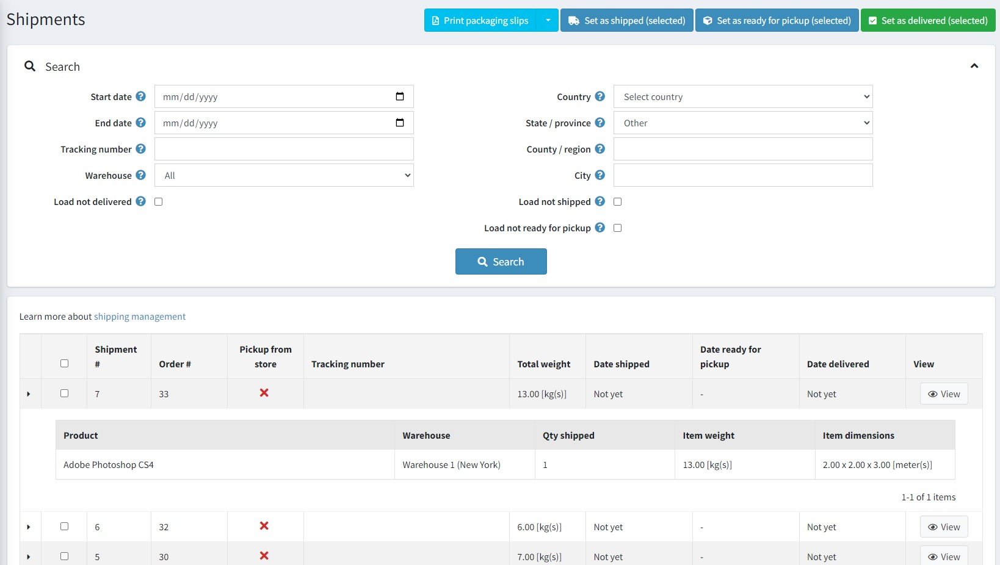
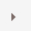
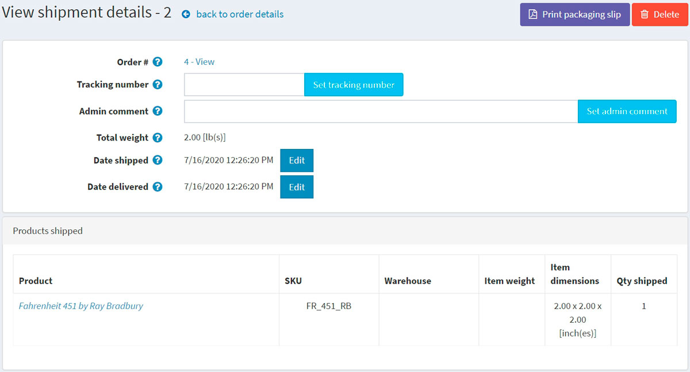
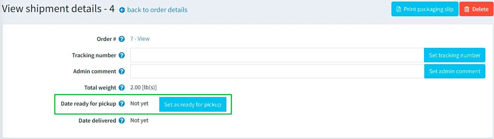

# 运输管理

要搜索并查看货件，请转到**销售 → 货件**。

## 发货清单

您可以在页面顶部按照不同的搜索条件来搜索货件：

- 在这些日期之间创建的货件的**开始日期**和**结束日期**。
- 如果您想查找具有特定跟踪号的货件，请输入**跟踪号**。
- 选择从特定仓库发送的货物的**仓库**。
- 如果您不想加载已交付的物品，请单击**加载未交付复选框**。
- 使用**国家、州/省、县/地区、城市**按运输目的地进行搜索。
- 如果您不想加载已发货的商品，请点击**加载未发货复选框**。
- 如果您要装载**尚未准备好取货**的物品，请选中“装载尚未准备好取货的物品”复选框。

选择某些货件，设置为**已发货（选定）**或**已送达（选定）**或**已准备好取货（选定）**。您还可以**打印包装单（选定）**或**打印包装单（全部）**以打印包装收据。

在货件列表中，店主可以通过点击货件的第一列来查看该货件的所有商品。

## 物流信息

如果您点击**查看**，将打开“查看货件详情”窗口，如下所示：

在此窗口中，您可以：

- 继续下单。
- 为货件设置**跟踪号**。
- 添加供内部使用的**管理员评论**。
- 查看**货件总重量**。
- 将货件标记为**已发货**。
- 编辑**发货日期**。
- 将货件标记为**已送达**。
- 编辑**交货日期**。
- **打印包装单**。
- **删除**该批货物。

如果客户在结账过程中选择了“店内取货”送货方式，您将能够将货件标记为“准备取货”。在“查看货件详情”页面上，此按钮如下所示：

