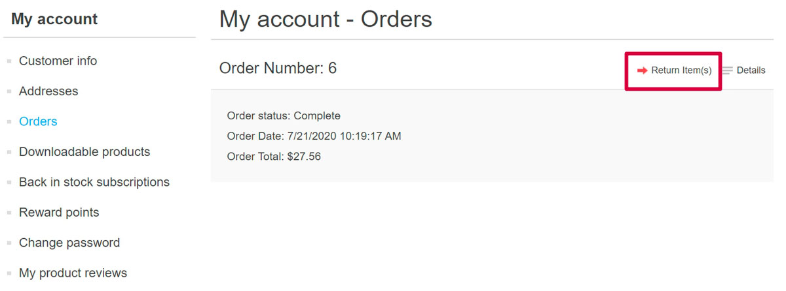
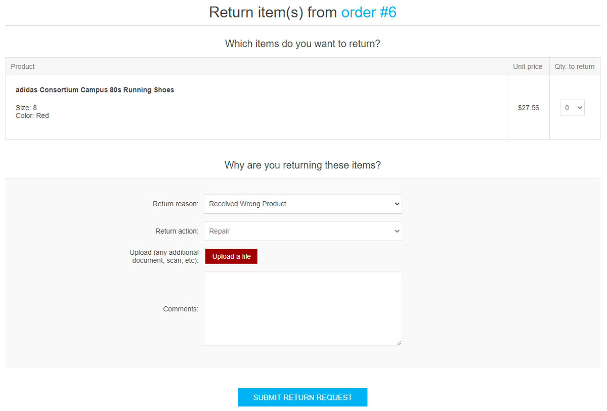
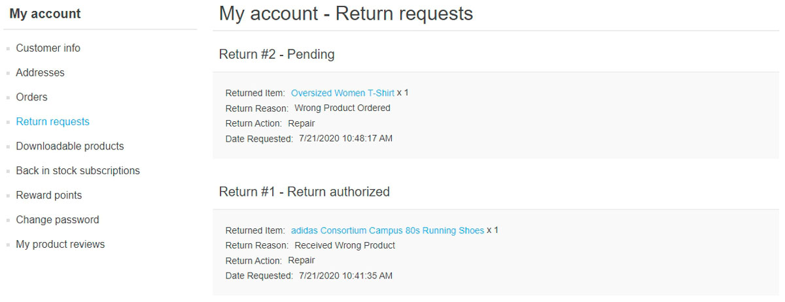
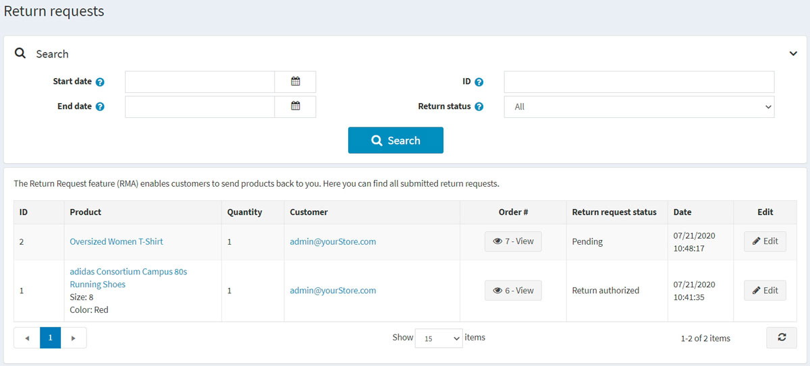
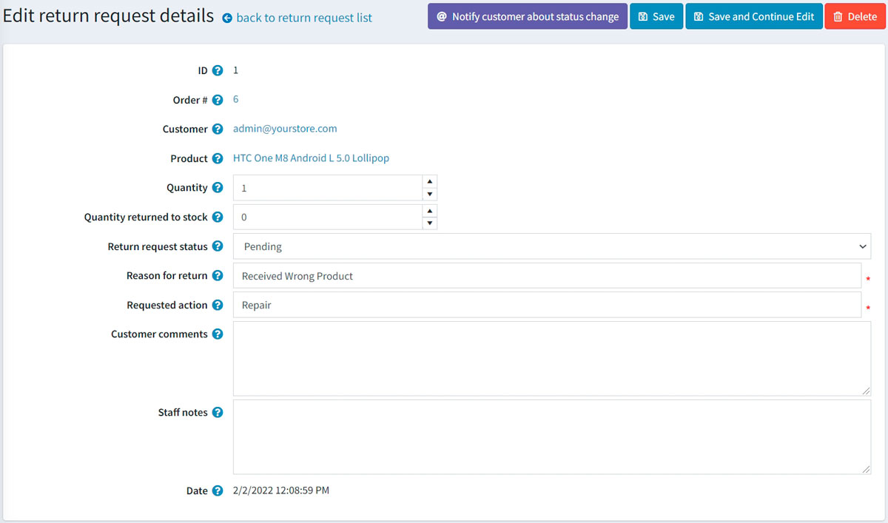
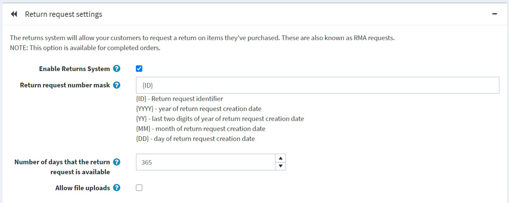
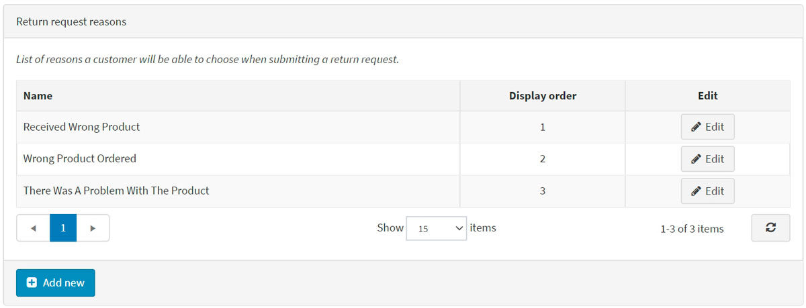
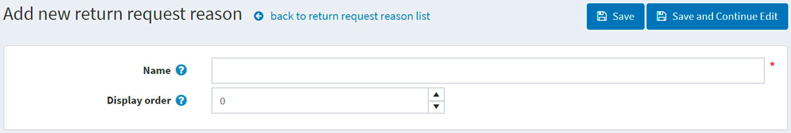
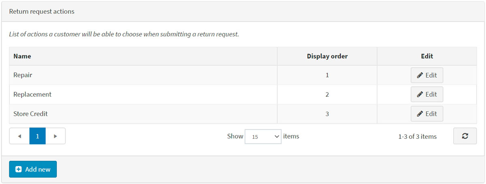

# 退货请求

退货请求功能使客户能够请求退回之前购买的商品。这也称为 RMA 请求。此选项仅适用于已完成的订单。退货请求设置在退货请求设置面板中的**配置 → 设置 → 订单设置**中进行管理。

要启用退货请求，请选中启用**退货系统复选框**。启用此选项后，公共商店的订单详细信息页面上会为已完成的订单显示**退货商品按钮**。

要继续进入退货请求设置部分，请单击[此处](#退货请求设置)。

在接下来的部分中，我们将描述您的客户如何使用退货请求功能以及如何在管理区域管理退货请求。

## 提交退货请求

要提交退货请求，客户应采取以下步骤：

1. 在公共商店中，进入我的账户窗口，点击**订单**。将显示以下页面：

2. 单击要退回的已完成订单旁边的**退货商品按钮**。将显示“订单号退货商品”窗口，如下例所示：

    - **返回数量**下拉列表允许选择要返回的商品数量。
    - **退货原因**下拉列表允许选择申请退货的原因。例如，订购了错误的产品、收到了错误的产品等等。阅读下文了解如何管理退货原因。
    - **退货操作**下拉列表允许选择需要采取的退货操作。例如，维修产品、更换产品、发放信用额度等。阅读下文了解如何管理退货操作。
    - 如果您想在请求中附加一些额外的文件或图片，请使用上传文件选项。(仅当选中“允许文件上传”复选框时，此选项才可用。)
    - 在评论字段中，客户可以输入可选的评论以供参考。

3. 使用退货请求功能后，客户可以通过点击退货请求在公共商店的“我的帐户”页面上查看已创建的退货请求及其状态：

## 管理退货请求

店主现在可以在管理区管理此退货请求。

要查看和编辑退货请求，请转到**销售 → 退货请求**。所有退货请求将显示如下：

点击退货请求旁边的**编辑**；将显示 编辑退货请求详细信息窗口：

商店管理员可以：

- 查看**退货请求ID**。

- 查看**订单号**。单击订单号将重定向到相关订单详细信息页面。

- 查看**客户**。单击客户电子邮件将重定向到关联的客户详细信息页面。

- 查看**产品**。单击产品名称将重定向到相关产品详细信息页面。

- 输入退回产品的**数量**。

- 填写**退回库存数量**字段。它代表应退回库存的商品数量。

- 选择**退货请求状态**：
    - *待办的*
    - *已收到*
    - *已授权退货*
    - *已修复商品*
    - *退款商品*
    - *请求被拒绝*
    - *取消*

- 在**退货原因**字段中，如有必要，编辑退货原因。

- 在**请求的操作**字段中，如有必要，编辑请求的操作。

- 在**客户评论**字段中，如有必要，编辑客户输入的评论。

- 在**员工备注**字段中，输入可选备注以供参考。这些备注不会显示给客户。

- 查看提交退货请求的**日期**。

> [!NOTE|style:flat]
> 单击**通知客户状态变化**按钮，向客户发送电子邮件，告知退货请求状态变化。
> 

## 退货请求设置

要定义退货请求设置，请转到**配置→设置→订单设置**。

此页面启用多商店配置；这意味着可以为所有商店定义相同的设置，也可以为各个商店定义不同的设置。如果您想要管理某个商店的设置，请从多商店配置下拉列表中选择其名称，然后选中左侧所需的所有复选框以为其设置自定义值。

转到退货请求设置面板：

在此面板中，您可以定义：

- **启用退货系统**，使您的客户能够提交所购物品的退货请求。

- 在**退货请求编号掩码**字段中，根据需要指定自定义退货请求编号。

- **退货请求可用的天数**用于设置退货请求链接在客户区域可用的天数。

> [!NOTE|style:flat]
> 例如，如果店主允许购买后 30 天内退货，则此字段将设置为 30。当客户登录网站并查看“我的帐户”时，30 天前完成的订单将没有**退货商品**按钮。

- 如果您想在提交退货请求时允许上传文件（例如图片） ，请选中**允许文件上传**复选框。此选项对于订单出现问题（例如收到损坏的商品或错误的产品）的客户特别有用。

### 退货请求原因

此面板显示客户在提交退货请求时可以选择的原因列表。

点击**新增**，添加新的请求原因。添加新的退货请求原因窗口将显示如下：

输入退货请求原因**名称**和**显示订单号**（1代表列表中的第一项）。单击**保存**以保存更改。

### 退货请求操作

此面板代表客户在提交退货请求时可以选择的操作列表。

点击**新增**，添加新的请求操作。添加新的退货请求操作窗口将显示如下：

输入退货请求操作**名称**和**显示订单号**（1代表列表中的第一项）。单击**保存**以保存更改。
